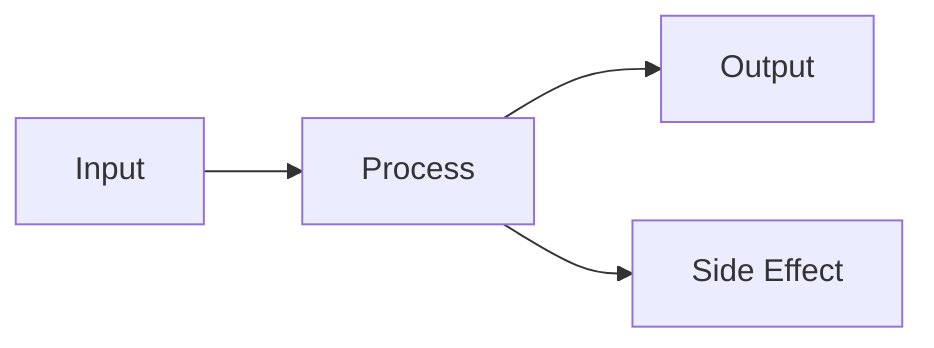

# SD — System Design: {Project/Feature Name}
**Date:** {YYYY-MM-DD}
**Status:** 🔵 Draft | 🟢 Approved
**Ref:** `RD-{name}.md`

---

## 1. Architecture Overview

<!-- Mô tả high-level. Dùng Mermaid nếu có nhiều components. -->

```
Component A ──→ Component B ──→ Output
     │
     └──→ Component C (async)
```

**Mermaid diagram (nếu cần):**


---

## 2. Data Flow

Step-by-step flow từ input đến output:

```
1. User/Trigger  →  input: {type}
2. {Component A} →  {action}: {detail}
3. {Component B} →  {action}: {detail}
4. Output        →  {format}: {destination}
```

---

## 3. Component Breakdown

### {Component A}

**Trách nhiệm:** ...
**Input:** ...
**Output:** ...
**Side effects:** ...

### {Component B}

**Trách nhiệm:** ...
**Input:** ...
**Output:** ...
**Side effects:** ...

---

## 4. Interface Contracts

### {function_name}(params) → return

```python
# Input
params = {
    "field_a": str,    # description
    "field_b": int,    # description, default: N
}

# Output
result = {
    "status": "ok" | "error",
    "data": ...,       # description
}

# Errors
# - raises ValueError if ...
# - returns {"status": "error"} if ...
```

---

## 5. Storage & State

| Data | Location | Format | Lifetime |
|---|---|---|---|
| Raw input | `raw/{type}/` | `.md` | Permanent |
| Processed output | `{output_dir}/` | `.md` | Permanent |
| Cache / temp | `{temp_dir}/` | `.json` | 24h / session |
| Config | `config.yaml` | YAML | Permanent |

---

## 6. Error Handling Strategy

| Scenario | Behavior | Logged? |
|---|---|---|
| External API timeout | Retry 1x, then skip source | Yes |
| LLM parse error | Retry 1x, then return error dict | Yes |
| File write error | Raise exception (stop execution) | Yes |
| Missing config key | Raise KeyError with clear message | Yes |

**Principle:** Lỗi ở external boundary → skip + log. Lỗi ở internal logic → raise.

---

## 7. Technology Decisions

| Quyết định | Chọn | Lý do | Không chọn vì |
|---|---|---|---|
| LLM engine | Groq direct SDK | Free tier, fast | CrewAI: overhead + tool-calling bug |
| Storage | Flat files (.md) | Đơn giản, no infra | DB: overkill cho personal project |
| Schedule | Windows Task Scheduler | No extra daemon | Cron: Windows phức tạp hơn |

---

*{Project} — SD v{version} | {date}*
