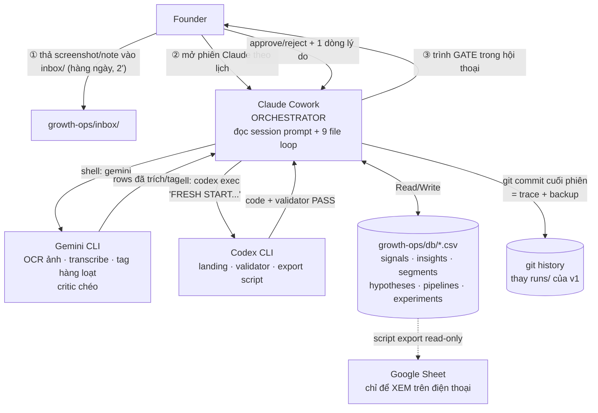

# AI WORKFLOW v2 — Claude Cowork orchestrator · Codex CLI coding · Gemini multimodal
2026-07-07 · Thay thế phần vận hành của `agent-flow.md` (v1) · Tiếp thu đủ 7 finding của `agent-flow-review.md`
Giữ nguyên từ v1 (không lặp lại ở đây): 5 luật xuyên suốt, 12 vai trò agent (§2 v1), nội dung prompt từng vai (§5 v1), schema dữ liệu (§4 v1 — chỉ đổi nơi lưu), sprint mẫu (§10.10 v1).

## 0. Thay đổi cốt lõi so với v1 — một câu

**v1: founder mở 12 phiên agent và tự bưng dữ liệu giữa các tool. v2: founder mở đúng 1 phiên Claude mỗi buổi theo lịch; Claude là orchestrator — tự đọc/ghi CSV trong repo, tự gọi Gemini CLI và Codex CLI qua shell, chỉ dừng lại đưa founder quyết ở gate.**

Founder không còn "vận hành hệ agent". Founder chỉ làm 3 việc: **thả ảnh vào inbox → mở phiên đúng lịch → quyết ở gate.**

## 1. Phân vai 3 tool — theo năng lực thật, không theo hype

| Tool | Vai | Được làm | KHÔNG được làm |
|---|---|---|---|
| **Claude (Cowork/Claude Code)** | **Orchestrator + bộ não phán đoán.** Chạy 4 session theo lịch; đóng các vai A3–A5, A9, A10; điều phối 2 tool kia; giữ toàn bộ ngữ cảnh Growth OS (9 file loop) | Đọc/ghi CSV db; gọi `gemini` và `codex exec` qua shell; draft hypothesis/pipeline/review; trình gate cho founder; commit git | Tự approve gate; tự publish; tự quyết SCALE/KILL |
| **Codex CLI** | **Thợ code.** Nhận brief từ Claude, trả code | Landing page, event logging, share card, **CSV validator**, script export CSV→Google Sheet (read-only view) | Quyết định sản phẩm; chạm content/copy hướng người dùng (Claude giữ voice); ⚠ luôn gọi dạng `codex exec` với prefix "FRESH START, don't ask" (nếu không sẽ treo ở prompt Session-Start) |
| **Gemini (CLI / AI Studio)** | **Mắt + tay khối lượng lớn + phản biện chéo.** Chi tiết §3 | OCR/trích signal từ screenshot; transcribe video; tag hàng loạt (kèm gold set); chạy checklist Critic cho artefact do Claude draft | Phán đoán cuối; copy thương hiệu; **không bao giờ nhận dữ liệu nhạy cảm/DM chưa che tên** (§3.3) |

**Luật cross-model (Finding 4):** ai draft thì model khác critique. Claude draft hypothesis/script → Gemini chạy checklist A12. Gemini tag signal → Claude spot-check 10 dòng ngẫu nhiên. Không tool nào tự chấm bài mình.

## 2. Kiến trúc v2



Nguồn sự thật = repo (CSV + prompt + taxonomy). Git log = trace "vì sao tuần đó quyết vậy". Sheet chỉ là màn hình.

## 3. Suy nghĩ kỹ về Gemini — dùng ở đâu, tránh ở đâu

### 3.1 Vì sao cần Gemini thật (không phải cho đủ bộ)
Signal đầu vào thật của platform này là **ảnh và video, không phải text**: screenshot comment TikTok, ảnh poll IG, ảnh hagaki nenkin người ta gửi hỏi, video của chính founder cần transcribe để tái sử dụng hook. Claude làm được nhưng đốt quota đắt vào việc rẻ; Gemini có multimodal + context dài + free tier rộng — đây là đúng người đúng việc, và nó giải phóng quota Claude cho phán đoán (A4, A5, A10).

### 3.2 Bốn việc giao Gemini (theo thứ tự giá trị)
1. **Intake multimodal (thay A1 phần máy):** founder thả ảnh vào `inbox/` cả tuần; đầu phiên T3, Claude gọi Gemini quét cả thư mục → trả rows `signals.csv` (nguyên văn text trong ảnh, nguồn, ngày). Nhanh gấp ~10 lần gõ tay.
2. **Tag hàng loạt (A2 phần cơ khí):** 50–100 signal/tuần × 3 trục tag — việc lặp thuần. Gemini tag kèm **gold set 20 ví dụ chuẩn** (Finding 5) nhét vào prompt mỗi lần; Claude spot-check 10 dòng ngẫu nhiên rồi mới cluster.
3. **Critic chéo (A12 cho artefact Claude draft):** Gemini nhận checklist 6 mục (§9 v1) + artefact → PASS/FAIL. Model khác não → bắt lỗi mà Claude tự-review sẽ trượt.
4. **Việc dài-ngữ-cảnh theo quý:** đọc lại TOÀN BỘ signals.csv 3 tháng (nghìn dòng) tìm pattern bị bỏ sót cho review quý — việc mà phiên tuần không bao giờ đủ chỗ.

### 3.3 Ranh giới cứng của Gemini (quan trọng hơn danh sách việc)
- **Dữ liệu:** free tier có thể dùng data để train. Luật: Gemini **chỉ nhận nội dung công khai** (comment public, poll, ảnh hagaki đã che tên/mã số). **DM và mọi thứ có định danh → Claude xử lý, không bao giờ qua Gemini.** Che tên làm TRƯỚC khi file vào inbox (founder che lúc chụp, hoặc thư mục `inbox/private/` chỉ Claude đọc).
- **Không phán đoán cuối:** Gemini không viết hypothesis, không đề xuất SCALE/KILL, không viết copy hướng người dùng (voice thương hiệu ở Claude).
- **Không pháp lý:** Gemini có Search grounding, dùng được để *tra fact* (ngày thi JLPT, hạn 確定申告) — nhưng mọi kết luận pháp lý vẫn theo luật Loop 5 + founder, không theo kết quả search.
- **Fallback khi hết quota:** việc 1–2 rơi về Claude với n nhỏ hơn (chỉ xử lý signal SQS cao); việc 3 rơi về "founder tự chạy checklist bằng tay 5 phút". Hệ không được chết vì 1 tool nghẽn.

## 4. Lịch tuần v2 — 4 phiên, founder mở 1 phiên/buổi

Khớp nguyên nhịp plan-tuan.md. Cột "Claude tự làm" = không cần founder; **đậm** = điểm founder phải quyết.

| Phiên | Khi | Claude (orchestrator) tự làm | Founder làm |
|---|---|---|---|
| `session-t2-review` | T2 21:00–22:30 | Đọc analytics export + experiments.csv → bảng [SỐ] n/n (A9) → gọi Gemini chạy critic checklist trên draft → draft SCALE/ITERATE/KILL/FREEZE từng pipeline kèm số dẫn chứng (A10) → sau khi quyết: ghi weekly_review, commit | **GATE ③:** quyết từng pipeline, 1 dòng lý do. 30–40' |
| `session-t3-cluster` | T3 21:00–22:00 | Gọi Gemini quét `inbox/` → signals.csv (che PII check) → Gemini tag kèm gold set → Claude spot-check 10 dòng → cluster thành insight draft (A2) → cập nhật nhiệt độ segment (A3) → commit | **Duyệt insight strength ≥2 + segment mới** (nếu có). 15–20' |
| `session-t4-build` | T4 21:00–22:30 | Draft hypothesis từ insight đã duyệt (A4) → pipeline card nếu <2 LIVE (A5) → 2 script hook nguyên văn (A6) → landing spec + experiment card (A7) → gọi Gemini critic chéo toàn bộ → nếu spec cần code: gọi `codex exec` viết + chạy validator → commit | Duyệt hypothesis/pipeline trong phiên. **Script CHƯA duyệt** — để sáng T5 |
| **Gate ① sáng T5** | T5 sáng, 10' | (Claude đã để sẵn 2 script + kết quả critic ở cuối phiên T4) | **Duyệt script khi đầu óc tỉnh** (Finding 7 — không approve lúc 23h). Tối T5 quay |
| `session-collect` | T6/T7/CN, 10'/lần | Nhận text founder dán (comment mới sau khi đăng) → chuẩn hoá rows (A1) → nếu tuần có lịch M1–M10: draft experiment giá (A8, chỉ khi 特商法 xanh) → commit | Dán comment/DM; **GATE ② nếu có offer/giá** |

Tuần EVENT: chỉ `session-collect` + `session-t2-review` (FREEZE). Tuần DUY TRÌ 4h: chỉ `session-t2-review` rút gọn.

**Tổng chi phí founder cho hệ AI: ~1h/tuần trong 14h** (quyết ở gate + dán input), so với ~2–3h làm tay các việc đó. Chênh lệch này là lý do tồn tại của hệ — và là thứ bị đo bởi kill criteria §6.

## 5. Repo structure v2

```
ai-project-opus/
├─ docs/growth-loops/            # knowledge base — Claude đọc đầu mỗi phiên, không sửa
├─ growth-ops/
│  ├─ sessions/                  # 4 session prompt (thay 12 prompt lẻ của v1)
│  │  ├─ session-t2-review.md    #   mỗi file: các vai chạy tuần tự + điểm dừng gate
│  │  ├─ session-t3-cluster.md   #   + lệnh shell gọi gemini/codex đúng cú pháp
│  │  ├─ session-t4-build.md
│  │  └─ session-collect.md
│  ├─ db/                        # NGUỒN SỰ THẬT (Finding 2) — CSV, commit mỗi phiên
│  │  ├─ signals.csv  insights.csv  segments.csv
│  │  ├─ hypotheses.csv  pipelines.csv  experiments.csv
│  │  └─ weekly_review/2026-W28.md ...
│  ├─ taxonomy/
│  │  ├─ tags.md                 # 16×7×8 tag + gold set 20 signal chuẩn (Finding 5)
│  │  └─ sqs-table.md
│  ├─ inbox/                     # founder thả screenshot/note hàng ngày → Gemini quét T3
│  │  └─ private/                # DM/ảnh có định danh — CHỈ Claude đọc, cấm Gemini
│  ├─ tools/                     # Codex viết: validate_csv.py · export_sheet.py
│  └─ founder-checklist.md       # A11 — in ra dán màn hình
```

Xoá so với v1: `prompts/` 12 file lẻ (gộp vào sessions/), `runs/` (git log thay thế), Google Sheet vai trò DB (thành read-only view).

## 6. Kill criteria cho chính hệ AI (Finding 6 — hệ phải theo luật của chính nó)

Viết trước khi chạy, đo ở review tuần 4:

| Điều kiện chết | Hành động |
|---|---|
| Tổng giờ founder cho hệ AI >1.5h/tuần (đo thật, ghi vào weekly review) | Cắt còn 2 phiên: t2-review + t4-build; collect/cluster làm tay |
| Founder approve ≥2 draft/tuần mà không đọc (tự khai — gate thành đóng dấu) | Như trên + giảm output agent (1 script/tuần thay 2) |
| Gemini tag sai >20% ở spot-check 2 tuần liên tiếp | Bỏ Gemini tagging, Claude tag trực tiếp n nhỏ (chỉ SQS ≥3) |
| CSV hỏng schema 2 lần dù có validator | Đơn giản hoá schema (bỏ cột phụ), không thêm tool |

Nguyên tắc: **hệ AI là một pipeline — nó phải tự chứng minh rẻ hơn làm tay, không được hưởng ngoại lệ.**

## 7. MVP roadmap v2 — 2 tuần (sửa từ §10.8 v1)

| Ngày | Việc | Tool |
|---|---|---|
| **T1** T2 | Dựng `growth-ops/` + 6 CSV header đúng schema + inbox/ | Claude 20' |
| T3 | Codex viết `validate_csv.py` + `export_sheet.py` (brief do Claude viết) | Codex ~1h máy |
| T4 | Viết `session-t3-cluster.md` + `session-collect.md`; **làm gold set**: founder tag tay 20 signal thật cùng Claude (1 lần duy nhất, ~45') | Claude + founder |
| T5–CN | Chạy thật: thả ảnh vào inbox → phiên cluster đầu tiên end-to-end (Gemini OCR + tag → Claude spot-check → founder duyệt) | Cả 3 tool |
| **T2** T2 | Weekly Review #1 bằng `session-t2-review` (số ít vẫn chạy đủ nghi thức) | Claude |
| T3 | Sửa prompt theo lỗi thật của tuần 1 (đặc biệt: Gemini đọc sai ảnh kiểu gì) | Claude |
| T4 | Viết `session-t4-build.md`; chạy chuỗi build đầu tiên; Gate ① sáng T5 đầu tiên | Claude + Gemini critic |
| CN | Retro 30': đo tổng phút founder đã tốn cho hệ (baseline cho kill criteria §6) | Founder |

Điều kiện tiên quyết không đổi: **Tuần 0 listening có ≥20 signal thật trước — không viết prompt cho dữ liệu tưởng tượng.**

## 8. Failure modes vận hành (những cách hệ này chết ngoài đời)

| Failure | Triệu chứng | Phòng ngừa đã cài |
|---|---|---|
| Codex treo | `codex exec` đứng im | Prefix "FRESH START, don't ask" bắt buộc trong mọi lệnh gọi (đã ghi vào session prompt) |
| Gemini hết quota giữa phiên | Lỗi 429 | Fallback §3.3: Claude xử lý n nhỏ (SQS cao trước), phần còn lại để tuần sau |
| Founder bỏ phiên T3 một tuần | inbox dồn 2 tuần | Không sao — inbox là buffer; phiên sau Gemini quét bù. Bỏ 2 tuần liên tiếp = tuần DUY TRÌ, theo luật plan-tuan §3 |
| PII lọt vào inbox thường | Ảnh DM có tên trong thư mục Gemini đọc | Bước 1 của mọi phiên cluster: Claude liệt kê file inbox, hỏi founder "có ảnh DM/định danh không?" trước khi gọi Gemini |
| Claude phiên mới quên ngữ cảnh | Draft lệch chuẩn loop1–6 | Dòng đầu mỗi session prompt: bắt buộc Read 3 file (growth-plan-final.md, taxonomy/tags.md, weekly review gần nhất) trước mọi việc |
| Hai phiên sửa CSV lệch nhau | Conflict git | 1 phiên/buổi theo lịch, commit cuối phiên — không bao giờ 2 phiên song song chạm db/ |

---

**Bước tiếp theo thực tế:** chưa phải viết session prompt. Vẫn là **Tuần 0 listening** — có 20 signal thật rồi mới dựng hệ (T1 của roadmap §7). Hệ này được thiết kế để lắp vào sau, không phải để trì hoãn việc đi nghe.
