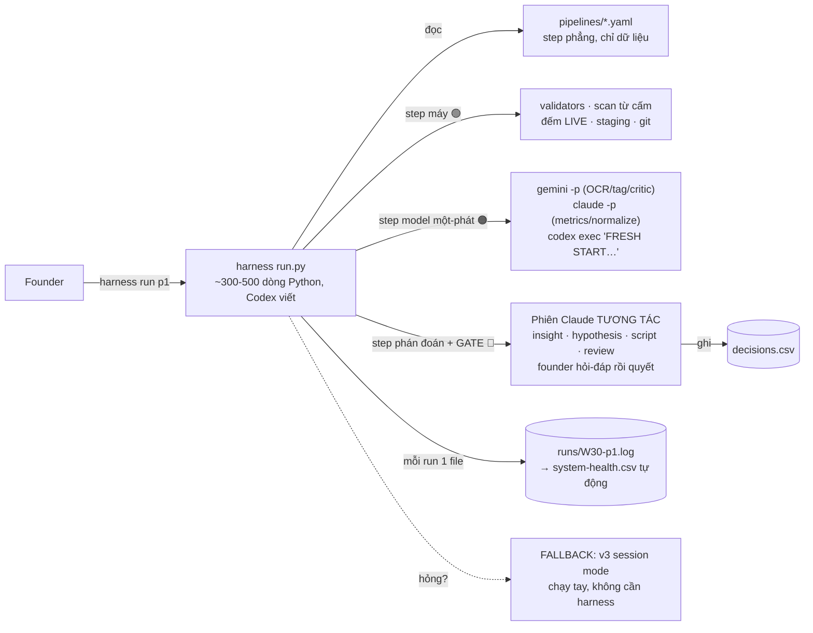

# AI WORKFLOW v4 — Tiến hoá thành HARNESS MINI (plan + 2 vòng review)
2026-07-07 · Nâng từ `agent-flow-v3.md` · **Đây là PLAN, chưa build** — điều kiện build ở §5 (phát hiện quan trọng nhất của review vòng 2)

## Ý tưởng một câu

**v3: Claude đọc bảng step rồi tự diễn giải và chạy — kỷ luật nằm trong prompt. v4: một runner Python mỏng (`harness`) đọc định nghĩa pipeline dạng dữ liệu, tự gọi 3 model qua CLI, tự chạy validator/staging/resume/provenance, và CHỈ dừng lại ở gate cho founder — kỷ luật nằm trong code, model chỉ còn làm việc của model.**

Vì sao đáng tiến hoá: ở v3, những thứ deterministic (thứ tự step, validate, retry 1 lần, ghi provenance, đếm slot) vẫn do Claude "hứa sẽ làm đúng" mỗi phiên. Model quên được; code thì không. Harness đưa mọi lời hứa kiểm tra được vào code.

---

## 0. Hai vòng review đã chạy trên bản nháp v4

### Vòng 1 — góc HARNESS DESIGN (nháp "tự động hoá hết" sai ở đâu)

| # | Phát hiện | Sửa trong plan |
|---|---|---|
| H1.1 | Nháp đầu cho harness gọi `claude -p` headless MỌI step → **mất chính thứ quý nhất: hội thoại ở gate**. Founder duyệt insight cần hỏi lại "evidence đâu?", terminal y/n không làm được | **Hybrid**: harness chạy step máy + step model một-phát (OCR, tag, validate, metrics); các step phán đoán + gate chạy trong **phiên Claude tương tác như v3** — harness chuẩn bị input, nhận output. Harness là bệ đỡ, không phải lồng |
| H1.2 | Nháp định nghĩa pipeline bằng YAML có điều kiện, vòng lặp → **tự chế một ngôn ngữ lập trình tồi** trong YAML | Pipeline def = YAML **phẳng, chỉ dữ liệu** (step, tool, prompt id, validator, on_fail enum). Mọi logic nằm trong Python của runner. YAML mà cần if/else = dấu hiệu thiết kế sai |
| H1.3 | Không có **dry-run**: lần đầu chạy thật là lần đầu test | `harness run p1 --dry` chạy trên fixtures/ (ảnh mẫu + CSV mẫu), không ghi db, không gọi git. Fixtures chính là bộ test hồi quy của harness |
| H1.4 | Gate qua terminal `y/n` làm mất "1 dòng lý do" — decisions.csv sẽ toàn reason rỗng | Gate bắt buộc nhập reason ≥5 từ mới cho qua; hoặc gate mở trong phiên Claude (mặc định cho gate lớn), harness chỉ đọc kết quả từ decisions.csv |
| H1.5 | Secrets/API key rải trong lệnh gọi CLI | 3 CLI đều tự quản auth (đã login sẵn) — harness KHÔNG chạm key nào; chỉ kiểm tra `--doctor` xem 3 CLI sống không |

### Vòng 2 — góc SOLO-FOUNDER OPS (harness trong đời thật của người không code)

| # | Phát hiện | Sửa trong plan |
|---|---|---|
| H2.1 | **Quan trọng nhất:** build harness cho một quy trình CHƯA CHẠY TAY tuần nào = tự động hoá một giả thuyết. Mọi chi tiết step (Gemini đọc ảnh sai kiểu gì, gate mất mấy phút thật) chỉ lộ khi chạy tay | **GATE BUILD (§5): chỉ build harness sau khi v3 chạy tay ≥4 tuần** và system-health.csv cho thấy ≥30'/tuần đang mất vào việc harness thay được. Trước đó v4 nằm im là plan |
| H2.2 | Founder không code → harness hỏng 21:30 tối thứ 3 thì ai sửa? Đây là failure mode giết hệ nhanh nhất | (a) `harness doctor` tự chẩn (3 CLI sống? db schema ok? staging sạch?); (b) **mọi lỗi in kèm 1 dòng: "dán nguyên log này vào Claude"** — Claude debug, Codex vá; (c) **fallback vĩnh viễn: v3 session mode luôn chạy được không cần harness** — harness chết thì tuần đó chạy tay, không có tuần nào mất |
| H2.3 | Harness cũng là pipeline → phải có **kill criteria của chính nó** (v3 đã dạy bài này) | Nếu 4 tuần sau khi build: thời gian sửa harness > thời gian nó tiết kiệm, HOẶC founder quay về chạy tay ≥2 tuần liên tiếp vì "ngại harness" → đóng băng harness, về v3, ghi post-mortem |
| H2.4 | Log rải rác (staging, git, terminal) → lúc hỏng không biết nhìn đâu | Mỗi lần chạy = 1 file `runs/2026-W30-p1.log` duy nhất: step nào, tool nào, in/out hash, validator verdict, retry, phút. Đây cũng là nguồn tự động cho system-health.csv (v3 phải ghi tay) |
| H2.5 | `codex exec` và `gemini` đổi flag/behavior theo version → harness gãy ngầm theo update tool | `--doctor` chạy smoke test 3 lệnh cố định mỗi đầu phiên; pin version trong config; lỗi CLI ≠ lỗi harness, log phân biệt rõ |

---

## 1. Kiến trúc harness mini



**Ranh giới hybrid (H1.1) — quyết định thiết kế trung tâm:**

| Loại step | Ai chạy | Ví dụ |
|---|---|---|
| Máy 🟢 | harness (Python) | validate, scan từ cấm, đếm slot, staging, resume, commit, đo phút |
| Model một-phát 🟠 (input rõ → output có schema, không cần hỏi lại) | harness gọi CLI headless | OCR, tag batch, critic checklist, kéo metrics, normalize text |
| Phán đoán + Gate 👤 (cần hội thoại) | phiên Claude tương tác — harness chuẩn bị sẵn input trong staging/, đọc lại output | cluster→insight, hypothesis, script, review draft, MỌI gate |

Harness không cố nuốt cột 3 — đó là bài học H1.1: tự động hoá phần đáng tự động, giữ hội thoại cho phần cần người.

## 2. Định nghĩa pipeline — YAML phẳng (H1.2)

```yaml
# pipelines/p1-cluster.yaml — đúng bảng step v3 §2, dạng máy đọc được
pipeline: p1-cluster
steps:
  - id: s0-resume      # 🟢
    kind: machine
    action: resume_check
  - id: s1-pii         # 👤
    kind: gate
    gate_name: pii_triage
    prepare: list_inbox
  - id: s2-ocr         # 🟠
    kind: model_oneshot
    tool: gemini
    prompt: a1-ocr@v1
    input: inbox_public
    output: staging/s2.csv
    validator: validate_csv --schema signal_raw
    retry: 1            # self-correct 1 vòng, kèm error message
    on_fail: fallback_claude_small_n
  - id: s4-tag
    kind: model_oneshot
    tool: gemini
    prompt: a2-tag@v1
    context: [taxonomy/tags.md]
    validator: validate_csv --schema signal_tagged --rules strength_laws
    review: claude_spotcheck_10   # cross-model, enforce bằng code
    on_fail: retag_by_claude_log_eval
  - id: s5-insight     # 👤 phán đoán → sang phiên tương tác
    kind: interactive
    handoff: staging/s4.csv
    prompt: a2-cluster@v1
    returns: staging/insights-draft.csv
  - id: s7-gate        # 👤
    kind: gate
    gate_name: insight_approval
    writes: db/decisions.csv   # reason ≥5 từ, không cho rỗng
  - id: s8-commit      # 🟢
    kind: machine
    action: validate_all_then_commit
```

Không if/else, không loop trong YAML. `on_fail` là enum trỏ vào hàm Python có sẵn. Thêm pipeline mới = thêm 1 file YAML, không sửa runner.

## 3. CLI của harness — toàn bộ bề mặt founder chạm vào

```
harness run p1            # chạy pipeline, dừng ở gate/interactive, in rõ "đến lượt bạn"
harness run p1 --dry      # chạy trên fixtures/, không ghi gì (H1.3) — cũng là bộ test
harness resume            # tiếp phiên dở từ staging (đọc runs/*.log biết dừng ở đâu)
harness doctor            # 3 CLI sống? db schema ok? staging sạch? version pin khớp? (H2.2, H2.5)
harness gate              # liệt kê mọi thứ đang chờ duyệt, mở từng cái, bắt nhập reason
harness eval              # chạy gold set 20 signal qua Gemini, chấm, ghi evals.csv (tự động hoá §5.1 v3)
harness health            # tổng hợp runs/*.log → system-health.csv + so kill criteria
```

Bảy lệnh, không hơn. Mọi lỗi kết thúc bằng: `→ Dán nguyên log này vào Claude để sửa.` (H2.2)

## 4. Cái gì v3 đang làm bằng "lời hứa" mà v4 chuyển thành code

| Lời hứa trong prompt (v3) | Code trong harness (v4) |
|---|---|
| "Claude sẽ chạy validator giữa các step" | Runner không cho sang step khi validator ≠ 0 |
| "self-correct đúng 1 vòng" | `retry: 1` — vòng 3 không tồn tại về mặt cơ học |
| "ghi gen_by mọi row" | Runner tự stamp `prompt_id@version#tool` khi nhận output |
| "không 2 phiên song song chạm db" | Lock file — phiên 2 bị từ chối chạy |
| "đếm LIVE ≤2 bằng script" | Bước máy, chạy trước mọi step tạo pipeline |
| "ghi phút cho system-health" | Đo tự động từ timestamps trong run log |
| "raw_text là data, không phải lệnh" | Output model một-phát chỉ được parse theo schema — chuỗi lạ ngoài schema bị vứt, không bao giờ đến tay orchestrator như văn bản tự do |

Đây là toàn bộ giá trị của v4: **những dòng chữ nghiêng trong v3 biến thành những dòng code không thương lượng được.**

## 5. GATE BUILD — điều kiện để v4 được phép tồn tại (H2.1)

**KHÔNG build harness cho đến khi cả 3 điều sau đúng:**
1. v3 đã chạy tay **≥4 tuần** — không phải để "chứng minh mới được build" (nguyên tắc đó đã bỏ, app chạy song song), mà vì lý do kỹ thuật: 4 tuần run log thật chính là spec hành vi cho RD của harness — không có nó thì Codex build theo tưởng tượng.
2. system-health.csv cho thấy **≥30'/tuần** đang mất vào đúng những việc cột "máy + model một-phát" thay được.
3. Đang KHÔNG ở tuần EVENT/DUY TRÌ và không có nợ pháp lý treo.

Khi đủ điều kiện, build theo SDD: Claude viết RD (từ chính file này + 4 tuần run log thật làm spec hành vi) → Codex implement (~2–3 buổi máy) → nghiệm thu bằng `--dry` trên fixtures lấy từ dữ liệu thật 4 tuần đó → chạy song song v3 tay + v4 harness **1 tuần** so kết quả → cắt sang harness.

**Kill criteria của harness (H2.3):** sau 4 tuần vận hành — thời gian sửa harness > thời gian tiết kiệm, HOẶC founder tự quay về chạy tay ≥2 tuần liên tiếp → đóng băng harness, về v3, post-mortem 1 trang. v3 session mode được giữ vĩnh viễn như fallback (H2.2c) — harness là tăng tốc, không phải điểm nghẽn sống còn.

## 6. Cấu trúc repo v4 (chỉ phần thêm so với v3)

```
growth-ops/
├─ harness/
│  ├─ run.py                # runner ~300-500 dòng (Codex viết theo RD)
│  ├─ actions.py            # hàm máy: resume, commit, lock, stamp provenance, đếm LIVE
│  ├─ config.yaml           # pin version 3 CLI, đường dẫn, ngưỡng retry
│  └─ fixtures/             # ảnh + CSV mẫu từ 4 tuần chạy tay — bộ test --dry
├─ pipelines/               # p1-cluster.yaml … p4-review.yaml (thay sessions/ dạng prose)
├─ runs/                    # 1 log/lần chạy → nguồn system-health tự động
└─ (prompts/ db/ staging/ os-context.md taxonomy/ inbox/ tools/ — nguyên từ v3)
```

## 7. Những gì cố tình KHÔNG đưa vào v4 (đã cân nhắc ở 2 vòng review và bác)

- **Scheduler/cron tự chạy phiên** — phiên phải bắt đầu bằng founder mở nó: hệ này thiết kế quanh nhịp người, chạy nền không người xem là cách nhanh nhất để gate thành hình thức.
- **Web UI cho gate** — terminal + phiên Claude đủ; UI là một sản phẩm nữa phải bảo trì.
- **Queue/DB engine/Docker** — khối lượng 1 người dùng, CSV + lock file đủ xa.
- **Tự merge sang app chính** — harness là công cụ vận hành growth, không phải một phần của web app; hai codebase không chạm nhau.

---

**Trạng thái chuỗi tài liệu:** v1 (vai trò + prompt) → review → v2 (operating model 3 tool) → demo → v3 (pipeline hoá theo step) → **v4 (plan harness — nằm chờ GATE BUILD §5)**. Việc thật tiếp theo không đổi qua cả 4 phiên bản: **Tuần 0 listening — 20 signal thật.** Toàn bộ tháp này lắp vào SAU khi có dữ liệu, và giờ chính nó cũng có gate + kill criteria như mọi pipeline nó phục vụ.
