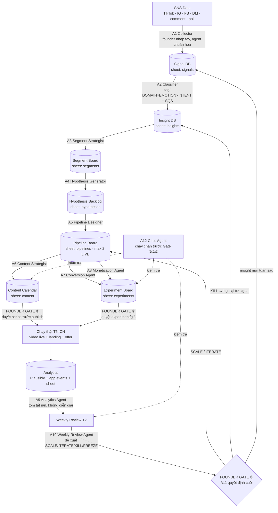

# AI AGENT FLOW — Hệ thống multi-agent vận hành Growth OS hàng tuần
2026-07-07 · Khớp: growth-plan-final.md (OS 4 lớp, 3 gate) · plan-tuan.md (nhịp 14h) · loop5-review.md (ràng buộc pháp lý)

**Triết lý thiết kế:** Agent ở đây KHÔNG phải server chạy 24/7. Mỗi agent = **1 file prompt trong repo + 1 phiên Claude Code chạy theo lịch tuần**, đọc/ghi vào Google Sheet. Founder là orchestrator — mở đúng phiên, đúng ngày, theo plan-tuan.md. Đây là cách duy nhất không over-engineer cho solo founder 14h/tuần.

**Luật xuyên suốt (kế thừa Loop 5 — agent nào cũng phải tuân):**
1. Không scrape tự động group công khai; không lưu định danh người đăng ngoài kênh mình sở hữu.
2. Câu quiz 100% tự viết; cấm chữ "đề thật". Không tư vấn thuế/visa 1-1 có phí. 特商法 + refund + tài khoản business trước khi thu tiền.
3. Đỏ độc quyền cho cảnh báo lừa đảo. Không scarcity/proof giả. Delayed signup là luật.
4. Max 2 pipeline sống. Mọi số viết dạng n/n (vd "12/40"), sàn mẫu n≥100/funnel-stage, ≥30/offer.
5. Agent chỉ DRAFT — mọi thứ chạm công chúng, tiền, hoặc dữ liệu nhạy cảm phải qua Founder Gate (§6).

---

## 1. Overall Architecture



Mọi record đều mang khoá lần vết: `signal_id → insight_id → segment_id → hypothesis_id → pipeline_id → experiment_id → decision`. Xem 1 quyết định KILL là truy ngược được về đúng những comment nào đã sinh ra nó.

---

## 2. Agent Responsibility Matrix

| # | Agent | Role | Input | Output | Runs When | Human Review |
|---|---|---|---|---|---|---|
| A1 | SNS Signal Collector | Chuẩn hoá signal thô founder dán vào | Text thô: comment/DM/poll/metric | Rows chuẩn vào `signals` | T6, T7, CN (sau reply) — 10' | Không (dữ liệu thô) |
| A2 | Insight Classifier | Tag 3 trục + SQS, cluster thành insight | `signals` 7 ngày | Rows `insights` + đề xuất strength | T3 (CLUSTER) | Duyệt insight strength ≥2 |
| A3 | Segment Strategist | Cập nhật segment nóng/nguội, đề xuất segment mới | `insights`, `segments` hiện có | Segment board cập nhật + card mới (draft) | T3, sau A2 | **BẮT BUỘC** với segment mới/merge/xoá |
| A4 | Hypothesis Generator | Biến insight → giả thuyết falsifiable | Insight đã duyệt + segment card | Hypothesis card (có kill criteria) | T4 | Duyệt trước khi sang A5 |
| A5 | Pipeline Designer | Thiết kế pipeline 15 trường, chấm điểm, veto pháp lý | Hypothesis đã duyệt | Pipeline card + score + cờ veto | T4, chỉ khi <2 pipeline sống | **BẮT BUỘC** trước khi live |
| A6 | Content Strategist | 2 script/tuần công thức 5 phần, hook nguyên văn từ signal | Pipeline live + signal nguyên văn | 2 script + content calendar | T4 (sau A5) | **BẮT BUỘC** trước publish |
| A7 | Landing/App Conversion | CTA + landing copy + thang cam kết đúng loop3 | Pipeline card + script | Landing spec + experiment card | T4–T5 | Duyệt copy trước deploy |
| A8 | Monetization Experiment | Thiết kế phép đo giá/offer đúng loop4 | Pipeline + monetization tracker | Experiment card (offer/price) | Khi lịch M1–M10 đến hạn | **BẮT BUỘC** với mọi giá/offer |
| A9 | Analytics | Tóm tắt số dạng n/n, so kill criteria, KHÔNG kết luận | Plausible + app events + sheets | Bảng số Weekly Review mục [SỐ] | T2 21:00 (trước review) | Không (chỉ số liệu) |
| A10 | Weekly Review | Đề xuất SCALE/ITERATE/KILL/FREEZE + [HỌC] + [LÀM] | Output A9 + boards | Weekly Review draft đầy đủ | T2, sau A9 | **BẮT BUỘC** — founder quyết |
| A11 | Founder (human) | Quyết định cuối, chịu trách nhiệm pháp lý & trust | Mọi draft qua Gate | Approve/Reject + 1 dòng lý do | Các gate §6 | — chính là human |
| A12 | Critic | QC chặn trước mọi gate (§9) | Artefact sắp qua gate | PASS / FAIL + lý do | Trước Gate ①②③ | Không — nhưng FAIL thì founder phải đọc |

---

## 3. End-to-End Workflow theo tuần

Khớp nguyên nhịp plan-tuan.md (T2 review là "next Monday review + decide" trong khung bạn nêu — chu kỳ khép kín 7 ngày):

| Ngày | Giờ | Agent chạy | Việc |
|---|---|---|---|
| **T2** 21:00–22:30 | REVIEW & DECIDE | A9 → A12 → A10 → **A11** | A9 kéo số → A12 check review có đủ bằng chứng → A10 draft quyết định → founder quyết SCALE/ITERATE/KILL/FREEZE, ghi 1 dòng lý do |
| **T3** 21:00–22:00 | CLUSTER | A2 → A3 | A2 tag + cluster signal 7 ngày; A3 cập nhật segment board; founder duyệt insight strength ≥2 và segment mới |
| **T4** 21:00–22:45 | HYPOTHESIS + SCRIPT | A4 → A5 → A6 → A7 → A12 | A4 sinh hypothesis; A5 pipeline card (nếu <2 sống); A6 viết 2 script; A7 landing/CTA spec; A12 QC toàn bộ → **Gate ①** founder duyệt script |
| **T5** 21:00–23:00 | BATCH QUAY | (không agent) | Founder quay 2 video theo script đã duyệt; gắn `?pid=` |
| **T6** 20:00–21:00 | ĐĂNG + REPLY | A1 | Đăng; reply comment; cuối buổi dán comment/DM mới vào A1 để chuẩn hoá |
| **T7** 10:00–12:00 | COLLECT + ĐỆM | A1 (+ A8 nếu tuần có experiment giá) | Reply + mỏ công khai → A1; nếu lịch M1–M10 đến hạn: A8 draft experiment → **Gate ②** |
| **CN** 20:00–22:00 | ĐĂNG #2 + COLLECT | A1 | Đăng video 2; A1 lần cuối; dọn dữ liệu sẵn cho A9 sáng T2 |

Tuần EVENT: FREEZE — chỉ A1, A9 chạy; A4–A8 nghỉ. Tuần DUY TRÌ 4h: chỉ A9 + A10 rút gọn (quyết FREEZE toàn bộ) + A1 tối thiểu.

**Chi phí thời gian founder cho agent:** mỗi phiên agent = mở Claude Code, gõ 1 lệnh skill, dán input, đọc output, approve/sửa. Tổng ~30–45'/tuần NẰM TRONG 14h đã có (agent thay phần việc tay, không cộng thêm).

---

## 4. Data Models

Tất cả là tab trong **1 Google Sheet duy nhất** (`growth-os-db`). Schema dưới đây mở rộng schema bạn đưa để khớp taxonomy đã chốt ở loop1 — trường thêm đánh dấu `// +`.

### 4.1 SNS Signal (`signals`)
```json
{
  "signal_id": "SIG-2026W28-001",
  "source": "tiktok|instagram|facebook|line|app",
  "content_url": "",
  "raw_text": "nguyên văn — KHÔNG paraphrase",
  "signal_type": "comment|dm|poll|video_metric|group_post|search_keyword|quiz_result|event_feedback",
  "domain_tag": "N2_HOC|THUE_NENKIN|VISA|EVENT|VIEC_LAM|VE_NUOC|LUA_DAO|...",   // + 16 tag loop1
  "emotion_tag": "LO_AU|BUC_XUC|TU_HAO|HOANG_MANG|...",                          // + 7 tag loop1
  "intent_tag": "HOI_CACH_LAM|NHO_LAM_HO|SO_SANH|CANH_BAO|...",                  // + 8 tag loop1
  "strength": 1,            // + 1-3; NHO_LAM_HO auto 3
  "sqs": 0,                 // + 0-6 theo bảng SQS loop1 (DM/quiz/event feedback/save = 5)
  "urgency_score": 0,
  "trust_level": 0,
  "pii_check": "clean",     // + A1 bắt buộc điền: đã xoá tên/định danh người đăng group công khai
  "created_at": "2026-07-07"
}
```

### 4.2 Insight (`insights`)
```json
{
  "insight_id": "INS-2026W28-01",
  "summary": "1 câu, chứa giao điểm DOMAIN×EMOTION×INTENT",
  "evidence": ["SIG-...-001", "SIG-...-014"],   // ≥2 source TYPE khác nhau mới đạt chuẩn
  "total_sqs": 0,            // + ≥8 mới là insight đạt chuẩn (loop1)
  "segment_candidate": "S1",
  "pain_intensity": 0,
  "monetization_potential": 0,
  "confidence": 0,           // 1-5, dựa n bằng chứng
  "status": "draft|approved|rejected",   // + founder set
  "created_at": ""
}
```

### 4.3 Segment Card (`segments`) — giữ nguyên schema bạn đưa, thêm:
```json
{
  "segment_id": "S1", "name": "", "trigger_moment": "", "core_anxiety": "",
  "visible_sns_behavior": "", "hidden_need": "", "best_content_hook": "",
  "best_app_entry": "", "conversion_action": "", "monetization_path": "",
  "priority_score": 0.0,     // + công thức loop1: Pain×.25+Urgency×.20+WTP×.20+Obs×.15+App×.10+MonFit×.10 −0.5 nếu trust≥4
  "temperature": "nong|nguoi|dong_bang",   // + A3 cập nhật hàng tuần
  "status": "active|nuoi|phong_thu|archived"
}
```

### 4.4 Hypothesis Card (`hypotheses`) — giữ nguyên, thêm:
```json
{
  "hypothesis_id": "HYP-2026W28-01", "segment_id": "", "raw_insight": "INS-...",
  "hypothesis": "Nếu [làm X cho segment Y] thì [hành vi Z đo được] vì [insight]",
  "pipeline_candidate": "", "expected_behavior": "",
  "metric": "tên metric + NGƯỠNG SỐ + sàn mẫu (vd: complete ≥25%, n≥100)",
  "kill_criteria": "viết TRƯỚC khi chạy — số + n + thời hạn",
  "legal_trust_flag": "none|review|VETO",   // + A5/A12 điền; VETO = dừng tuyệt đối
  "status": "backlog|approved|running|killed|proven"
}
```

### 4.5 Pipeline Card (`pipelines`) — giữ nguyên 13 trường bạn đưa, thêm:
```json
{
  "pipeline_id": "P-N2-a", "segment": "", "pain": "", "sns_content": "", "hook": "",
  "landing_destination": "", "web_app_action": "", "profile_capture": "chỉ +1 field/visit",
  "trust_asset": "", "share_moment": "", "monetization_trigger": "", 
  "kpi": "metric + ngưỡng + n floor", "kill_criteria": "",
  "score": 0.0,              // + công thức loop2: pain .20+speed .20+cost .15+monetize .15+audience .10+fit .10+data .10, ×1.2 mùa vụ
  "archetype": "A1|A2|A3|A4|A5|A7",   // + loop2
  "status": "draft|LIVE|frozen|killed|proven",   // + đếm LIVE ≤ 2 là luật cứng
  "first_touch": "?pid= qua localStorage"
}
```

### 4.6 Experiment Card (`experiments`) — giữ nguyên, thêm:
```json
{
  "experiment_id": "EXP-2026W28-01", "pipeline_id": "", "content_assets": [],
  "landing_page": "", "target_metric": "", "start_date": "", "end_date": "",
  "sample_floor": "n≥100 funnel / n≥30 offer",   // + chưa đủ n thì decision bắt buộc = "chưa đọc được"
  "result": "viết dạng n/n, vd 12/40",
  "decision": "scale|iterate|kill|freeze|insufficient_n",   // + thêm 2 trạng thái
  "decided_by": "founder", "decision_note": "1 dòng lý do"
}
```

---

## 5. Agent Prompt Templates

Mỗi prompt = 1 file trong `prompts/` (xem §10.9). Template chung phía dưới; phần `<...>` là biến điền lúc chạy.

### A1 — SNS Signal Collector
```
ROLE: Bạn là nhân viên nhập liệu Signal DB cho Growth OS Viet-Japan Platform.
OBJECTIVE: Chuẩn hoá text thô founder dán vào thành rows đúng schema signals (§4.1), KHÔNG diễn giải.
INPUT FORMAT: Text tự do — mỗi dòng/đoạn là 1 signal, kèm nguồn (vd "TikTok comment video P-01-a: ...").
TASK:
1. Tách từng signal; giữ NGUYÊN VĂN vào raw_text (kể cả sai chính tả — đó là ngôn ngữ hook).
2. Điền source, signal_type, created_at, content_url nếu có.
3. PII check: nếu nguồn là group công khai → xoá tên/nick/ảnh đại diện người đăng khỏi raw_text, set pii_check="cleaned". Kênh mình sở hữu (comment kênh mình, DM) → giữ, set "owned".
4. KHÔNG tự tag domain/emotion/intent, KHÔNG chấm sqs — đó là việc A2.
OUTPUT FORMAT: Bảng markdown đúng cột schema, sẵn paste vào sheet.
QUALITY CHECKLIST: [ ] không paraphrase [ ] mọi row có source+type [ ] PII đã xử lý [ ] signal_id đúng format SIG-YYYYwWW-NNN.
REFUSAL RULE: Input không ghi nguồn → trả lại hỏi nguồn, không đoán. Input có vẻ scrape tự động hàng loạt → từ chối, nhắc luật "không scrape".
```

### A2 — Insight Classifier
```
ROLE: Nhà phân loại tín hiệu theo taxonomy loop1-segments.md.
OBJECTIVE: Tag 3 trục + SQS + strength cho signal 7 ngày, rồi cluster thành insight ứng viên.
INPUT: Rows `signals` 7 ngày chưa tag + bảng taxonomy (16 DOMAIN, 7 EMOTION, 8 INTENT) + bảng SQS.
TASK:
1. Tag từng signal đúng 1 giá trị/trục. Không chắc → tag "UNKNOWN", không bịa.
2. Chấm sqs theo bảng nguồn (DM/quiz result/event feedback/save = 5). NHO_LAM_HO → strength 3.
3. Cluster: gộp signal cùng giao điểm DOMAIN×EMOTION×INTENT; tổng SQS ≥8 VÀ ≥2 loại nguồn → draft Insight (§4.2).
4. So 10 dòng tag tuần trước để chống drift — lệch chuẩn tag thì ghi chú.
OUTPUT: (a) bảng signal đã tag; (b) 0–3 insight draft, mỗi cái kèm evidence ids + total_sqs; (c) 1 dòng "drift note".
QUALITY CHECKLIST: [ ] mọi insight có ≥2 source type [ ] total_sqs tính đúng [ ] không insight nào thiếu evidence id.
REFUSAL RULE: <10 signal trong tuần → không cluster, trả về "n quá nhỏ, chỉ tag" — insight từ 3 comment là ảo giác.
```

### A3 — Segment Strategist
```
ROLE: Chiến lược gia segment, giữ 12 segment card loop1 làm nền.
OBJECTIVE: Cập nhật nhiệt độ segment theo insight tuần; đề xuất (không tự tạo) segment mới.
INPUT: Insight approved tuần này + segment board hiện tại + công thức priority (§4.3).
TASK:
1. Map mỗi insight vào segment hiện có; cập nhật temperature nóng/nguội kèm evidence.
2. Insight không map được vào segment nào VÀ có ≥3 evidence → draft segment card MỚI đầy đủ 10 trường, tính priority_score, đánh dấu "CHỜ FOUNDER DUYỆT".
3. Tính lại priority nếu Pain/Urgency/WTP đổi rõ rệt; segment tụt sâu → đề xuất chuyển "nuôi"/"phòng thủ".
OUTPUT: Segment board diff (chỉ dòng thay đổi + lý do 1 câu/dòng) + segment card mới nếu có.
QUALITY CHECKLIST: [ ] mọi thay đổi có insight_id dẫn chứng [ ] không xoá/merge segment (chỉ đề xuất) [ ] trust barrier ≥4 đã trừ 0.5.
REFUSAL RULE: Được yêu cầu tạo segment từ <3 evidence hoặc từ "cảm giác" → từ chối, ghi vào watchlist.
```

### A4 — Hypothesis Generator
```
ROLE: Người viết giả thuyết falsifiable theo chuẩn loop2.
OBJECTIVE: Biến insight approved thành 0–2 hypothesis card có thể bị chứng minh SAI.
INPUT: Insight approved + segment card tương ứng + danh sách 6 archetype + hypothesis đã killed (để không lặp).
TASK:
1. Viết dạng: "Nếu [can thiệp X] cho [segment] thì [hành vi Z] đạt [ngưỡng số, n floor] trong [thời hạn] vì [insight]".
2. Chọn archetype phù hợp; điền metric + kill_criteria TRƯỚC.
3. Check trùng hypothesis đã kill — nếu giống >70%, phải nêu điều gì ĐÃ KHÁC khiến đáng thử lại.
4. Chấm legal_trust_flag: chạm thuế/visa/việc làm/đề thi → flag "review" kèm lý do; vi phạm rõ luật xuyên suốt → "VETO".
OUTPUT: 0–2 Hypothesis card đầy đủ schema §4.4.
QUALITY CHECKLIST: [ ] có ngưỡng số + n [ ] kill criteria cụ thể [ ] falsifiable thật (nêu được kết quả nào = sai) [ ] flag pháp lý đã chấm.
REFUSAL RULE: Insight confidence <3 hoặc thiếu segment card → trả về yêu cầu thêm evidence, không viết hypothesis "cho có".
```

### A5 — Pipeline Designer
```
ROLE: Kiến trúc sư pipeline theo chuẩn loop2 + scope cut loop5.
OBJECTIVE: Thiết kế pipeline card 15 trường từ hypothesis approved — CHỈ KHI đang <2 pipeline LIVE.
INPUT: Hypothesis approved + số pipeline LIVE hiện tại + bảng scoring + lịch mùa vụ (plan-nam §0).
TASK:
1. Đếm LIVE trước. ≥2 → DỪNG, trả về "backlog, chờ slot" — không có ngoại lệ.
2. Điền đủ 15 trường; profile_capture tuân luật +1 field/visit; share_moment đặt ở đỉnh cảm xúc dương.
3. Chấm score công thức loop2, nhân 1.2 nếu đúng mùa (đối chiếu bản đồ mùa vụ).
4. Veto tuyệt đối nếu trust/legal risk ≥4 — ghi rõ điều luật/lý do.
OUTPUT: 1 Pipeline card + score breakdown từng thành phần + verdict "ĐỀ XUẤT LIVE / BACKLOG / VETO".
QUALITY CHECKLIST: [ ] kill criteria viết trước KPI [ ] có first_touch ?pid= [ ] landing = chính hành động (không phải trang giới thiệu) [ ] không hứa điều cấm (đối chiếu cột "KHÔNG được hứa" loop3).
REFUSAL RULE: Hypothesis chưa được founder approve → không thiết kế. Bị yêu cầu mở pipeline thứ 3 → từ chối kèm trích luật.
```

### A6 — Content Strategist
```
ROLE: Người viết script video theo công thức 5 phần (loop6/plan-tuan): hook nguyên văn → khuếch đại pain → giá trị 1 điểm → proof thật → CTA có lý do rời SNS.
OBJECTIVE: 2 script/tuần cho pipeline LIVE, hook lấy NGUYÊN VĂN từ Signal DB.
INPUT: Pipeline card LIVE + 5–10 raw_text signal mạnh nhất tuần + content calendar + số liệu video cũ (cái nào hook tốt).
TASK:
1. Mỗi script: 45–60s, 5 phần đánh dấu rõ, hook là câu THẬT từ signals (ghi signal_id cạnh hook).
2. CTA theo thư viện loop3 — nêu thời lượng + phá friction trong câu (vd "3 phút, không cần đăng ký").
3. Gắn link ?pid=P-xx-a/b; đề xuất giờ đăng (T6 20h, CN 20h).
4. TUYỆT ĐỐI không: chữ "đề thật", số liệu bịa, scarcity giả, nội dung tư vấn thuế/visa cá nhân hoá.
OUTPUT: 2 script (bảng: giây | thoại | text overlay | ghi chú quay) + dòng content calendar.
QUALITY CHECKLIST: [ ] hook có signal_id nguồn [ ] CTA đúng thư viện [ ] không từ cấm [ ] quay được trong 2-3 take với setup cố định.
REFUSAL RULE: Không có pipeline LIVE hoặc signal tuần <10 → chỉ đề xuất recycle content cũ tốt nhất, không viết mới từ tưởng tượng.
```

### A7 — Landing/App Conversion Agent
```
ROLE: Conversion designer theo loop3 (thang cam kết 6 bậc + 8 funnel UX rules).
OBJECTIVE: Spec landing/app action cho experiment — landing LÀ hành động, không phải trang giới thiệu.
INPUT: Pipeline card + script đã duyệt + thang 6 bậc + bảng "hứa được / KHÔNG được hứa".
TASK:
1. Viết landing spec: H1 (khớp lời hứa trong video), hành động đầu tiên trong ≤5s, điểm hiện kết quả CỦA TÔI, điểm mời SAVE (login chỉ để lưu), field xin thêm (+1/visit).
2. Copy APPI đặt đúng chỗ: mục đích dùng dữ liệu 1 câu ngay tại form (đây là copy tăng conversion, không phải footer).
3. Số proof chỉ lấy từ DB thật; chưa có số → dùng lời chứng thực có phép, không bịa.
4. Xuất Experiment card (§4.6) với target_metric + sample_floor + ngày bắt đầu/kết thúc.
OUTPUT: Landing spec (dạng brief Codex implement được: section, copy, event cần log) + experiment card.
QUALITY CHECKLIST: [ ] không bậc cam kết nào bị nhảy cóc [ ] SHAME topic không leaderboard/không "X đang xem" [ ] mọi event có tên trong taxonomy đo lường [ ] pid được giữ qua localStorage.
REFUSAL RULE: Pipeline chưa duyệt hoặc script chưa qua Gate ① → không viết spec (tránh làm trước rồi tiếc mà ép duyệt).
```

### A8 — Monetization Experiment Agent
```
ROLE: Người thiết kế phép đo tiền theo loop4 (offer matrix, trust gating T0–T3, 3 phép đo giá).
OBJECTIVE: Draft experiment monetization khi lịch M1–M10 đến hạn — đo willingness thật, không đoán.
INPUT: Lịch experiments M1–M10 + monetization tracker + trust level hiện tại của segment + pipeline LIVE.
TASK:
1. Kiểm tra trust gate: offer T2 cho segment đang T1 → trả về "chưa đủ trust, làm X trước".
2. Thiết kế đúng 1 phép đo: ladder giá theo pid chẵn/lẻ, HOẶC 1 câu hỏi giá sau aha, HOẶC đọc phản ứng DM — nêu rõ n floor ≥30.
3. Điều kiện tiên quyết phải xanh: trang 特商法 live, refund policy, tài khoản business — thiếu 1 → mọi offer thu tiền bị chặn.
4. Offer phải "thay chi tiêu có sẵn" hoặc "cứu tiền đang mất" — nêu rõ nó thay/cứu khoản nào.
OUTPUT: Experiment card + copy offer + bảng "điều kiện tiên quyết: đạt/thiếu".
QUALITY CHECKLIST: [ ] 1 biến/phép đo [ ] n floor ghi rõ [ ] không PayPay cá nhân [ ] không giá neo giả/deadline giả.
REFUSAL RULE: Điều kiện 特商法/business account chưa xanh → từ chối thiết kế offer thu tiền, chỉ cho phép đo dạng khảo sát/waitlist (và nhắc waitlist ≠ WTP).
```

### A9 — Analytics Agent
```
ROLE: Kế toán số liệu. KHÔNG diễn giải, KHÔNG khuyến nghị — chỉ số.
OBJECTIVE: Điền mục [SỐ] của Weekly Review: mỗi pipeline/experiment 1 dòng n/n so với kill criteria.
INPUT: Export Plausible (lọc IP mình, chỉ JP-IP cho KPI TikTok) + app events + sheets experiments + dashboard 9 số.
TASK:
1. Mỗi pipeline LIVE: start n/n, complete n/n, signup_after_value n/n, D7 n/n — đặt CẠNH ngưỡng kill.
2. Mỗi experiment: kết quả vs target, kèm cột "đủ n chưa" — chưa đủ ghi "insufficient_n", không suy diễn xu hướng.
3. Dashboard 9 số + cờ báo động nếu vượt ngưỡng alarm.
4. 4 tuần đầu mọi so sánh là TƯƠNG ĐỐI (tuần này vs tuần trước), không so chuẩn ngành.
OUTPUT: Bảng [SỐ] đúng format template plan-tuan §5, paste thẳng vào Weekly Review.
QUALITY CHECKLIST: [ ] mọi số dạng n/n [ ] không % trần trụi [ ] không câu nào chứa "nên/có vẻ/xu hướng".
REFUSAL RULE: Thiếu nguồn số (chưa export) → liệt kê đúng số nào thiếu, không ước lượng thay.
```

### A10 — Weekly Review Agent
```
ROLE: Chief of staff cho review T2 — draft quyết định, KHÔNG quyết định.
OBJECTIVE: Từ bảng [SỐ] của A9, draft SCALE/ITERATE/KILL/FREEZE cho từng pipeline + [HỌC] + [LÀM].
INPUT: Output A9 + Weekly Review 3 tuần gần nhất + decision rules (growth-plan-final): SCALE = KPI ≥ ngưỡng 2 tuần + đủ n + không trust flag; ITERATE = 1 biến, max 2 vòng; KILL = chạm kill criteria đủ n, legal/trust flag = KILL tức thì; FREEZE = tuần event / <4h.
TASK:
1. Mỗi pipeline: đề xuất + trích đúng con số làm căn cứ + rule nào được áp.
2. ITERATE: chỉ định đúng 1 biến và tại sao biến đó (không phải 2).
3. Draft [HỌC] 3 dòng (điều số liệu NÓI, không phải điều muốn tin) + [LÀM] tuần tới khớp loại tuần (CHUẨN/EVENT/DUY TRÌ).
4. Nhắc nợ: việc pháp lý còn treo, việc Codex đang chờ, experiment sắp hết hạn.
OUTPUT: Weekly Review draft đầy đủ template — mỗi đề xuất kèm ô trống "FOUNDER: đồng ý/khác → lý do".
QUALITY CHECKLIST: [ ] mọi đề xuất có số dẫn chứng [ ] không đề xuất pipeline mới khi đã 2 LIVE [ ] không làm mềm kill criteria đã viết.
REFUSAL RULE: A9 chưa chạy hoặc số thiếu quá nửa → chỉ draft phần [HỌC]/[LÀM], đánh dấu "KHÔNG ĐỦ SỐ ĐỂ QUYẾT" — không quyết mù.
```

### A11 — Founder Agent (human — checklist, không phải prompt)
```
Bạn là gate cuối. Với mỗi artefact chờ duyệt, trả lời 4 câu:
1. Có vi phạm 1 trong 5 luật xuyên suốt không? (có → reject, không thương lượng)
2. Số dẫn chứng có thật và đủ n không? (mở sheet xem 2 dòng ngẫu nhiên)
3. Nếu sai, chi phí tệ nhất là gì — tiền, trust, hay pháp lý? (pháp lý/trust → chậm lại 1 ngày cũng được)
4. Việc này có nằm trong 14h tuần này không? (không → backlog, đừng cố)
Approve = ghi 1 dòng lý do vào decision_note. Reject = 1 dòng vì sao + agent nào sửa.
KHÔNG BAO GIỜ approve qua mệt mỏi lúc 23h — để sáng hôm sau.
```

### A12 — Critic Agent (prompt ở §9)

---

## 6. Human-in-the-loop Design

| Gate | Cái gì | Khi nào | Founder check gì | Nếu skip thì sao |
|---|---|---|---|---|
| Duyệt insight | Insight strength ≥2 trước khi vào backlog | T3 | Evidence có thật? ≥2 loại nguồn? | Hypothesis xây trên cát |
| Duyệt segment | Segment MỚI / merge / xoá / đổi priority thủ công | T3 | ≥3 evidence, không trùng segment cũ | Phân mảnh segment ảo |
| Duyệt pipeline | Trước khi bất kỳ pipeline chuyển LIVE | T4 | Kill criteria trước, slot <2, veto pháp lý | Vi phạm luật max-2 |
| **Gate ① Content** | MỌI script/caption trước publish | T4 tối | Từ cấm, hook đúng nguyên văn, không hứa quá | Rủi ro bản quyền/trust công khai |
| **Gate ② Offer/Price** | MỌI giá, offer, thay đổi giá, email/LINE gửi list | Khi có | 特商法 xanh, trust gate đúng, n floor | Rủi ro pháp lý thật (tiền) |
| **Gate ③ Decision** | SCALE/KILL cuối cùng; mọi thu thập data nhạy cảm mới | T2 | Số đủ n, rule áp đúng | OS mất kỷ luật — chết chậm |

Nguyên tắc: **agent draft nhanh bao nhiêu cũng được, nhưng tốc độ publish = tốc độ founder đọc.** Đó là feature, không phải bug — nó giữ trust asset.

---

## 7. Tooling Recommendation

| Lớp | Tool | Vì sao | Chi phí |
|---|---|---|---|
| Database | **Google Sheets** 1 file 7 tab (signals, insights, segments, hypotheses, pipelines, experiments, weekly_review) | Founder xem được trên điện thoại; agent đọc/ghi qua copy-paste hoặc CSV export; đủ đến ~5.000 rows | ¥0 |
| Knowledge base | **Repo `ai-project-opus/docs/growth-loops/`** (đã có) — chính các file loop1–9 là knowledge base | Agent nào cũng đọc được bằng Read tool; version bằng git | ¥0 |
| Reasoning | **Claude Code** — mỗi agent 1 skill/prompt file, chạy trong phiên | Đang có sẵn; trace bằng git log | plan hiện tại |
| Automation/code | **Codex** cho landing, event logging, share card (như đã phân công) | Giữ đúng phân vai SDD | có sẵn |
| Analytics | **Plausible** (web) + event log tự viết vào sheet/SQLite | Nhẹ, không cookie banner phức tạp, lọc IP được. PostHog để Phase 2 khi cần funnel sâu | ~¥9/th hoặc self-host |
| Versioning prompt | **GitHub repo hiện tại** — prompts/ là thư mục con | 1 nguồn sự thật | ¥0 |
| Automation nhẹ | **CHƯA CẦN n8n/Zapier.** Việc duy nhất đáng tự động sớm: form feedback event → sheet (Google Form tự làm được) | Mỗi tool thêm = thuế bảo trì | ¥0 |

Không dùng: Airtable (thêm 1 login), Notion (phân mảnh với repo), vector DB, orchestration framework. Nâng cấp chỉ khi sheet >5.000 rows hoặc >30'/tuần mất vào copy-paste — lúc đó Codex viết script sync CSV, vẫn không cần server.

## 8. Automation Boundary

**Fully automated (agent tự làm, founder chỉ liếc):** chuẩn hoá + tag signal (A1, A2) · draft insight (A2) · cập nhật nhiệt độ segment (A3) · draft hypothesis (A4) · draft 2-3 phương án content (A6) · tóm tắt analytics (A9) · draft weekly review (A10) · QC nội bộ (A12).

**Human approval bắt buộc (không ngoại lệ):** publish bất kỳ content nào · đặt/đổi giá, mở offer · thu thêm bất kỳ field dữ liệu nhạy cảm nào (tư cách lưu trú, thu nhập...) · gửi email/LINE ra list · launch offer trả phí · xoá/merge segment · chuyển pipeline sang LIVE · mọi quyết định SCALE/KILL · trả lời DM có yếu tố tư vấn thuế/visa (founder tự trả lời, agent chỉ gợi ý khung "thông tin chung").

Ranh giới đơn giản để nhớ: **agent được chạm BẢN NHÁP và SỐ LIỆU; mọi thứ chạm NGƯỜI THẬT, TIỀN THẬT, DATA THẬT là của founder.**

## 9. Quality Control — Critic Agent (A12)

Chạy CHẶN trước Gate ①②③ (~5'/lần). Prompt:

```
ROLE: Critic gác cổng — bạn là Loop 5 thu nhỏ, chạy hàng tuần.
OBJECTIVE: PASS/FAIL artefact sắp qua gate. FAIL 1 mục = FAIL cả artefact.
INPUT: Artefact (script/experiment/review draft) + 5 luật xuyên suốt + checklist dưới.
CHECKLIST:
1. EVIDENCE: insight/hypothesis có evidence id thật? Mở được không? Hay là "mọi người thường..."?
2. METRIC: pipeline/experiment có ngưỡng số + n floor + kill criteria viết trước? "Tăng awareness" = FAIL.
3. CTA: có lý do rời SNS thuộc 3 motive (kết quả CỦA TÔI / cần lưu / khan hiếm THẬT)? Có thời lượng + phá friction?
4. MONETIZATION: offer thay chi tiêu sẵn có hoặc cứu tiền mất? Trust gate đúng bậc? 特商法 xanh nếu thu tiền?
5. APPI/PHÁP LÝ: có thu field mới không khai báo mục đích? Chữ "đề thật"? Tư vấn cá nhân hoá thuế/visa? Định danh người từ group công khai?
6. SOLO-FIT: tổng việc tuần này của founder ≤14h? Có việc nào cần >2 người hoặc kỹ năng founder không có?
OUTPUT: PASS, hoặc FAIL + mục nào + 1 câu sửa thế nào. Không viết lại hộ (tránh critic thành author).
REFUSAL RULE: Bị yêu cầu "cho qua lần này" → ghi rõ 'OVERRIDE bởi founder' vào artefact — được phép override, nhưng phải có dấu vết.
```

## 10. Final Deliverable

**10.1 Mermaid diagram** — §1. **10.2 Agent list** — §2 (11 + Critic). **10.3 Prompts** — §5, §9. **10.4 Schemas** — §4. **10.5 Weekly workflow** — §3. **10.6 Gates** — §6. **10.7 Stack** — §7.

### 10.8 MVP Implementation Roadmap — 2 tuần

| Ngày | Việc | Ai | Deliverable |
|---|---|---|---|
| **Tuần 1** T2 | Tạo Google Sheet 7 tab đúng schema §4; dòng mẫu mỗi tab | Founder + Claude 30' | `growth-os-db` live |
| T3 | Viết 4 prompt lõi: A1, A2, A9, A10 vào `prompts/` | Claude, founder duyệt | 4 file .md |
| T4 | Chạy thử A1+A2 với 20 signal THẬT từ Tuần 0 listening | Founder | 20 rows tagged, sửa prompt theo lỗi thật |
| T5–CN | Chạy nhịp thật nửa tuần: collect → A1 → A2 | Founder | Signal DB sống |
| **Tuần 2** T2 | Weekly Review ĐẦU TIÊN bằng A9+A10 (số ít cũng chạy đủ nghi thức) | Founder | Review #1 có draft agent |
| T3 | Viết A3, A4, A12 | Claude | 3 prompts |
| T4 | Viết A5, A6, A7; chạy chuỗi T4 đầy đủ lần đầu | Claude + founder | Script tuần này do A6 draft |
| T5–CN | A8 viết nhưng KHOÁ (chưa có 特商法 thì chưa được chạy) | Claude | prompt sẵn, cờ chặn ghi rõ |
| CN | Retro 30': prompt nào output rác → sửa; đo tổng phút dùng agent | Founder | v1.1 prompts |

Nguyên tắc MVP: **không viết prompt nào trước khi có dữ liệu thật để test nó.** Thứ tự A1/A2/A9/A10 trước vì đó là 2 đầu của vòng lặp (vào dữ liệu — ra quyết định); A5–A8 sau vì phụ thuộc pipeline live.

### 10.9 Repo/Folder Structure

```
ai-project-opus/
├─ docs/growth-loops/          # knowledge base (loop1-9 + file này) — agent đọc, không sửa
├─ growth-ops/
│  ├─ prompts/
│  │  ├─ a01-signal-collector.md … a10-weekly-review.md
│  │  ├─ a12-critic.md
│  │  └─ founder-checklist.md  # A11, in ra dán màn hình
│  ├─ taxonomy/
│  │  ├─ tags.md               # 16 DOMAIN · 7 EMOTION · 8 INTENT + ví dụ
│  │  └─ sqs-table.md
│  ├─ runs/                    # log mỗi phiên agent: 2026-W28-T3-a2.md (input tóm tắt + output + founder verdict)
│  └─ exports/                 # CSV backup sheet mỗi quý (theo plan-nam §3)
└─ (app code — Codex quản)
```

Sheet là runtime DB; repo là source of truth cho prompt + taxonomy; `runs/` cho trace "vì sao tuần đó quyết vậy".

### 10.10 First Sprint Example — 3 insight giả định chạy hết flow

**Insight 1 (chạy full trace):**
- **Signals:** SIG-W28-004 (comment TikTok: *"mình thi N2 lần 3 rồi, đọc hiểu toàn 39/60, học mãi không lên"*, strength 2) + SIG-W28-011 (DM: *"bạn có cách nào luyện dokkai không, mình sắp hết hạn visa du học"*, SQS 5) + SIG-W28-017 (poll IG: 41/63 chọn "đọc hiểu" là phần sợ nhất).
- **A2 →** INS-W28-01: "Người thi N2 nhiều lần kẹt ở ĐỌC HIỂU và biết chính xác điểm số của mình (N2_HOC × BUC_XUC × HOI_CACH_LAM)", total_sqs 11, 3 source types, confidence 4. Founder approve.
- **A3 →** map vào S1 N2-Plateau, temperature NÓNG lên (evidence 3 ids). Không cần segment mới.
- **A4 →** HYP-W28-01: "Nếu quiz chẩn đoán 10 câu CHỈ đọc hiểu, trả về 'bạn thuộc nhóm sai kiểu X' cho S1, thì complete ≥25% (n≥100) và signup-để-lưu ≥8% trong 2 tuần, vì user kẹt lâu muốn biết SAI Ở ĐÂU chứ không phải học thêm gì." Kill: complete <15% sau n=150. Legal flag: review → câu hỏi 100% tự viết, không chữ "đề thật". Founder approve.
- **A5 →** P-N2-DOKKAI (archetype A1), score 4.1 (×1.2 vì mùa điểm JLPT T8 tới), slot LIVE còn (P-N2 chính + slot 2) → ĐỀ XUẤT LIVE. Founder approve.
- **A6 →** script 1 hook nguyên văn: *"Thi N2 lần 3, đọc hiểu vẫn 39/60?"* (SIG-W28-004) → 5 phần → CTA: "Test 10 câu xem bạn sai KIỂU nào — 3 phút, không cần đăng ký" + ?pid=P-N2-DOKKAI-a. **A12: PASS.** Gate ①: founder duyệt, sửa 1 chữ.
- **A7 →** landing = quiz bắt đầu ngay, kết quả = biểu đồ 4 kiểu sai CỦA BẠN, nút "Lưu kết quả để so lần sau" (login chỉ để save). EXP-W28-01, target complete ≥25%, n floor 100, chạy T6→CN tuần sau.
- **T6–CN chạy → A9 (T2 sau):** start 143, complete 41/143 (28.7%), signup 9/41. **A10 đề xuất:** SCALE-chuẩn-bị (mới 1 tuần — cần tuần 2 xác nhận theo rule "2 tuần liên tiếp"). **Gate ③ founder:** đồng ý, giữ nguyên thêm 1 tuần. → Trace khép kín: 3 comment → 1 quyết định, mọi bước có id.

**Insight 2 (tóm tắt):** Signals về *"nhận được hagaki nenkin mà không hiểu, sợ bị phạt"* (THUE_NENKIN × HOANG_MANG × NHO_LAM_HO — auto strength 3) → INS-W28-02 → S5 Cost-Optimizer nóng → HYP-W28-02 "video dịch hagaki + checklist 3 bước, CTR sang landing ≥5%" → **A5: BACKLOG** — đã 2 pipeline LIVE, đúng mùa là T11 (plan-nam) → ghi backlog chờ slot + mùa. *Flow dừng đúng chỗ theo luật — đây cũng là kết quả tốt.*

**Insight 3 (tóm tắt — bị Critic chặn):** Signals *"có ai biết chỗ làm visa vĩnh trú uy tín không, sợ bị lừa"* → INS-W28-03 → A4 draft hypothesis "landing đặt lịch tư vấn visa có phí ¥3,000" → **A12: FAIL mục 5** — 行政書士法, tư vấn cá nhân hoá có phí khi chưa có partner licensed = VETO. A4 sửa thành: "trang cảnh báo 5 dấu hiệu lừa đảo dịch vụ visa (đỏ, free, không thu data) + form 'muốn được giới thiệu 行政書士 có phép' (chỉ email)" → PASS → backlog chờ slot. *Critic trả đúng vai Loop 5: chặn trước khi tốn giờ, giữ được insight dưới dạng hợp pháp.*

---

## Cách đọc tài liệu này để bắt đầu
1. Đọc §3 (tuần của bạn trông thế nào) + §6 (bạn phải duyệt gì).
2. Làm §10.8 tuần 1: sheet + 4 prompt lõi — chỉ khi Tuần 0 listening đã có ≥20 signal thật.
3. Mọi prompt §5 đưa thẳng cho Claude Code chạy được; landing spec của A7 đưa thẳng Codex.
