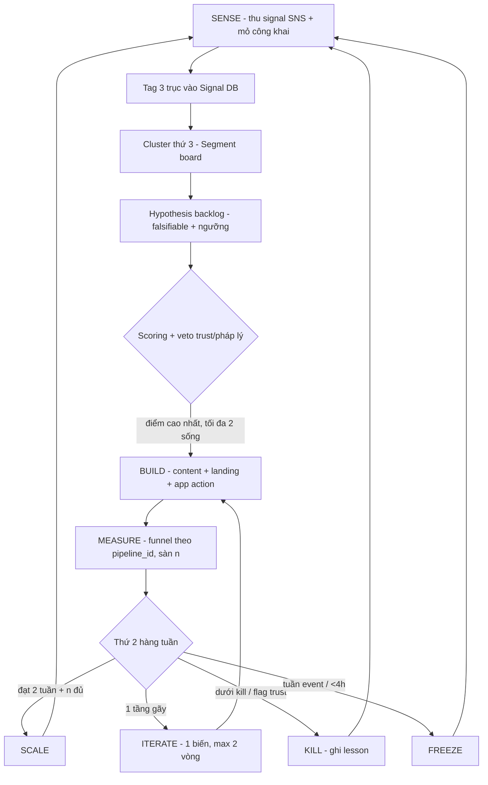

# GROWTH PLAN FINAL — Viet-Japan Platform
**Loop 6 — Synthesizer (Chief Strategy Officer)** · 2026-07-07
Tổng hợp từ: loop1-segments · loop2-pipelines · loop3-conversion · loop4-monetization · loop5-review (scope cut khắc nguyên, không làm mềm)

---

## 0. Governing thought

SNS là đất mượn (cảm biến + cửa hút), web app là đất sở hữu (bộ nhớ + máy đo + nơi duy nhất monetize), email/LINE là đất thuê dài hạn (dây kéo về). Chúng tôi không quản lý pipeline — chúng tôi vận hành **dây chuyền sinh pipeline** theo nhịp tuần. Mọi pipeline đi qua đúng một chuỗi logic:

```
SNS signal → segment → pain → hypothesis → content hook → web action
→ profile data → conversion → monetization → metric → decision (scale/iterate/kill/freeze)
```

Phase 1 KHÔNG có: social network riêng, forum, chat, feed. Không thương lượng.

## 1. Growth Operating System



Nguyên tắc bất biến: mọi link mang `pipeline_id` · kill criteria viết trước launch · mọi pipeline ≥1 trust asset · đỏ độc quyền cảnh báo lừa đảo · delayed signup · APPI đầy đủ (privacy policy, không chỉ "mã hóa") · Phase 1–2 không phí giới thiệu việc/kickback · không số ảo, không scarcity giả.

## 2. Insight taxonomy (chốt)

`Signal = DOMAIN × EMOTION × INTENT + strength(1–3) + nguồn + nguyên văn`

- **DOMAIN (18):** JLPT_N2_GRAMMAR, JLPT_MOTIVATION, VISA_RENEWAL, VISA_CHANGE, JOB_SEARCH, JOB_WORKPLACE, LIVING_COST, TAX_NENKIN, HOUSING, LONELINESS, EVENT_TRUST, SIDE_INCOME, FAMILY_SUPPORT, SCHOOL_APPLICATION, RETURN_HOME, SCAM_ALERT, **HEALTH_ACCESS** (bổ sung Loop 11 — y tế là nhu cầu phổ quát duy nhất plan bỏ trống, đếm tần suất từ Tuần 0), **ADMIN_PAPERWORK** (bổ sung Loop 11 — trợ cấp/hồ sơ hành chính đang bị "dịch vụ FB không license" thu 5–50k¥/lần)
- **EMOTION (7):** ANXIETY, CONFUSION, FRUSTRATION, SHAME, FOMO, DISTRUST, PRIDE (bỏ trống khi không rõ — không đoán)
- **INTENT (8):** HOI_CACH_LAM, HOI_CHI_PHI, HOI_UY_TIN, NHO_LAM_HO (auto strength 3), XA_STRESS, KHOE, TIM_BAN, CANH_BAO
- **Strength:** 1 lẻ tẻ · 2 = ≥5 lần/tuần hoặc ≥2 loại nguồn · 3 = ≥2 loại nguồn + WTP signal. Chỉ ≥2 lên backlog.
- **SQS nguồn (0–6):** DM/quiz result/event feedback/save = 5 · search = 4 · live/group/comment = 3 · share = 2 · poll = 2 · reaction = 1. Insight đạt chuẩn: tổng SQS ≥8, ≥2 loại nguồn.

## 3. Segment framework (12 segment, sau revised priority Loop 5)

| Ưu tiên | Segment | Trigger | Hidden need | Trạng thái 12 tuần đầu |
|---|---|---|---|---|
| 1 | S1 N2-Plateau (4.35) | Trượt/mock thấp, 3 tháng trước thi | Feedback + tiến bộ đo được | **CHẠY — pipeline chính** |
| 2 | S3+S8 Event/Trust (3.75) | 3–18 tháng sau sang / vừa bị lừa | Cớ an toàn gặp người + bằng chứng kiểm chứng được | **CHẠY — nhịp chậm** |
| 3 | S5 Cost-Optimizer (4.00) | Mùa thuế T1–3, nghỉ việc | Con số CỦA TÔI | Chuẩn bị T8, live T11 đón mùa |
| 4 | S6 Grad-Job-Hunter (3.70) | Mùa 就活 | Được chê an toàn (máy không phán xét) | T8+ nếu P-N2 ổn |
| 5 | S2 Visa-Deadline (3.90) | 30–90 ngày trước hạn | Xác nhận không sót | Chỉ checklist+reminder; có phí đợi partner 行政書士 |
| — | S9 Side-Hustler | — | Phân biệt thật/lừa | Phòng thủ: content đỏ, vĩnh viễn |
| Phase 2 | S7 Salary, S11 Return (gộp S5), S12 House, S10 Family, S4 Fresh | — | — | Ngủ đông / nuôi |

Full card 12 segment: xem loop1-segments.md. Lưu ý A4: mọi điểm số là giả thuyết — Tuần 0 listening có quyền lật bảng.

## 4. Insight → Pipeline method

`Raw signal → Interpreted pain (2 câu bắt buộc: "họ thuê giải pháp làm việc gì?" + "vì sao Google/group/senpai chưa giải được?") → Segment → JTBD → Hypothesis 1 câu falsifiable có ngưỡng → Pipeline card 15 trường → Test metric + sàn n`

Scoring chọn pipeline: pain .20 + speed .20 + cost .15 + monetize .15 + audience .10 + fit .10 + data .10 · ×1.2 nếu đúng mùa (JLPT T4-7/T9-12, 就活 T3-6, thuế T1-3, về nước T12-3) · trust/pháp lý risk ≥4 = **veto tuyệt đối**.

## 5. Pipeline archetypes (6)

| ID | Chain | Không dùng khi |
|---|---|---|
| A1 | Pain → Tool/Quiz free → Save progress → Paid | Pain một-lần, không có gì để lưu |
| A2 | Trust proof → Event+cọc → Paid event | Chưa có proof (event #1 = gần vốn để SẢN XUẤT proof) |
| A3 | Search intent → Checklist → Capture → (partner) consultation | Pain cảm xúc mơ hồ |
| A4 | Achievement → Share card → Referral | Chủ đề SHAME; chưa có gì đáng khoe |
| A5 | Anxiety → Assessment → Workshop | Không có chuyên gia có phép đứng lớp — CẤM bán anxiety suông |
| A7 | Career intent → Profile pool → (P3) partner | Bán lead trước license — CẤM. Cả archetype hoãn Phase 2 |

2 pipeline sống 12 tuần đầu (theo Loop 5): **P-N2** (A1) và **P-EVENT** (A2). P-SCAM chạy nền không tính. Chi tiết route/hypothesis/kill: loop2-pipelines.md.

**Bổ sung Loop 7-8 (2026-07-08):** **P-REMIT** (A3, so sánh phí kiều hối + affiliate) chạy NỀN như P-SCAM — không tính vào 2 pipeline sống, vì MVP là bảng so sánh tĩnh cập nhật tay, không theo mùa, chi phí gần 0. Bắt đầu 1 affiliate partner trước khi mở rộng. KPI: landing→click affiliate ≥8% (n≥150). Chi tiết: loop7-brainstorm-new-ideas.md, loop8-execution-brainstorm.md.

**Bổ sung Loop 11 (2026-07-09) — Idea backlog need-driven (top 10 từ 30 ý, đã chấm need-strength trước, không ưu ái asset có sẵn).** Không ý nào chiếm suất 2 pipeline sống trước Gate 2; vào theo 2 cửa:
- *Cửa NỀN (content/checklist chạy như P-SCAM, chi phí ~0):* Bộ y tế lần đầu (chọn khoa + thẻ triệu chứng song ngữ + protocol ốm đêm) · So sánh gửi hàng Việt–Nhật có pháp nhân · Checklist chốt quyền lợi trước khi nghỉ việc (有給/退職金) · Sổ tay câu nói an toàn nơi làm việc
- *Cửa PHASE 2 (candidate pipeline, chuẩn bị/presale cuối kỳ):* **Máy quét trợ cấp theo tình huống** (#1 — bằng chứng WTP kép mạnh nhất) · **Tự chấm điều kiện 永住** (#2 — thay khoản 30–50k¥ đang trả 行政書士) · Luyện đề bằng lái + 外免切替 theo tỉnh · Gói "rời nhà không mất oan một yên" (敷金/chuyển nhà/火災保険) · Bộ tự tạo hồ sơ mời bố mẹ · Luyện thi 特定技能 theo ngành
- *Insight định hướng:* vùng trống lớn nhất = **self-service hoá thủ tục hành chính** (thay "kinh tế dịch vụ giấy tờ không license" trên FB đang thu 5–50k¥/lần). Điều kiện pháp lý từng ý (行政書士法/弁護士法/保険業法/y tế): loop11/top10-final.md.

## 6. Conversion mechanism library (tóm tắt vận hành)

- 3 động lực rời SNS: **kết quả CỦA TÔI** / **cần lưu-dùng lại** / **khan hiếm thật**. CTA không thuộc nhóm nào = bỏ.
- Landing = chính hành động (câu quiz số 1), không trang giới thiệu.
- Thang cam kết 6 bậc: vào (hỏi 0) → nhận full kết quả → login chỉ để LƯU → +1 field/lần quay lại → trả tiền sau aha thứ 2 → share ở đỉnh cảm xúc DƯƠNG.
- Chủ đề SHAME (CV/visa/tiền): không leaderboard, không "X người đang xem"; riêng tư là feature; APPI viết thành copy tăng conversion ("không đăng nhập thì xoá ngay").
- Copy CTA: ghi thời gian ("2 phút") + phá friction trong câu ("không cần đăng ký, không xin SĐT" — A18: nói thẳng cái họ sợ).
- Sửa theo A1: cấm chữ "đề thật" — câu hỏi 100% tự viết "chuẩn format đề".
- Full library + copy từng pipeline: loop3-conversion.md.

## 7. Monetization discovery

- Nguyên tắc: offer thay khoản đang chảy đi chỗ khác (đại lý 10–20%, trường ¥50–150K, kèo ¥8–15K) hoặc cứu khoản mất trắng (nenkin bỏ quên).
- 4 dòng Phase 1–2: one-shot nhỏ (¥1,500–9,800) · service qua partner có phép · event (¥2–5K + cọc ¥1,000) · sub nhẹ (¥980/th). B2B trường tiếng = dòng nhân bản sớm nhất, tiền tính 2027.
- 3 phép đo giá: ladder 2 giá theo pid · hỏi 1 câu sau aha · đọc phản ứng giá trong DM.
- Trust gating T0–T3; ngưỡng build = ≥30 người TRẢ THẬT (waitlist join ≠ bằng chứng — A10).
- Điều kiện tiên quyết mọi thu tiền: **pipeline pháp lý tuần 1** (mục 10).
- Full matrix + 10 experiments: loop4-monetization.md (M4 tư vấn thuế 1-1 ĐÃ SỬA theo A2: thông tin chung hoặc partner đứng tên).

## 8. Measurement system

- **North Star: profile sống** = ≥1 field profile + ≥1 hành động giá trị trong 28 ngày.
- 3 tầng nối bằng pipeline_id (first-touch, localStorage): SNS (retention, save, **JP-IP click** — không phải view, A3) → App (landing→start ≥50%, complete ≥30%, signup ≥8%, D7 ≥15%) → Money (offer→pay ≥5%, click→done ≥30%).
- Benchmark = giả định làm việc: 4 tuần đầu chỉ so TƯƠNG ĐỐI giữa biến thể (A19).
- Sàn n: 100/tầng funnel, 30/offer. Ghi số dạng "12/40", không "30%".
- Event taxonomy `object_action` + property {pipeline_id, src}: chi tiết Growth OS v2 tab 09.
- Vanity list (cấm đưa vào dashboard): tổng view, follower, tổng lượt quiz all-time, waitlist không giá.

## 9. Weekly cadence + Founder dashboard

Nhịp: T2 review 90' → T3 cluster 60' → T4 hypothesis+script 105' → T5 batch quay 2h → T6 đăng → T6-CN collect 15'/ngày. Tổng 14h (ledger tab loop). Chế độ **duy trì tối thiểu 4h/tuần** (1 recycle + reply + review) là chế độ chính thức, không phải thất bại (A20). Log 5 dòng/ngày = đạt (A14).

**Founder dashboard — 1 màn hình, nhìn mỗi thứ 2 (9 số):**

| # | Số | Nguồn | Báo động khi |
|---|---|---|---|
| 1 | Profile sống (North Star) | Sheet | Không tăng 2 tuần |
| 2 | Signal mới/tuần + số ngày có log | Signal DB | <20 dòng hoặc <4 ngày |
| 3 | JP-IP click theo pipeline | Analytics | Tụt >50% |
| 4 | Funnel P-N2: start/complete/signup (dạng n/n) | Analytics | Dưới kill với n đủ |
| 5 | Funnel P-EVENT: register/cọc/attend | Sheet | attend <70% |
| 6 | ¥ thu thật tuần này + luỹ kế | Monetization tracker | — |
| 7 | WTP signals (DM hỏi giá, NHO_LAM_HO) | Signal DB | — |
| 8 | Giờ đã dùng / 14h | Ước tay | >14h hai tuần liền |
| 9 | Trust flags (complaint, hiểu nhầm giá) | Mọi kênh | ≥1 = họp khẩn với chính mình |

## 10. Must / Should / Later

**MUST (tuần 0–2, chặn mọi thứ khác):**
1. Pipeline pháp lý (~6–8h): privacy policy + mục đích sử dụng data · trang 特定商取引法 + chính sách hoàn · tài khoản thanh toán business (Stripe/Square — không PayPay cá nhân) · rà 100% câu quiz là tự viết · **(bổ sung Loop 8) nhãn "PR/quảng cáo" rõ trên mọi link affiliate (P-REMIT, SIM) — bắt buộc theo ステマ規制, hiệu lực từ 10/2023**
2. Tuần 0 listening: 100 dòng Signal DB từ mỏ công khai + dùng thử 3 app đối thủ (Migii/Mochi/…) → viết USP P-N2 trong 1 câu · **(bổ sung Loop 8) list 5-10 group Facebook mục tiêu + đọc rule đăng bài từng group** (kênh song song TikTok, né rủi ro sai geo A3) · **(bổ sung Loop 11) tag thêm 2 domain mới HEALTH_ACCESS + ADMIN_PAPERWORK khi listening — đếm tần suất thật để xác nhận/bác top 10 backlog Loop 11**
3. Hạ tầng OS: Sheet 6 board + pid convention + analytics + lọc IP bản thân
4. P-N2 launch: 2 video A/B + quiz + phiếu điểm + M1 waitlist có giá

**SHOULD (tuần 3–8):** event #1 ≤16 người gần vốn — **(sửa Loop 8) co-host với hội đồng hương/chùa/NPO qua network cá nhân trước (không cold outreach)**, họ góp địa điểm/quảng bá, mình lo nội dung/vận hành → recap → P-EVENT có cọc · LINE OA 3 chạm · share card phiếu điểm (mùa kết quả T8) · M8 khảo sát giá · iterate P-N2 theo data

**LATER (tuần 9+/Phase 2):** P-TAX (content T8, tool T11) · P-CV (T8+ nếu P-N2 ổn) · M6 workshop khi có partner 行政書士 · B2B 3 cuộc gặp (tiền 2027) · P-SALARY/P-RETURN/tour license/recruiter — Phase 2–3

## 11. 2-week first experiment plan

Tiền đề: Tuần 0 + pipeline pháp lý xong.

- **T1-T2/T3:** dựng nốt hạ tầng đo; viết Pipeline Card P-01 (kill criteria ký trước); **T4:** script 2 video từ nguyên văn Signal DB; **T5:** batch quay; **T6 tối:** đăng (pid P-01-a/b) + M1 waitlist ¥4,900 dưới phiếu điểm; **T6-CN:** collect + reply.
- **T2-T2:** review #1 — hook thắng theo JP-IP click + funnel số dạng n/n; quyết iterate 1 biến; **T3-T5:** chạy biến thắng + công bố event #1 (≤16 người, cọc ¥1,000, bảng chi phí theo khoản mục — không đăng hoá đơn thô, A15); **CN:** review #2.
- Thành công sau 2 tuần: ≥1 hook JP-IP CTR ≥1% · complete ≥25% (n≥100) · ≥5 waitlist thấy giá · ≥8 cọc event · Signal DB ≥160 dòng · giờ ≤14h/tuần.
- Dưới ngưỡng: so tương đối, iterate 1 biến/tuần, không kill tuyệt đối trong 4 tuần đầu.

## 12. 12-week roadmap

| Tuần | Trọng tâm | Gate cuối kỳ |
|---|---|---|
| 0 | Listening + pháp lý + đối thủ | 100 signal · USP 1 câu · pháp lý xong |
| 1–2 | P-N2 launch + M1 | Funnel đo được sạch, n bắt đầu tích |
| 3–4 | Iterate P-N2 · event #1 (gần vốn) | **GATE 1:** complete ≥25% (n≥100) & attend ≥70% → tiếp. Cả hai fail sau iterate → quay lại Signal DB chọn giao điểm khác |
| 5–6 | Recap → P-EVENT #2 có margin · LINE OA · M8 khảo sát giá | ≥8 cọc event #2 · ≥100 câu trả lời giá |
| 7–8 | Share card mùa kết quả JLPT (T8) · M2 ladder giá · quyết định mở P-CV | **GATE 2 (mốc đo, KHÔNG chặn build — app build song song từ tuần 1):** ≥30 người trả thật bất kỳ offer nào → mở bán premium chính thức + tăng đầu tư. Chưa → app vẫn hoàn thiện, chỉ hoãn mở bán rộng |
| 9–10 | P-CV launch (nếu P-N2 ổn) hoặc dồn P-N2 · content P-TAX trái mùa | Signal DB ≥600 dòng · profile sống ≥300 |
| 11–12 | Tool thuế live đón mùa · B2B 3 cuộc gặp · presale M7 nếu đúng mùa | **GATE 3:** MRR+one-shot ≥¥30K/tháng & 2 pipeline proven → viết kế hoạch Q1/2027 + tăng tốc app (app đã build song song theo SDD từ đầu, gate chỉ quyết mức đầu tư tiếp) |

## 13. Final business plan (1 đoạn, không mềm)

12 tuần tới là xây app SONG SONG với chứng minh 3 điều bằng tiền và data thật: (1) người Việt tại Nhật chịu rời SNS vì kết quả cá nhân hoá (P-N2); (2) minh bạch chi phí chuyển được người-đã-bị-lừa thành người-trả-tiền (P-EVENT); (3) có ít nhất một offer ≥30 người trả thật. App build liên tục theo SDD (Codex) và học từ funnel data mỗi tuần; 3 điều trên quyết định mức đầu tư và hướng feature, không quyết định có build hay không. Đạt cả ba → Phase 2 mở rộng theo mùa (thuế→就活→visa partner) với OS đã chạy trơn; hụt ≥2 → toàn bộ giả định nền của business plan v2.1 phải xét lại trước khi mở rộng đầu tư thêm. Người ra quyết định duy nhất là dashboard 9 số, mỗi thứ 2.

## Templates dùng hàng tuần
7 template (Insight Log, Segment/Hypothesis/Pipeline/Experiment/Monetization Card, Weekly Review): đã chốt trong Growth OS v2 tab 12 — dùng nguyên, thêm 2 trường vào Weekly Review: "số ngày có log" và "giờ đã dùng/14h".

## Quality bar tự chấm (Loop 6)
Specificity 5 · Practicality 5 · Monetization 4 (doanh thu 12 tuần chủ đích khiêm tốn — trung thực hơn là đẹp) · Measurement 5 · Risk 5 → đạt. Sang Vòng 7–9 (plan tuần/tháng/năm).
