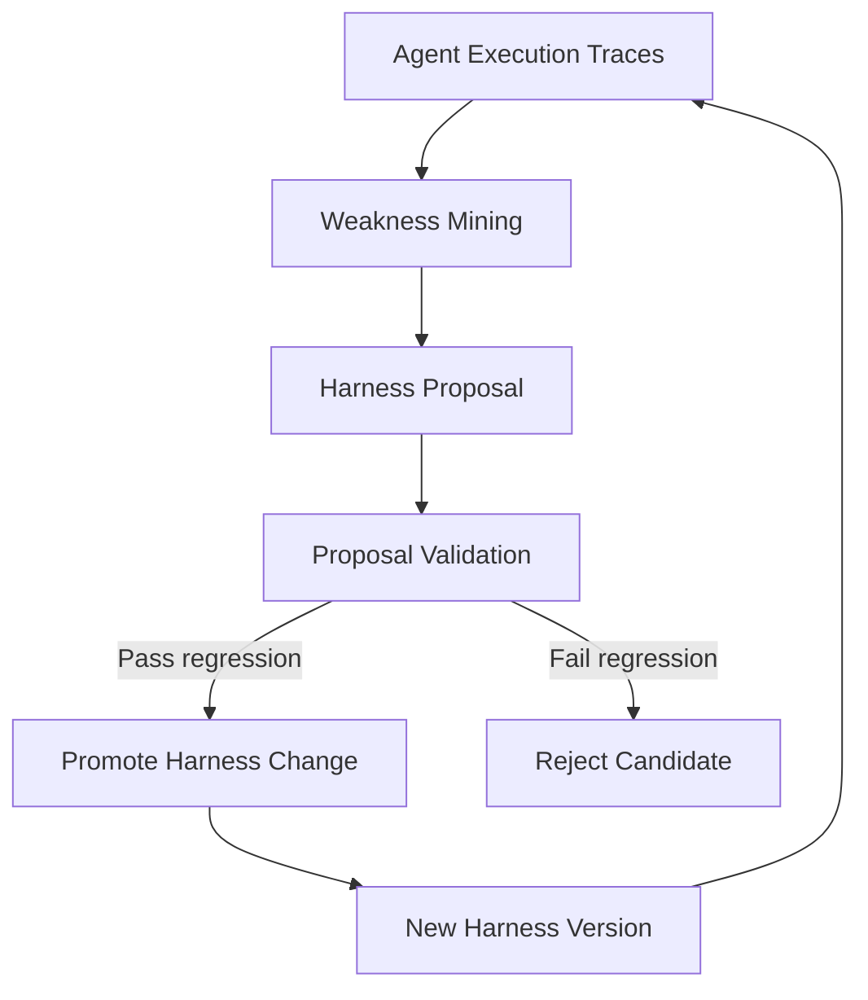
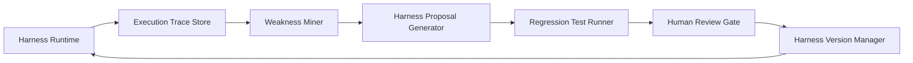

# 12. Self-Harness: Harnesses That Improve Themselves

## Position in the Harness Learning Path

This note should be studied after the basic Harness architecture modules:

1. Agent runtime and orchestration
2. Tool manager and sandbox runtime
3. Workflow customization
4. Skill library / prompt library
5. Evaluation and regression testing
6. Harness observability
7. Self-Harness / Harness evolution

The key shift is this:

> A normal Harness executes an agent workflow. A Self-Harness observes failed executions, mines weaknesses, proposes Harness edits, validates them with regression tests, and then promotes safe changes into the Harness.

This turns Harness design from a manually maintained configuration layer into an iterative improvement system.

---

## Paper Reference

**Title:** Self-Harness: Harnesses That Improve Themselves  
**Authors:** Hangfan Zhang, Shao Zhang, Kangcong Li, Chen Zhang, Yang Chen, Yiqun Zhang, Lei Bai, Shuyue Hu  
**Affiliation:** Shanghai Artificial Intelligence Laboratory  
**Preprint date shown in screenshot:** 8 Jun 2026

---

## Core Problem

LLM agent performance is not determined only by the base model. It is jointly shaped by:

- The base LLM
- The Harness that mediates its interaction with the environment
- Tool definitions
- Prompt templates
- Workflow structure
- Routing policies
- Memory policy
- Evaluation and validation logic

Traditional Harness engineering is still heavily manual. Engineers observe failures, inspect logs, modify prompts or workflows, and retest. This approach scales poorly because different models expose different failure modes and modern LLMs evolve quickly.

Self-Harness proposes that the agent can improve its own operating Harness without relying on stronger external agents or manual engineering.

---

## Three-Stage Self-Harness Loop



### 1. Weakness Mining

The system analyzes execution traces to identify recurring, model-specific failure patterns.

Examples:

- Tool call format errors
- Wrong tool selection
- Repeated planning loops
- Missing verification step
- Weak decomposition of tasks
- Overly broad search behavior
- Failure to preserve state between steps
- Poor handling of terminal/runtime feedback

The output should be concrete weakness records, not generic advice.

Recommended internal schema:

```json
{
  "weakness_id": "WH-001",
  "source_trace_ids": ["trace-2026-001", "trace-2026-017"],
  "failure_pattern": "Agent repeatedly retries shell command without inspecting stderr",
  "affected_models": ["model-a"],
  "affected_workflows": ["coding-task-runtime"],
  "hypothesis": "The Harness lacks an explicit stderr interpretation step before retry",
  "severity": "high"
}
```

### 2. Harness Proposal

The system generates candidate Harness edits that are minimal but targeted.

Candidate edits may include:

- Prompt patch
- Tool description patch
- Workflow step insertion
- Planner policy change
- Retry policy change
- Model routing rule
- Validation checklist
- Memory write/read policy
- Sandbox execution policy

Important principle:

> Do not merely add generic instructions. Convert observed weaknesses into executable Harness changes.

Recommended proposal schema:

```json
{
  "proposal_id": "HP-001",
  "linked_weakness_id": "WH-001",
  "edit_type": "workflow_step_insert",
  "target_file": "harness/workflows/coding-task.yaml",
  "patch_summary": "Insert stderr diagnosis step before retrying failed shell commands",
  "expected_improvement": "Reduce repeated terminal retry failures",
  "risk": "May slow down simple command recovery"
}
```

### 3. Proposal Validation

Candidate changes are accepted only after regression testing.

Validation should test:

- Does the candidate improve the failed cases?
- Does it preserve performance on previously passing cases?
- Does it avoid increasing latency or cost beyond threshold?
- Does it avoid unsafe tool behavior?
- Is the edit small enough to audit?

Recommended validation gate:

```yaml
validation_gate:
  required:
    - failed_case_replay_pass_rate_improves
    - held_out_regression_does_not_drop
    - no_new_security_policy_violation
    - cost_delta_under_threshold
    - human_review_required_for_production
```

---

## How to Apply This to ai-project-opus

For the AI project Opus Harness, Self-Harness should not be implemented as a fully autonomous self-modifying system at the beginning. It should be implemented as a controlled CI/CD layer for Harness improvement.

Recommended architecture:



Production rule:

> The system may propose Harness changes automatically, but production promotion must remain human-gated.

---

## Learning Objectives

After studying this module, the learner should be able to:

1. Explain why Harness quality is model-specific.
2. Distinguish between improving the model and improving the Harness.
3. Design an execution trace schema that supports failure mining.
4. Convert recurring failures into concrete Harness patch proposals.
5. Build a regression gate for Harness changes.
6. Explain why self-improvement must be versioned, auditable, and reversible.

---

## Practical Exercise

### Exercise 1: Trace Mining

Take 10 failed agent runs from the Harness runtime and classify each failure into one of the following groups:

- Planning failure
- Tool selection failure
- Tool parameter failure
- Runtime/sandbox failure
- Memory failure
- Verification failure
- User intent misunderstanding
- Output formatting failure

Output file:

```text
evals/weakness-mining/weakness_report.md
```

### Exercise 2: Harness Proposal

For each high-frequency weakness, create one minimal Harness edit proposal.

Output file:

```text
evals/harness-proposals/proposals.jsonl
```

### Exercise 3: Regression Gate

Build a small regression suite with:

- 5 previously failed cases
- 10 previously passed cases
- 3 safety-sensitive cases
- 3 cost/latency-sensitive cases

Output file:

```text
evals/regression/self_harness_gate.yaml
```

---

## Where This Fits in the Enterprise Harness Roadmap

Self-Harness belongs in Phase 4 or Phase 5, not Phase 1.

Recommended sequence:

| Phase | Focus | Self-Harness Role |
|---|---|---|
| Phase 1 | Manual Harness MVP | Collect traces only |
| Phase 2 | Tool manager + sandbox | Add structured error traces |
| Phase 3 | Evaluation layer | Build regression suite |
| Phase 4 | Weakness mining | Generate weakness reports |
| Phase 5 | Proposal validation | Auto-generate candidate patches, human-gated merge |
| Phase 6 | Controlled self-improvement | Versioned Harness evolution |

---

## Key Design Rule for Opus

Do not allow the agent to directly rewrite production Harness files.

Use this controlled flow instead:

```text
execution trace
  -> weakness report
  -> proposal JSONL
  -> candidate branch
  -> regression test
  -> human review
  -> merge
  -> versioned Harness release
```

This makes Self-Harness suitable for enterprise AI projects because every improvement remains traceable, testable, reviewable, and reversible.

---

## Relationship to Existing Harness Modules

| Existing Module | Self-Harness Extension |
|---|---|
| Tool Manager | Mine tool misuse and patch tool descriptions or schemas |
| Workflow Engine | Insert, remove, or reorder workflow steps based on failure traces |
| Skill Library | Promote recurring successful prompts into reusable skills |
| Model Router | Route tasks to models based on observed model-specific weakness |
| Sandbox Runtime | Convert runtime errors into structured learning signals |
| Evaluation Layer | Validate candidate Harness changes before promotion |
| Version Manager | Track Harness releases and rollback unsafe changes |

---

## Summary

Self-Harness is the evolution layer of an AI Harness. It does not replace the base architecture. It sits above runtime, observability, and evaluation, then uses execution traces to improve prompts, workflows, routing, tool policies, and validation logic.

For ai-project-opus, the immediate value is not full autonomy. The immediate value is building a disciplined loop:

> Run agent tasks → collect traces → mine weaknesses → propose Harness edits → regression test → human review → versioned release.

This should become the long-term improvement loop for the Opus Harness.