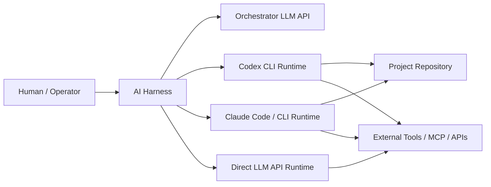
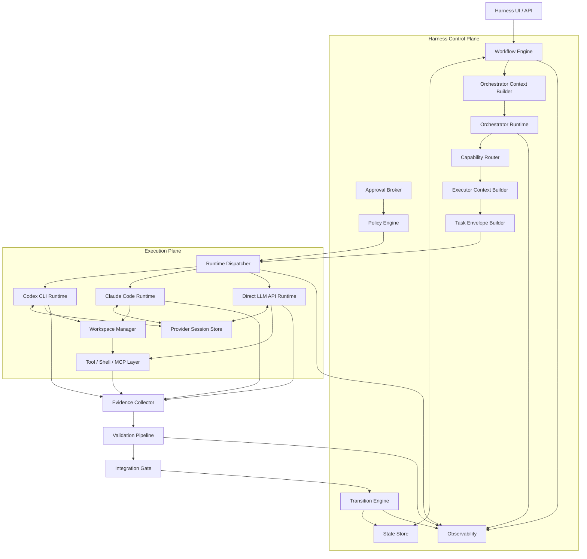
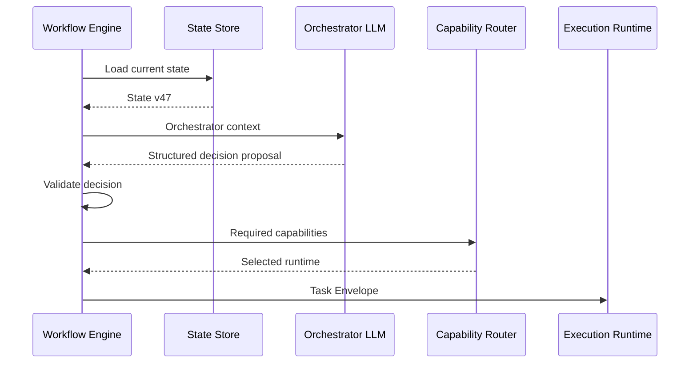

# AI Harness Overall Architecture Design

**Document Type:** System Architecture Design  
**Version:** 1.02  
**Status:** Architecture Baseline Candidate  
**Date:** 2026-08-15  
**Scope:** AI Harness Control Plane, Orchestrator LLM Runtime, and Heterogeneous Execution Runtimes  
**Primary Execution Runtimes:** Codex CLI, Claude Code/CLI, Direct LLM API  
**Architecture Review Method:** arc42-lite + C4 + ADR + ATAM-lite

---

## 1. Purpose

Tài liệu này định nghĩa kiến trúc tổng thể cho một AI Harness trong đó:

- Harness sở hữu workflow orchestration và authoritative state.
- Harness sử dụng một LLM API làm reasoning/orchestration runtime có thể thay thế.
- Harness có thể dispatch task sang nhiều execution runtime khác nhau:
  - Codex CLI
  - Claude Code / Claude CLI
  - Direct LLM API
  - các runtime khác trong tương lai
- Coding/agent CLI không được mặc định coi là “brain” hay control plane của Harness.
- External execution runtime có thể giữ working memory/session riêng, nhưng không sở hữu workflow truth.
- Agent output không tự động trở thành workflow state.
- State transition chỉ xảy ra qua deterministic Harness control logic sau validation.
- Runtime/provider có thể thay đổi mà không yêu cầu viết lại core workflow.

Kiến trúc này tối ưu cho tiến trình từ single-agent PoC đến multi-runtime, multi-agent execution platform.

---

## 2. Architectural Premise

### 2.1 Core Premise

Hệ thống được xây theo ba tầng trách nhiệm:

```text
1. Deterministic Harness Core
   = State + Workflow + Policy + Transition + Validation authority

2. Orchestrator Reasoning Runtime
   = LLM API dùng để phân tích, đề xuất kế hoạch, chọn capability và đề xuất next action

3. Execution Runtime
   = Codex CLI / Claude Code / Direct LLM API thực hiện specialist task
```

### 2.2 Architectural Rule

```text
Role ≠ Provider ≠ Transport
```

Ví dụ:

```text
Claude API
→ có thể làm Orchestrator Runtime

Claude Code CLI
→ có thể làm Execution Runtime

OpenAI API
→ có thể làm Orchestrator Runtime hoặc Direct LLM Execution Runtime

Codex CLI
→ chủ yếu làm Execution Runtime
```

### 2.3 Primary Boundary

```text
LLM may propose.
Harness decides.
Execution agent performs.
Evidence proves.
State transition commits.
```

---

## 3. Scope

### 3.1 In Scope

- Workflow orchestration
- Authoritative Harness State
- LLM-based orchestration reasoning
- Structured orchestration decisions
- Runtime capability routing
- Codex CLI integration
- Claude Code / CLI integration
- Direct LLM API execution
- Provider session continuity
- Context selection
- Task envelope construction
- Runtime policy enforcement
- Approval management
- Workspace lifecycle
- Evidence collection
- Validation
- State versioning
- Retry, timeout and recovery
- Execution observability
- Parallel execution foundation
- Integration gate

### 3.2 Out of Scope for V1.02

- Enterprise semantic long-term memory
- Autonomous workflow rewriting
- Fully distributed multi-machine execution
- Autonomous production deployment
- Cross-provider conversation-memory synchronization
- Advanced model-cost optimization
- Fully autonomous semantic merge conflict resolution

---

## 4. Business Drivers

### BD-01 — Provider Independence

Harness phải có thể thay Orchestrator LLM hoặc Execution Runtime mà không rewrite core workflow.

### BD-02 — AI-Assisted Orchestration with Deterministic Control

LLM được dùng để reasoning, decomposition và recommendation nhưng không được trực tiếp sở hữu workflow transition authority.

### BD-03 — Heterogeneous Execution

Cùng một workflow có thể sử dụng Codex CLI, Claude Code và Direct LLM API dựa trên capability của task.

### BD-04 — Long-Running Specialist Execution

Coding agent phải có khả năng duy trì execution context, đọc repository, dùng shell/tool và tiếp tục review/revise loop.

### BD-05 — Human and Harness Governance

Human gate, approval, policy, state transition và auditability phải nằm ngoài execution agent.

### BD-06 — Evolution from Single-Agent to Multi-Agent

Kiến trúc phải hỗ trợ mở rộng dần từ một execution agent sang parallel specialist agents mà không làm thay đổi control-plane core.

---

## 5. Business Constraints & Target Scale

Các target dưới đây là baseline V1.02 và có thể được điều chỉnh bằng ADR hoặc release planning.

| Constraint / Target | V1.02 Baseline |
|---|---|
| Concurrent execution | 1–5 active executions |
| State loss tolerance | 0 committed state transitions |
| Canonical workspace corruption tolerance | 0 |
| Orchestrator provider replacement | Không thay Workflow Engine |
| Execution provider replacement | Không thay Workflow State model |
| Runtime failure recovery | Workflow state phải recoverable |
| Session persistence | Per execution concern / configurable |
| Human approval | Explicit for sensitive operations |
| Context budget | Selected context; no full-state dump by default |
| Parallel writers | Chỉ sau workspace isolation + integration gate |

---

## 6. Architecturally Significant Requirements

### ASR-01 — State Consistency

Workflow state không được phụ thuộc vào conversational memory của model, agent CLI hoặc provider session.

### ASR-02 — Orchestration Determinism

LLM orchestrator chỉ được đề xuất structured decision. Chỉ deterministic Harness Runtime mới được commit workflow transition.

### ASR-03 — Provider Independence

Workflow Engine không phụ thuộc trực tiếp vào OpenAI, Anthropic, Codex CLI, Claude CLI, MCP hoặc provider-specific protocol.

### ASR-04 — Runtime Capability Heterogeneity

Không giả định mọi runtime có cùng capability. Routing phải dựa trên capability contract.

### ASR-05 — Execution Continuity

Execution runtime phải có thể tiếp tục working context nếu provider hỗ trợ persistent session.

### ASR-06 — Failure Isolation

Agent/runtime failure không được làm corrupt committed Harness State hoặc canonical workspace.

### ASR-07 — Security Boundary

Permission phải được enforce qua policy/runtime/sandbox, không chỉ bằng prompt.

### ASR-08 — Evidence-Based Validation

Agent statement là non-authoritative. Workflow completion cần observable evidence khi evidence có thể thu thập được.

### ASR-09 — Context Efficiency & Fidelity

Harness phải truyền đúng context cần thiết cho từng role/call, tránh full-history/full-state dumping.

### ASR-10 — Concurrent Execution Safety

Parallel execution phải có state-version conflict detection và workspace isolation.

### ASR-11 — Semantic Integration Safety

Kết quả parallel execution phải qua integration gate; clean Git merge không đồng nghĩa semantic consistency.

### ASR-12 — Observability

Mọi decision, execution, evidence, validation và transition phải trace được theo correlation IDs.

---

## 7. Architecture Principles

### 7.1 Harness State Is Authoritative

```text
Harness State
    >
Provider Session Memory
    >
Agent Report
```

Nếu session memory conflict với Harness State thì Harness State luôn thắng.

### 7.2 LLM Orchestrator Is Advisory, Not Authoritative

```text
Orchestrator LLM
    ↓
Structured Decision Proposal
    ↓
Harness Rule / Transition Validation
    ↓
Accepted or Rejected
```

### 7.3 Execution Agent Is a Worker, Not the Workflow Engine

Codex CLI hoặc Claude Code có thể đọc, sửa, chạy tool/test và report kết quả; chúng không được tự quyết định state transition, gate bypass, retry policy hoặc workflow completion.

### 7.4 Prompt Is Not a Security Boundary

```text
Prompt / Instructions
= SHOULD / HOW

Policy / Sandbox / Approval
= CAN / CANNOT
```

### 7.5 Context Is Selected, Not Dumped

Context được build theo role và task; full workflow state hoặc full chat history không được truyền mặc định.

### 7.6 Evidence Over Claims

Nếu agent nói “tests passed”, Harness phải ưu tiên test exit code hoặc test artifact thực tế.

### 7.7 Runtime Capability Before Provider Name

Router chọn runtime theo capability requirement trước, provider name sau.

### 7.8 Canonical Workspace Is Protected

Agent không được mặc định sửa trực tiếp canonical workspace trong execution có khả năng fail hoặc parallelize.

---

## 8. System Context View



---

## 9. High-Level Architecture



---

## 10. Control Plane vs Execution Plane

### 10.1 Control Plane

Control Plane sở hữu:

- Workflow Engine
- State Store
- Transition Engine
- Policy Engine
- Approval Broker
- Orchestrator Context Builder
- Orchestrator Runtime
- Capability Router
- Executor Context Builder
- Task Envelope Builder
- Validation policy
- Observability model

Control Plane là nơi deterministic workflow authority tồn tại.

### 10.2 Execution Plane

Execution Plane gồm:

- Codex CLI Runtime
- Claude Code Runtime
- Direct LLM API Runtime
- Provider sessions
- Workspace Manager
- Shell/tools/MCP
- Runtime-native agent loop

Execution Plane có quyền thực hiện task trong giới hạn policy nhưng không sở hữu workflow truth.

---

## 11. Orchestrator Runtime

### 11.1 Role

Orchestrator Runtime dùng LLM API để:

- hiểu current situation
- phân tích state delta
- đề xuất decomposition
- đề xuất required capabilities
- đề xuất next action
- đề xuất specialist role

### 11.2 Interface

```text
OrchestratorRuntime

decide(
    orchestrator_context,
    available_capabilities
) -> OrchestrationDecision
```

### 11.3 Provider Implementations

```text
OrchestratorRuntime
    ├── OpenAIOrchestrator
    ├── ClaudeAPIOrchestrator
    ├── GeminiOrchestrator
    └── OtherAPIOrchestrator
```

### 11.4 Structured Decision Contract

Ví dụ:

```json
{
  "action": "delegate",
  "task_role": "coder",
  "required_capabilities": [
    "filesystem_write",
    "shell",
    "persistent_session"
  ],
  "objective": "Revise API error handling",
  "reason": "Reviewer rejected current API design"
}
```

Structured decision là proposal, không phải committed state transition.

### 11.5 Why CLI Is Not the Primary Brain

Codex CLI / Claude Code CLI có thể technically thực hiện planning, nhưng không được dùng làm primary control-plane brain mặc định vì chúng bundle:

- provider session state
- filesystem access
- tool loop
- execution lifecycle
- runtime-specific behavior

Dùng CLI làm primary brain làm tăng:

- provider coupling
- hidden state
- replay complexity
- state reconciliation complexity
- control/execution boundary ambiguity

CLI có thể làm planner/reviewer task nhưng output vẫn phải quay về Harness deterministic control.

---

## 12. Execution Runtime Abstraction

### 12.1 Common Interface

```text
ExecutionRuntime

execute(task_envelope)
continue_execution(execution, task_envelope)
cancel(execution)
get_capabilities()
```

### 12.2 Runtime Families

```text
ExecutionRuntime
    ├── AgentCLIRuntime
    │     ├── CodexRuntime
    │     └── ClaudeCodeRuntime
    │
    └── LLMApiRuntime
          ├── OpenAIRuntime
          ├── ClaudeAPIRuntime
          └── OtherLLMRuntime
```

### 12.3 Capability Contract

Ví dụ:

```text
reasoning
filesystem_read
filesystem_write
shell
repo_search
tool_execution
mcp
persistent_session
session_resume
sandbox
approval
streaming
```

Router không được assume mọi runtime support mọi capability.

---

## 13. Capability-Based Routing

Ví dụ task:

```text
Review architecture document
```

Required:

```text
reasoning
read_artifact
```

Candidate:

```text
Direct LLM API
Codex
Claude Code
```

Ví dụ task:

```text
Fix backend and run tests
```

Required:

```text
filesystem_write
repo_search
shell
persistent_session
```

Candidate:

```text
Codex CLI
Claude Code
```

Direct LLM API chỉ phù hợp nếu Harness cung cấp Tool Broker tương ứng.

---

## 14. Context Architecture

Hai context builder được tách rõ vì Orchestrator và Executor cần context khác nhau.

### 14.1 Orchestrator Context Builder

Input có thể gồm:

- current workflow stage
- task graph
- current state summary
- artifact status
- review findings
- human decisions
- runtime capability catalog
- relevant policy constraints

Không cần full source code.

### 14.2 Executor Context Builder

Input có thể gồm:

- objective
- authoritative state delta
- acceptance criteria
- review findings
- constraints
- artifact locators
- workspace path
- prior provider session reference

Không cần full workflow graph.

### 14.3 Context Authority

```text
Harness State
    │
    ├── Orchestrator Context Builder
    │       ↓
    │   Orchestrator LLM
    │
    └── Executor Context Builder
            ↓
        Execution Runtime
```

---

## 15. Task Envelope

Task Envelope là execution boundary giữa Control Plane và Execution Plane.

```text
AgentTaskEnvelope

execution_id
run_id
task_id
state_version

objective
role
required_capabilities

authoritative_state_subset
artifact_references
review_findings
constraints
acceptance_criteria

workspace_reference
provider_session_reference
```

Ví dụ:

```yaml
execution_id: EXE-104
run_id: RD-BD-001
task_id: API-REVISION-02
state_version: 47

role: coder

objective:
  Revise API error handling.

required_capabilities:
  - filesystem_write
  - repo_search
  - shell
  - persistent_session

authoritative_state:
  stage: API_DESIGN
  review_status: REJECT
  revision: 2

artifact_references:
  - docs/requirements.md
  - design/api.md

review_findings:
  - Pagination contract missing
  - Error schema inconsistent

constraints:
  - Do not modify requirement documents

acceptance_criteria:
  - API design updated
  - Relevant tests or validations pass
```

---

## 16. State Model

### 16.1 Harness State

Harness State là authoritative workflow state.

Ví dụ:

```text
run_id
workflow_stage
status
state_version
artifacts
reviews
human_decisions
retry_count
execution_refs
```

### 16.2 Provider Session

Provider Session chỉ lưu continuity của runtime.

```text
provider
provider_session_id
provider_thread_id
parent_thread_id
agent_id
cwd
created_at
last_used_at
status
```

### 16.3 Authority Rule

```text
Harness State
    ↓ authoritative snapshot/delta
Provider Session
    ↓ execution
Agent Result
    ↓ validation
Harness State
```

Không có bidirectional state synchronization ngang hàng giữa Harness State và agent memory.

---

## 17. Provider Session Strategy

Session reuse giúp:

- giảm repo re-discovery
- tăng continuity
- giảm token/cost
- hỗ trợ review/revise

Nhưng tăng risk:

- stale assumptions
- hidden state
- reproducibility loss

Rule:

```text
reuse_thread != trust_thread
```

Mỗi follow-up phải inject tối thiểu:

- current state version
- current objective
- current findings
- critical invariants

Session lifetime là configurable và phải có ADR riêng.

---

## 18. Workspace Lifecycle

Workspace isolation là requirement cho cả failure safety và future parallelism.

### 18.1 Execution Lifecycle

```text
CREATE ISOLATED WORKSPACE
        ↓
EXECUTE
        ↓
COLLECT EVIDENCE
        ↓
VALIDATE
        ↓
COMMIT / MERGE
```

Failure path:

```text
EXECUTE
   ↓
FAIL
   ↓
QUARANTINE / DISCARD / RETRY
```

### 18.2 Canonical Workspace Rule

Agent không được mặc định sửa trực tiếp canonical workspace trong task có khả năng:

- fail giữa chừng
- retry
- parallelize
- require review before merge

### 18.3 Implementation Options

- Git worktree
- isolated working directory
- temporary branch/workspace
- provider sandbox workspace

---

## 19. State Versioning and Concurrency

Mọi Task Envelope phải mang `state_version`.

Ví dụ:

```text
API Agent starts from v10
DB Agent starts from v10

API completes
→ validated
→ state becomes v11

DB completes based on v10
```

Harness phải detect:

```text
base_state_version != current_state_version
```

Sau đó:

- revalidate
- reconcile
- retry
- reject

V1.02 dùng optimistic concurrency control.

---

## 20. Evidence Architecture

### 20.1 Agent Report

Non-authoritative:

- summary
- implementation notes
- claimed changed files
- claimed test result
- unresolved issues
- recommendation

### 20.2 Observable Evidence

Authoritative hơn khi có thể đo:

- actual Git diff
- file existence
- artifact hash
- command output
- test exit code
- lint/static analysis
- schema validation
- policy validation
- integration result

### 20.3 Evidence Model

Mỗi evidence item nên có:

```text
evidence_id
execution_id
type
source
authority_level
timestamp
result
artifact_reference
```

---

## 21. Validation Pipeline

Validation được chia thành nhiều tầng:

```text
L0 Structural
   schema / Pydantic / format

L1 Deterministic
   file / hash / exit code / test

L2 Semantic Rule
   domain rule / static analysis / contract consistency

L3 AI Review
   LLM reviewer

L4 Human Gate
   explicit human approval
```

Authority preference:

```text
Deterministic evidence
    >
AI interpretation
```

khi deterministic evidence tồn tại.

---

## 22. Integration Gate

Workspace isolation giải quyết physical write conflict nhưng không giải quyết semantic conflict.

Ví dụ:

```text
API Agent:
customer_id = string

DB Agent:
customer_id = integer
```

Git merge có thể sạch nhưng system vẫn sai.

Do đó parallel execution cần:

```text
Parallel Execution
      ↓
Local Validation
      ↓
Merge Candidate
      ↓
Integration Gate
      ↓
Cross-artifact / Contract Validation
      ↓
Canonical Workspace
```

Integration Gate có thể gồm:

- cross-artifact schema consistency
- API/DB contract check
- integration test
- semantic reviewer
- human gate

---

## 23. Security Architecture

### 23.1 Instruction Layer

System/developer instructions định nghĩa expected behavior.

### 23.2 Harness Policy Layer

Policy Engine định nghĩa:

- read-only
- workspace-write
- network access
- command restrictions
- tool permissions
- approval requirements

### 23.3 Provider Policy Translation

```text
Harness Permission Policy
        ↓
Provider Policy Translator
        ↓
Provider Sandbox / Runtime Enforcement
```

Provider semantics khác nhau nên phải có adapter riêng.

### 23.4 Approval Broker

```text
Runtime requests sensitive operation
        ↓
Approval Broker
        ├── Auto approve by policy
        ├── Human approval
        └── Deny
```

Agent không được tự approve operation của chính nó.

---

## 24. Failure Architecture

Failure domains:

- Orchestrator LLM failure
- Invalid orchestration decision
- Execution runtime crash
- Provider session loss
- Tool failure
- Command timeout
- Workspace failure
- Validation failure
- Integration failure
- Harness process failure

Core rule:

```text
Execution failure
    ≠
Workflow state corruption
```

và:

```text
Execution failure
    ≠
Canonical workspace corruption
```

State chỉ commit tại explicit transition boundary.

Canonical workspace chỉ update sau validation/integration gate.

---

## 25. Observability

Trace hierarchy:

```text
WorkflowRun
   ↓
OrchestrationDecision
   ↓
Task
   ↓
Execution
   ↓
Provider Session
   ↓
Tool Calls
   ↓
Artifacts
   ↓
Evidence
   ↓
Validation
   ↓
Integration
   ↓
State Transition
```

Minimum correlation IDs:

- run_id
- task_id
- execution_id
- orchestration_decision_id
- provider_session_id
- state_version

---

## 26. Quality Attributes

### Reliability
Runtime crash không làm mất committed state hoặc contaminate canonical workspace.

### Correctness
Task completion dựa trên evidence và validation, không dựa trên agent claim.

### Security
Capability bị giới hạn theo policy và provider enforcement.

### Modifiability
Thay Orchestrator LLM hoặc Execution Runtime không đổi core workflow model.

### Scalability
Parallelism chỉ được bật cùng workspace isolation, version control và integration gate.

### Observability
Có thể reconstruct toàn bộ causal chain của một run.

### Performance
Context được chọn theo role; session reuse được dùng có kiểm soát.

### Cost Efficiency
Tránh full-history/full-state duplication và tránh re-discovery không cần thiết.

### Reproducibility
Harness State và Task Envelope đủ để giải thích/replay decision dù provider session có working memory riêng.

---

## 27. ATAM-lite Utility Tree

```text
UTILITY
│
├── Reliability                              P1
│   ├── State consistency                    P1
│   ├── Crash recovery                       P1
│   └── Workspace consistency                P1
│
├── Correctness                              P1
│   ├── Evidence validation                  P1
│   └── Semantic integration                 P1
│
├── Security                                 P1
│   ├── Sandbox enforcement                  P1
│   └── Approval governance                  P1
│
├── Modifiability                            P1
│   ├── Orchestrator provider independence   P1
│   └── Execution runtime independence       P1
│
├── Observability                            P2
│   └── Execution reconstruction             P1
│
├── Performance                              P2
│   ├── Context efficiency                   P2
│   └── Session reuse                        P2
│
└── Scalability                              P2
    └── Safe parallel execution              P2
```

---

## 28. Sensitivity Points

| Sensitivity Point | Main Impact |
|---|---|
| Context selection / token budget | Correctness, Cost, Latency |
| Session reuse policy | Continuity, Cost, Reproducibility |
| State commit boundary | Reliability, Consistency |
| Workspace isolation granularity | Reliability, Performance |
| Sandbox level | Security, Agent autonomy |
| Validation depth | Correctness, Cost, Latency |
| Runtime abstraction depth | Modifiability, Provider capability |
| Orchestrator autonomy level | Flexibility, Predictability, Auditability |

---

## 29. Trade-off Points

| Decision | Improves | Costs / Risks |
|---|---|---|
| Reuse provider session | Performance, continuity | Stale context, reproducibility |
| Rich context | Correctness | Cost, latency |
| Strong sandbox | Security | Agent autonomy, completion rate |
| Deep validation | Correctness | Latency, cost |
| Strong runtime abstraction | Modifiability | Provider-native capability |
| Workspace isolation | Reliability | Resource/operational cost |
| More LLM orchestration autonomy | Flexibility | Predictability, auditability |
| More deterministic routing | Predictability | Adaptability |

---

## 30. Key Architecture Decisions

Các decision này phải được tách thành ADR:

- **ADR-001** Harness State is authoritative.
- **ADR-002** Separate deterministic Control Plane and Execution Plane.
- **ADR-003** Orchestrator LLM is advisory; Transition Engine is authoritative.
- **ADR-004** Orchestrator provider is pluggable via LLM API.
- **ADR-005** CLI agents are execution runtimes, not primary control-plane brain.
- **ADR-006** Use capability-based runtime routing.
- **ADR-007** Use Task Envelope as execution boundary.
- **ADR-008** Provider session is working memory only.
- **ADR-009** Separate Orchestrator Context Builder and Executor Context Builder.
- **ADR-010** Evidence validation precedes state transition.
- **ADR-011** Use state versioning and optimistic concurrency.
- **ADR-012** Use isolated execution workspace before commit/merge.
- **ADR-013** Parallel result requires Integration Gate.
- **ADR-014** Provider policy translation is required.
- **ADR-015** Direct LLM API execution requires Tool Broker when tool capability is needed.
- **ADR-016** MCP/SDK/CLI are transport/runtime implementation concerns, not workflow-domain abstractions.

---

## 31. Architectural Risks

### RISK-01 — Hidden State in CLI Sessions

**Risk:** CLI session memory becomes implicit workflow state.  
**Mitigation:** Harness State authoritative; inject state version and critical delta every relevant turn.

### RISK-02 — Orchestrator Overreach

**Risk:** LLM orchestrator starts acting as workflow engine.  
**Mitigation:** Structured decision proposal + deterministic transition validation.

### RISK-03 — Workspace Mutation Before Validation

**Risk:** Agent crash leaves canonical repository dirty.  
**Mitigation:** Isolated workspace lifecycle + commit/merge gate.

### RISK-04 — Agent Claims Accepted as Truth

**Risk:** Agent says tests passed but evidence disagrees.  
**Mitigation:** Evidence Collector + layered validation.

### RISK-05 — Provider Abstraction Leakage

**Risk:** Codex/Claude-specific concepts leak into WorkflowState.  
**Mitigation:** ExecutionRuntime + capability model + ProviderSession.

### RISK-06 — Parallel Semantic Conflict

**Risk:** Parallel changes merge physically but break semantic contract.  
**Mitigation:** Integration Gate.

### RISK-07 — Policy Semantics Differ by Provider

**Risk:** `read-only` or approval behavior differs across runtimes.  
**Mitigation:** Provider Policy Translator + runtime-specific security test suite.

### RISK-08 — Excessive Context

**Risk:** Full state/history injection increases cost, latency and stale information.  
**Mitigation:** Separate context builders + artifact references.

### RISK-09 — Session Reuse Reduces Reproducibility

**Risk:** Provider session contains assumptions not represented in Harness State.  
**Mitigation:** minimal authoritative delta injection + session lifecycle policy.

---

## 32. Architecture Validation Plan

| ID | Architecture Hypothesis | Experiment | Pass Condition |
|---|---|---|---|
| EV-01 | Harness State overrides provider memory | Inject stale CLI/session state | Current Harness State wins 100% |
| EV-02 | Orchestrator cannot bypass transition rules | LLM proposes invalid transition | Transition rejected |
| EV-03 | Runtime crash does not corrupt state | Kill execution mid-task | Committed Harness State unchanged |
| EV-04 | Runtime crash does not corrupt canonical workspace | Kill after partial writes | Canonical workspace unchanged |
| EV-05 | Agent claim is non-authoritative | Fake `tests_passed=true` | Harness uses actual failing test result |
| EV-06 | Sandbox is enforced | Reviewer attempts write | Write denied |
| EV-07 | Stale async result is detected | Parallel executions from same state version | Stale commit blocked/reconciled |
| EV-08 | Execution runtime abstraction works | Swap FakeRuntime/CodexRuntime | Workflow Engine unchanged |
| EV-09 | Orchestrator provider abstraction works | Swap OpenAI/Claude API | Workflow definition unchanged |
| EV-10 | Session continuation works | Review/revise same provider session | Previous working context retained |
| EV-11 | Context selector is effective | Full context vs selected context benchmark | Defined quality/cost target met |
| EV-12 | Parallel integration is safe | Semantically conflicting agent outputs | Integration Gate blocks invalid merge |
| EV-13 | Run can be reconstructed | Simulated failure after multi-step execution | Complete causal trace available |
| EV-14 | Policy translation is correct | Same policy across Codex/Claude runtime | Equivalent security outcome |

---

## 33. Runtime Scenarios

### 33.1 Orchestrator Chooses an Execution Runtime



### 33.2 Review / Revise with Persistent CLI Session

```text
Harness State v47
    ↓
Codex / Claude Code session A
    ↓
execution
    ↓
evidence
    ↓
review = REJECT
    ↓
Harness State v48
    ↓
same provider session A
+ authoritative delta v48
    ↓
revision
```

### 33.3 Invalid Orchestrator Proposal

```text
Orchestrator LLM:
"Move to COMPLETED"

Harness:
review_status = REJECT

Transition Engine:
invalid transition

Result:
stay in REVIEW
```

---

## 34. Evolution Roadmap

### Phase 0 — Architecture Foundation

- Harness State + versioning
- OrchestratorRuntime interface
- ExecutionRuntime interface
- Capability model
- Task Envelope
- Structured OrchestrationDecision

### Phase 1 — Single Orchestrator + Single Execution Runtime

- OpenAI or Claude API as Orchestrator
- Codex CLI or Claude Code as Executor
- persistent provider session
- basic context builders

### Phase 2 — Workspace Safety

- isolated execution workspace
- failure quarantine/discard
- canonical commit/merge boundary

### Phase 3 — Trust Boundary

- Evidence Collector
- Validation Pipeline
- deterministic transition gating

### Phase 4 — Governance

- Policy Engine
- Provider Policy Translator
- Approval Broker

### Phase 5 — Multi-Runtime

- Codex CLI
- Claude Code
- Direct LLM API Runtime
- capability routing

### Phase 6 — Safe Parallelism

- parallel execution
- optimistic concurrency
- workspace isolation per agent
- Integration Gate

### Phase 7 — Protocol Expansion

- MCP transport where interoperability is useful
- SDK/CLI transport alternatives
- runtime transport strategy by provider

---

## 35. Architecture Review Gates

Architecture chỉ được coi là ready khi trả lời rõ:

1. Source of truth nằm ở đâu?
2. Ai có quyền commit workflow transition?
3. Orchestrator LLM có thể làm gì và không thể làm gì?
4. CLI agent có bị biến thành hidden workflow engine không?
5. Provider-specific logic có leak vào domain model không?
6. Runtime được chọn theo capability hay hardcoded provider?
7. Context cho Orchestrator và Executor có được tách đúng không?
8. Provider session memory khác Harness State thế nào?
9. Runtime crash có làm dirty canonical workspace không?
10. Agent claim được verify bằng evidence nào?
11. Validation layer nào có authority cao nhất cho từng loại evidence?
12. Parallel result có integration gate không?
13. Stale state được detect bằng cách nào?
14. Security được enforce bằng code/runtime hay chỉ bằng prompt?
15. Approval request do ai quyết định?
16. Có thể thay OpenAI Orchestrator bằng Claude API mà workflow không đổi không?
17. Có thể thay Codex CLI bằng Claude Code mà workflow không đổi không?
18. Có reconstruct được toàn bộ run từ observability data không?
19. Sensitivity point nào đang được hardcode?
20. Architecture claim nào chưa có executable evidence?

---

## 36. Final Architecture Baseline

Target architecture:

```text
┌────────────────────────────────────────────────────────────┐
│                    DETERMINISTIC HARNESS                    │
│                                                            │
│  State Store                                               │
│  Workflow Engine                                           │
│  Transition Engine                                         │
│  Policy / Approval                                         │
│                                                            │
│        Orchestrator Context Builder                        │
│                    ↓                                       │
│            OrchestratorRuntime                             │
│                    ↓                                       │
│         OpenAI API / Claude API / Other API                │
│                    ↓                                       │
│       Structured OrchestrationDecision                     │
│                    ↓                                       │
│             Deterministic Validation                       │
│                    ↓                                       │
│             Capability Router                              │
│                    ↓                                       │
│          Executor Context Builder                          │
│                    ↓                                       │
│              Task Envelope                                 │
└────────────────────┬───────────────────────────────────────┘
                     │
              Runtime Dispatcher
                     │
      ┌──────────────┼──────────────┐
      ▼              ▼              ▼
  Codex CLI      Claude Code     Direct LLM API
  Runtime        Runtime         Runtime
      │              │              │
      └──────────────┼──────────────┘
                     ▼
              Isolated Workspace
                     │
                     ▼
             Tools / Shell / MCP
                     │
                     ▼
              Execution Result
                     │
                     ▼
              Evidence Collector
                     │
                     ▼
             Validation Pipeline
                     │
                     ▼
              Integration Gate
                     │
                     ▼
             Transition Engine
                     │
                     ▼
                Harness State
```

### Final Position

Kiến trúc V1.02 chốt các nguyên tắc:

```text
Harness = authority
LLM API Orchestrator = reasoning/advisory role
Codex CLI / Claude Code = execution role
Direct LLM API = optional execution role
Provider session = working memory
Evidence = basis for validation
Transition Engine = only workflow commit authority
```

CLI có thể được giao planning/reviewer task khi phù hợp capability, nhưng không được mặc định trở thành primary brain/control plane.

Mục tiêu là cho phép đổi:

```text
OpenAI Orchestrator
→ Claude API Orchestrator
```

hoặc:

```text
Codex CLI Executor
→ Claude Code Executor
```

mà không redesign Workflow Engine hoặc Harness State model.
