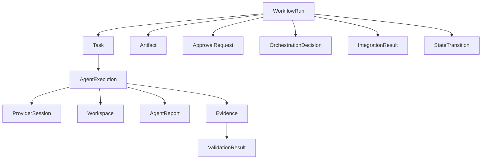

# State & Data Architecture — AI Harness

**Document Type:** Detailed Architecture Design  
**Document Set:** Harness Architecture ver1.04  
**Status:** Draft Baseline  
**Date:** 2026-08-15  
**Parent:** `02-ai-harness-overall-architecture-v1.02.md`  
**Scope:** Authoritative workflow state, persistence boundaries, provider-session metadata, execution/evidence data, artifact metadata, concurrency and recovery

---

## 1. Purpose

Tài liệu này định nghĩa **state model và data architecture** cho AI Harness.

Mục tiêu không phải bắt đầu từ database tables, mà xác định trước:

1. dữ liệu nào là **authoritative workflow state**;
2. dữ liệu nào chỉ là **execution/session working state**;
3. component nào có quyền đọc/ghi từng loại state;
4. transaction boundary nằm ở đâu;
5. dữ liệu nào phải durable, immutable hoặc ephemeral;
6. cách phát hiện stale execution và concurrent update;
7. cách recover Harness sau process/runtime failure;
8. từ logical model đó derive physical persistence model.

Nguyên tắc nền tảng:

```text
Domain State first
    ↓
Persistence semantics
    ↓
Storage mapping
    ↓
Physical schema
```

Không thiết kế database theo hướng `tables first → workflow semantics later`.

---

## 2. Architectural Drivers & Traceability

Tài liệu này hiện thực hóa các ASR từ Overall Architecture:

| ASR | State/Data implication |
|---|---|
| ASR-01 State Consistency | Một authoritative state duy nhất, có version |
| ASR-02 Orchestration Determinism | LLM decision không tự mutate state |
| ASR-03 Provider Independence | Provider-specific metadata không leak vào domain state |
| ASR-05 Execution Continuity | Persist provider-session reference nhưng không coi session là truth |
| ASR-06 Failure Isolation | Commit state theo explicit transaction boundary |
| ASR-08 Evidence-Based Validation | Evidence lưu độc lập với Agent Report |
| ASR-10 Concurrent Execution Safety | Optimistic concurrency qua `state_version` |
| ASR-11 Semantic Integration Safety | Integration result là first-class data |
| ASR-12 Observability | Run/Task/Execution/Decision/Transition có correlation IDs |

---

## 3. Core State Principle

### 3.1 Authority hierarchy

```text
Harness State
    >
Validated Evidence
    >
Provider Session Metadata
    >
Agent Report
    >
Provider/CLI Memory
```

Giải thích:

- **Harness State** là workflow truth.
- **Validated Evidence** có thể chứng minh một điều kiện thực tế nhưng không tự commit transition.
- **Provider Session Metadata** chỉ giúp continuation/resume.
- **Agent Report** là self-reported result, non-authoritative.
- **Provider memory** là working cognition, không phải persistent workflow state.

### 3.2 Single source of truth

Không tồn tại mô hình:

```text
Harness State ⇄ Codex State ⇄ Claude State
```

Đúng phải là:

```text
Harness State
      │ authoritative delta
      ▼
Execution Runtime
      │ result + evidence
      ▼
Validator / Transition Engine
      │
      ▼
Harness State
```

---

## 4. State Classification

Data được chia thành năm lớp.

### 4.1 Authoritative Domain State — Durable

Bao gồm:

- WorkflowRun
- Workflow current stage/status
- Task lifecycle
- State version
- Human decisions
- Retry counters
- Accepted artifact versions
- Approved/rejected validation result
- State transition history

Storage requirement:

```text
Durable + transactional + recoverable
```

### 4.2 Execution State — Durable Metadata

Bao gồm:

- AgentExecution
- runtime/provider
- execution status
- start/end timestamps
- source state version
- workspace reference
- timeout/cancellation state
- execution correlation IDs

Execution state **không được trực tiếp thay thế WorkflowState**.

### 4.3 Provider Session State — Durable Reference, Provider-owned Content

Harness persist:

- provider
- session/thread ID
- runtime type
- working directory reference
- last-used timestamp
- lifecycle status

Harness **không cần duplicate toàn bộ provider conversation** vào WorkflowState.

### 4.4 Evidence / Audit State — Append-oriented

Bao gồm:

- Git diff metadata
- test result
- command result
- artifact hash
- schema validation result
- policy validation result
- integration result
- LLM reviewer result
- human review result

Evidence nên append-oriented; evidence cũ không bị rewrite chỉ vì có evidence mới.

### 4.5 Ephemeral Runtime State

Bao gồm:

- active subprocess handle
- streaming token buffer
- temporary tool response
- in-memory context assembly
- lock lease/cache
- temporary workspace runtime handle

Không được yêu cầu cho workflow recovery sau restart.

---

## 5. Logical Domain Model

### 5.1 Core entities

```text
WorkflowRun
 ├── Task
 │    └── AgentExecution
 │         ├── ProviderSession
 │         ├── Workspace
 │         ├── AgentReport
 │         ├── Evidence[]
 │         └── ValidationResult[]
 │
 ├── Artifact[]
 ├── ApprovalRequest[]
 ├── OrchestrationDecision[]
 ├── IntegrationResult[]
 └── StateTransition[]
```

### 5.2 ER view



---

## 6. Entity Definitions

### 6.1 WorkflowRun

Represents một end-to-end workflow instance.

Core fields:

```text
run_id
workflow_definition_id
status
current_stage
state_version
created_at
updated_at
started_at
completed_at
```

Optional domain snapshot:

```text
state_payload
```

`state_payload` chỉ chứa workflow-domain data thật sự cần để tiếp tục workflow, không chứa raw provider conversation hoặc full execution logs.

### 6.2 Task

Represents một logical work item trong workflow.

```text
task_id
run_id
task_type
role
status
priority
objective
required_capabilities
created_from_state_version
created_at
updated_at
```

Một Task có thể có nhiều AgentExecution do retry/revision.

### 6.3 AgentExecution

Represents một runtime invocation.

```text
execution_id
task_id
run_id
runtime_type
provider
status
base_state_version
workspace_id
provider_session_id
attempt_no
started_at
ended_at
failure_class
failure_detail_ref
```

Invariant:

```text
AgentExecution completion
≠
Task completion
```

Task chỉ complete sau validation/transition gate.

### 6.4 ProviderSession

Represents continuation reference tới provider-owned working memory.

```text
provider_session_id
provider
runtime_type
external_session_id
external_thread_id
parent_session_id
agent_role
workspace_id
status
created_at
last_used_at
expires_at
```

Không lưu `review_status`, `workflow_stage` hoặc authoritative domain decision ở entity này.

### 6.5 Workspace

Represents isolated mutable execution area.

```text
workspace_id
run_id
execution_id
workspace_type
path_or_ref
base_revision
branch_ref
status
created_at
released_at
```

Status example:

```text
CREATED
ACTIVE
VALIDATING
ACCEPTED
QUARANTINED
DISCARDED
MERGED
```

### 6.6 Artifact

Artifact metadata được lưu trong DB; binary/file content có thể ở filesystem/object store/Git.

```text
artifact_id
run_id
task_id
artifact_type
logical_name
storage_uri
version
content_hash
source_execution_id
status
created_at
```

Status:

```text
CANDIDATE
VALIDATED
ACCEPTED
SUPERSEDED
REJECTED
```

### 6.7 AgentReport

Self-reported execution summary.

```text
report_id
execution_id
summary
claimed_changes
claimed_tests
unresolved_issues
recommendation
raw_response_ref
created_at
```

AgentReport luôn non-authoritative.

### 6.8 Evidence

```text
evidence_id
execution_id
run_id
type
source
authority_level
result_status
payload_ref
artifact_ref
content_hash
created_at
```

Evidence type examples:

```text
GIT_DIFF
FILE_EXISTENCE
TEST_RESULT
COMMAND_RESULT
LINT_RESULT
SCHEMA_RESULT
POLICY_RESULT
LLM_REVIEW
HUMAN_REVIEW
INTEGRATION_RESULT
```

### 6.9 ValidationResult

```text
validation_id
execution_id
run_id
validator_type
status
rule_set
input_evidence_ids
findings
created_at
```

Status:

```text
PASS
FAIL
INCONCLUSIVE
REQUIRES_HUMAN
```

### 6.10 OrchestrationDecision

LLM-generated proposal hoặc deterministic routing decision.

```text
decision_id
run_id
state_version
decision_source
model_provider
model_name
action
required_capabilities
proposed_role
reason
accepted
rejection_reason
created_at
```

Invariant:

```text
OrchestrationDecision.accepted = true
```

chỉ có nghĩa Harness chấp nhận proposal để thực hiện bước tiếp theo; không đồng nghĩa workflow state đã hoàn tất.

### 6.11 ApprovalRequest

```text
approval_id
run_id
execution_id
operation_type
risk_level
requested_by
status
decision_by
decision_reason
created_at
decided_at
```

### 6.12 StateTransition

Immutable audit record của state change.

```text
transition_id
run_id
from_version
to_version
from_stage
to_stage
from_status
to_status
trigger_type
trigger_ref
actor_type
created_at
```

`StateTransition` phải append-only trong normal operation.

### 6.13 IntegrationResult

Represents cross-artifact / cross-workspace validation trước canonical merge.

```text
integration_id
run_id
candidate_artifact_ids
candidate_execution_ids
status
findings
validated_contracts
created_at
```

---

## 7. State Transition Model

### 7.1 Transition ownership

Chỉ **Transition Engine** có quyền commit authoritative workflow state transition.

Không component nào sau đây được tự commit workflow transition:

- Orchestrator LLM
- Codex CLI
- Claude Code
- Direct LLM Executor
- Reviewer LLM
- Tool result
- AgentReport

### 7.2 Commit sequence

```text
Current State vN
      ↓
Task / Execution
      ↓
Evidence
      ↓
Validation
      ↓
Integration / Human Gate if required
      ↓
Transition Rule Evaluation
      ↓
Atomic Commit
  - update WorkflowRun
  - increment state_version
  - append StateTransition
```

### 7.3 Atomicity invariant

Không được xảy ra trạng thái:

```text
WorkflowRun.state_version = 12
```

nhưng không tồn tại transition record từ 11 → 12.

Update current state và append transition phải nằm trong cùng transaction boundary.

---

## 8. Optimistic Concurrency Control

### 8.1 State version

Mỗi Task Envelope chứa:

```text
base_state_version
```

Ví dụ:

```text
API execution starts from v10
DB execution starts from v10

API accepted → v11
DB returns based on v10
```

DB result không được blind commit.

### 8.2 Commit rule

Conceptual operation:

```sql
UPDATE workflow_runs
SET state_version = :new_version,
    ...
WHERE run_id = :run_id
  AND state_version = :expected_version;
```

Nếu affected row = 0:

```text
STALE_STATE_CONFLICT
```

Sau đó policy chọn:

- revalidate
- reconcile
- retry
- reject

### 8.3 No distributed lock by default

V1.04 ưu tiên optimistic concurrency thay vì global workflow lock vì:

- đơn giản hơn;
- phù hợp 1–5 concurrent executions;
- tránh giữ lock trong long-running LLM/CLI task;
- execution có thể kéo dài phút mà không block state store.

---

## 9. Workspace and State Consistency

State consistency chưa đủ; cần cả **workspace consistency**.

Không chấp nhận:

```text
Harness State = unchanged
Canonical repository = partially modified by failed agent
```

Do đó:

```text
Canonical Workspace
      ↓ clone/worktree
Execution Workspace
      ↓ agent mutation
Evidence + Validation
      ↓ PASS
Integration Gate
      ↓
Canonical Merge
```

Failed execution:

```text
Execution Workspace
      ↓ FAIL
QUARANTINE / DISCARD
```

Canonical repo không bị mutation trước acceptance boundary.

---

## 10. Persistence Architecture

### 10.1 Recommended V1.04 storage split

```text
PostgreSQL
  → authoritative state
  → execution metadata
  → transitions
  → provider-session references
  → approvals
  → validation metadata
  → artifact metadata

Git / Filesystem / Object Storage
  → source code
  → large artifacts
  → logs
  → evidence payloads
  → generated documents
  → diff/test output when large

Provider-owned session store
  → Codex / Claude conversation working memory

In-memory cache
  → active context
  → streaming buffers
  → short-lived runtime handles
```

### 10.2 Why PostgreSQL baseline

PostgreSQL phù hợp V1.04 vì cần:

- ACID transaction cho authoritative state;
- optimistic concurrency;
- relational traceability giữa run/task/execution/evidence;
- JSON/JSONB cho extensible provider-neutral payload;
- mature indexing và operational tooling.

Không dùng vector database làm authoritative workflow store.

### 10.3 JSONB usage rule

JSONB phù hợp cho:

- provider-neutral extensible payload;
- structured findings;
- capability snapshot;
- small state extensions.

Không nên biến toàn bộ database thành một bảng duy nhất:

```text
workflow_runs(id, giant_json_blob)
```

Các entity cần query, constraint và lifecycle riêng phải có table riêng.

---

## 11. Proposed Physical Schema

V1.04 baseline tables:

```text
workflow_runs
workflow_tasks
agent_executions
provider_sessions
workspaces
artifacts
agent_reports
execution_evidence
validation_results
orchestration_decisions
approval_requests
state_transitions
integration_results
```

Optional later:

```text
workflow_definitions
runtime_capabilities
model_invocations
cost_usage
context_snapshots
event_outbox
```

---

## 12. Data Relationship Rules

### Rule D-01

Một `WorkflowRun` có nhiều `Task`.

### Rule D-02

Một `Task` có nhiều `AgentExecution` do retry/revision/provider switch.

### Rule D-03

Một `ProviderSession` có thể được reuse bởi nhiều execution của cùng execution concern nếu policy cho phép.

### Rule D-04

Một execution chỉ được mutate một assigned workspace tại một thời điểm.

### Rule D-05

Artifact candidate phải reference execution tạo ra nó.

### Rule D-06

Evidence phải reference execution hoặc integration operation tạo ra evidence.

### Rule D-07

StateTransition phải reference trigger/evidence/approval phù hợp để audit.

### Rule D-08

Provider-specific fields phải nằm trong provider metadata, không thêm trực tiếp vào `WorkflowRun` schema trừ khi trở thành domain concept chung.

---

## 13. Event and Audit Model

V1.04 không bắt buộc full Event Sourcing.

Tuy nhiên Harness cần append-oriented audit events cho các event quan trọng:

```text
RUN_CREATED
TASK_CREATED
ORCHESTRATION_DECIDED
EXECUTION_STARTED
EXECUTION_FINISHED
APPROVAL_REQUESTED
APPROVAL_DECIDED
EVIDENCE_COLLECTED
VALIDATION_FINISHED
INTEGRATION_FINISHED
STATE_TRANSITIONED
RUN_COMPLETED
RUN_FAILED
```

Recommendation:

- authoritative current state lưu normalized tables;
- state transitions/audit events lưu append-only;
- không reconstruct toàn bộ production state từ event log trong V1.04.

Đây là **state + audit log**, chưa phải full Event Sourcing architecture.

---

## 14. Recovery Model

### 14.1 Harness process restart

Sau restart Harness phải có thể reconstruct:

```text
current WorkflowRun state
pending tasks
running/interrupted executions
provider session references
workspace references
pending approvals
last committed transition
```

### 14.2 Running execution after restart

Execution được classify:

```text
RUNNING
    ↓ process restart
UNKNOWN / INTERRUPTED
```

Recovery policy dựa vào runtime capability:

- resume provider session;
- inspect workspace;
- collect partial evidence;
- retry execution;
- quarantine workspace;
- require human decision.

Không tự mark `COMPLETED` chỉ vì provider session còn tồn tại.

### 14.3 Idempotency

Các command có side effect cần `idempotency_key` hoặc equivalent execution identity khi khả thi để tránh duplicate processing sau retry.

---

## 15. Data Retention & Privacy

Các loại data có retention policy khác nhau.

| Data | Default direction |
|---|---|
| Workflow state | Durable |
| State transitions | Durable / audit |
| Approval history | Durable / audit |
| Evidence metadata | Durable |
| Large command/test logs | Retention configurable |
| Raw prompts/responses | Retention configurable, potentially sensitive |
| Provider session IDs | Until session lifecycle ends + audit retention |
| Temporary workspace | Cleanup after acceptance/rejection policy |
| Secrets/tokens | Never persist in workflow data |

Raw prompt/response không mặc định được coi là business state.

Secrets phải được redacted trước observability persistence.

---

## 16. Indexing Strategy — Baseline

Primary indexes:

```text
workflow_runs(run_id)
workflow_runs(status, updated_at)
workflow_tasks(run_id, status)
agent_executions(task_id, attempt_no)
agent_executions(run_id, status)
provider_sessions(external_session_id)
execution_evidence(execution_id, type)
validation_results(execution_id, status)
state_transitions(run_id, to_version)
approval_requests(run_id, status)
artifacts(run_id, logical_name, version)
```

Index chỉ finalize sau query/load profile; không optimize prematurely.

---

## 17. Transaction Boundaries

### TX-01 — Create Run

Atomic:

```text
insert WorkflowRun
append RUN_CREATED audit event
```

### TX-02 — Create Task

Atomic:

```text
verify current state_version
insert Task
append task-created audit metadata
```

### TX-03 — Start Execution

Atomic:

```text
insert AgentExecution
attach ProviderSession/Workspace refs
set task execution status
```

Không giữ DB transaction mở trong suốt LLM/CLI execution.

### TX-04 — Commit State Transition

Atomic:

```text
check expected state_version
validate transition preconditions
update WorkflowRun
increment state_version
append StateTransition
update Task status where applicable
```

### TX-05 — Accept Artifact / Integration

Atomic metadata transaction sau khi external workspace merge/commit operation đã có deterministic result hoặc transaction choreography phù hợp.

---

## 18. Database vs Filesystem Boundary

Không lưu mọi thứ vào PostgreSQL.

### Database stores

- identities
- lifecycle state
- references
- hashes
- metadata
- decisions
- validation summaries
- audit linkage

### Workspace/Object/Git stores

- source tree
- generated files
- large logs
- binary artifacts
- diff payload
- large test reports

DB giữ pointer + hash để trace:

```text
artifact_id
storage_uri
content_hash
```

---

## 19. Provider Independence in Data Model

Sai:

```text
workflow_runs.codex_thread_id
workflow_runs.claude_session_id
```

Đúng:

```text
provider_sessions
    provider
    runtime_type
    external_session_id
    external_thread_id
```

Tương tự, không thêm:

```text
codex_status
claude_status
```

vào WorkflowRun.

Provider-specific payload dùng:

```text
provider_metadata JSONB
```

trong provider-owned entity khi thực sự cần.

---

## 20. State Machine Ownership

Logical state machine thuộc Workflow Runtime, không thuộc database trigger.

Database enforce:

- uniqueness
- foreign key
- not-null
- optimistic version condition
- selected check constraints

Workflow Runtime enforce:

- allowed transition
- required evidence
- human gate
- retry policy
- semantic state rule

Không nhét workflow orchestration phức tạp vào DB stored procedure/trigger.

---

## 21. Example End-to-End Data Flow

```text
1. WorkflowRun v12

2. OrchestratorDecision D-55
   proposes CODER task

3. Task T-20 created from v12

4. AgentExecution E-31
   runtime = CODEX_CLI
   base_state_version = 12

5. ProviderSession S-8 attached

6. Workspace W-13 created

7. Codex modifies isolated workspace

8. Evidence collected
   EV-90 git diff
   EV-91 tests

9. ValidationResult V-18 = PASS

10. IntegrationResult I-4 = PASS

11. Transition Engine checks
    current state still = v12

12. Atomic commit
    WorkflowRun → v13
    append StateTransition ST-13
    artifact version accepted
```

Nếu bước 11 phát hiện current version = 13:

```text
E-31 = STALE_RESULT
→ revalidate/reconcile/retry
→ no blind commit
```

---

## 22. ATAM-lite Review

### Scenario DA-01 — Stale parallel result

**Business Driver:** Multi-agent execution  
**ASR:** ASR-10 Concurrent Execution Safety  
**Decision:** state version + optimistic concurrency  
**Quality Attribute:** Reliability / Consistency  
**Scenario:** Hai agent chạy từ v10; agent A commit v11; agent B trả result từ v10.  
**Expected:** agent B không blind commit.  
**Risk:** retry/reconciliation complexity.  
**Evidence:** integration test phải chứng minh stale commit bị block.

### Scenario DA-02 — Agent crash after file mutation

**Business Driver:** Failure isolation  
**ASR:** ASR-06  
**Decision:** isolated workspace + canonical merge gate  
**Quality Attribute:** Reliability  
**Scenario:** Codex crash sau khi sửa file nhưng trước validation.  
**Expected:** canonical workspace và committed Harness State không đổi.  
**Trade-off:** tăng disk/worktree operational cost.  
**Evidence:** crash-injection test.

### Scenario DA-03 — Provider memory conflicts with state

**Business Driver:** Deterministic control  
**ASR:** ASR-01 / ASR-05  
**Decision:** ProviderSession chỉ lưu continuation reference.  
**Quality Attribute:** Reproducibility / Correctness  
**Scenario:** Claude/Codex session nhớ `review=PASS`, Harness đang `REJECT`.  
**Expected:** new task envelope inject authoritative state và Harness state thắng.  
**Evidence:** session-conflict test.

---

## 23. Key Risks

### DATA-R01 — Giant State Blob

Nếu toàn bộ state bị nhét vào một JSON blob, queryability, migration và integrity sẽ kém.

**Mitigation:** normalized core entities + JSONB có giới hạn.

### DATA-R02 — Provider Leakage

Provider IDs leak vào WorkflowRun.

**Mitigation:** ProviderSession abstraction.

### DATA-R03 — Hidden Workspace State

DB báo task chưa complete nhưng canonical repo đã bị agent sửa.

**Mitigation:** isolated workspace lifecycle.

### DATA-R04 — Audit Without Authority Semantics

Có nhiều logs nhưng không biết log nào authoritative.

**Mitigation:** classify AgentReport vs Evidence vs StateTransition.

### DATA-R05 — Long DB Transaction Around LLM

Giữ transaction trong vài phút khi LLM/CLI chạy gây lock và failure complexity.

**Mitigation:** short transaction boundaries; long-running execution outside DB transaction.

### DATA-R06 — Full Event Sourcing Too Early

Event sourcing làm tăng cognitive/operational complexity cho PoC.

**Mitigation:** current-state tables + append-only transition/audit log ở V1.04.

---

## 24. Architecture Decisions to Capture as ADR

- **ADR-D01** PostgreSQL is the authoritative state store baseline.
- **ADR-D02** Harness uses state + audit log, not full Event Sourcing in V1.04.
- **ADR-D03** Optimistic concurrency uses `state_version`.
- **ADR-D04** Provider sessions store references only, not workflow truth.
- **ADR-D05** Artifacts are externalized; DB stores metadata and hashes.
- **ADR-D06** Isolated workspace protects canonical repository.
- **ADR-D07** Workflow transition logic stays in Harness Runtime, not DB triggers.

---

## 25. Implementation Guidance

Suggested backend package boundaries:

```text
harness/
  domain/
    workflow.py
    task.py
    execution.py
    artifact.py
    evidence.py
    transition.py

  persistence/
    repositories/
    models/
    migrations/

  state/
    store.py
    concurrency.py

  sessions/
    provider_session_store.py

  workspace/
    workspace_store.py

  audit/
    event_store.py
```

Domain model không được import provider SDK hoặc CLI adapter.

---

## 26. Definition of Done for State/Data Architecture

Trước khi backend persistence được coi là baseline, cần chứng minh:

1. Harness restart không mất committed state.
2. State version tăng atomically với StateTransition.
3. Stale execution không overwrite state mới.
4. Provider session ID có thể persist/resume mà không leak provider semantics vào WorkflowRun.
5. Agent crash không làm canonical workspace dirty.
6. AgentReport không thể tự làm task complete.
7. Evidence trace được từ execution đến transition.
8. Accepted artifact có storage reference + content hash.
9. Secrets không xuất hiện trong persisted business state.
10. Có migration strategy cho schema evolution.

---

## 27. Next Design Dependencies

Tài liệu này là input trực tiếp cho:

```text
04-workflow-runtime-design.md
    → state machine
    → retry/checkpoint/resume
    → transition rules

05-agent-runtime-integration-design.md
    → ProviderSession lifecycle
    → ExecutionRuntime mapping

06-context-memory-design.md
    → state/context selection boundary

07-workspace-artifact-design.md
    → workspace lifecycle
    → artifact storage/versioning
```

Physical DDL/migration chi tiết chỉ nên finalize sau khi `04-workflow-runtime-design.md` chốt lifecycle/state machine cuối cùng.
