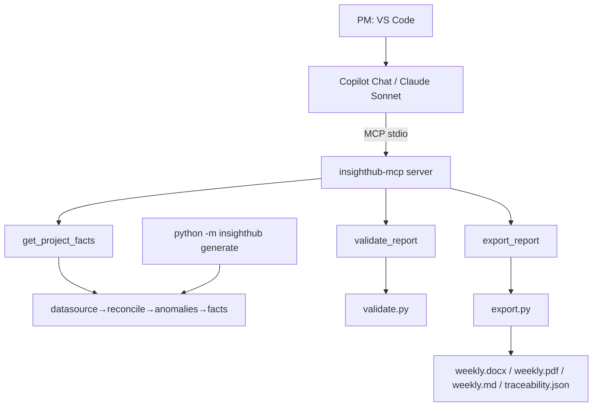

# SD — System Design: InsightHub Reporting Co-pilot (MVP, Concept B)
**Date:** 2026-05-22
**Status:** 🟢 Approved
**Ref:** `RD-insighthub-copilot-mvp.md`

---

## 1. Architecture Overview

Hai lớp. Lớp 1 do GitHub Copilot lo (không code), Lớp 2 là toàn bộ code của ta.

```
┌─ LỚP 1 · UX (GitHub Copilot — không phải code của ta) ──────────────┐
│  VS Code  →  Copilot Chat (model: Claude Sonnet, license Copilot)   │
│             đọc .github/copilot-instructions.md + prompt file       │
└───────────────────────────┬─────────────────────────────────────────┘
                            │  MCP protocol (stdio) · cấu hình .vscode/mcp.json
┌───────────────────────────▼─────────────────────────────────────────┐
│  LỚP 2 · ENGINE — insighthub-mcp server (Python, fastmcp)            │
│                                                                      │
│   Data tools (đã có):  list_jira_issues · list_chat_messages ·       │
│                        list_code_activity                            │
│   Pipeline tools (MỚI): get_project_facts · validate_report ·         │
│                         export_report                                │
│                            │                                         │
│   datasource → reconcile → anomalies → facts → validate → export      │
│   (pipeline Python deterministic — tái dùng nguyên, KHÔNG sửa)        │
└──────────────────────────────────────────────────────────────────────┘
                            ▲
        Đường song song:    │  python -m insighthub generate  (CLI headless,
                            │  in-memory MCP client / gọi pipeline trực tiếp,
                            │  template-only — không cần Copilot/LLM)
```



**Nguyên tắc:** mọi con số do Lớp 2 (Python) tính. Copilot chỉ viết câu chữ quanh `Facts`.
Lớp chống hallucination (`validate_report`) nằm ở Lớp 2 → không phụ thuộc LLM nào.

---

## 2. Data Flow

### 2.1 Luồng Copilot (chính)

```
1. PM gõ trong Copilot Chat: "Tạo báo cáo tuần Project Sakura, 15-21/05, EN"
2. Copilot đọc .github/copilot-instructions.md → biết quy trình bắt buộc
3. Copilot → MCP get_project_facts(period_start, period_end)
4. MCP server: datasource.load() → reconcile() → detect() → build_facts()
   → trả Facts JSON (mọi số + citation) + cache Facts object trong server
5. Copilot (Sonnet) viết narrative 9 section TỪ Facts JSON (chỉ dùng số trong đó)
6. Copilot → MCP validate_report(sections)  [dùng Facts đã cache]
7. Nếu violations != [] → Copilot sửa narrative, lặp lại bước 6 (tối đa 2 lần)
8. Copilot → MCP export_report(sections, lang)  → ghi 5 file output (docx/pdf/md/json/log)
9. PM xem file trong VS Code; tinh chỉnh hội thoại → quay lại bước 5-8 cho section liên quan
```

### 2.2 Luồng CLI headless (lưới an toàn + deliverable)

```
1. python -m insighthub generate --type weekly --lang en --no-llm
2. datasource.load() → reconcile() → detect() → build_facts()
3. report.generate(use_llm=False) → narrative template-only (gạch đầu dòng)
4. validate() → export()  → 5 file output (docx/pdf/md/json/log)
   (chạy mọi máy có Python 3.11, KHÔNG cần VS Code/Copilot/LLM)
```

---

## 3. Component Breakdown

### insighthub_mcp/server.py  *(SỬA — thêm 3 tool + cache)*
**Trách nhiệm:** expose 6 MCP tool; giữ 1 cache Facts ở module level.
**Input:** lời gọi tool từ Copilot (stdio) hoặc từ in-memory client (CLI).
**Output:** dict JSON-able.
**Side effects:** `export_report` ghi file; mọi tool ghi 1 dòng audit log.

### insighthub/ (pipeline)  *(GIỮ NGUYÊN — không sửa)*
`datasource · reconcile · anomalies · facts · report · validate · export · templating · schema`.
Đã chạy E2E. SD này không đổi contract nội bộ của pipeline.

### insighthub/__main__.py  *(GIỮ — CLI headless)*
`_load_state()` đã gọi `datasource.load()`. Là đường deliverable + fallback.

### .vscode/mcp.json  *(MỚI)*
Khai báo server để VS Code/Copilot tự spawn qua stdio.

### .github/copilot-instructions.md  *(MỚI)*
Repo-wide instruction Copilot tự đọc. Chứa: persona "InsightHub Reporting Co-pilot";
quy trình bắt buộc (get_project_facts → viết → validate_report → export_report);
**luật anti-hallucination** (chỉ dùng số trong Facts JSON; giữ nguyên `[system:ref]`;
9 section cố định; JA dùng keigo).

### .github/prompts/weekly-report.prompt.md  *(MỚI)*
Prompt file VS Code — lệnh "một phát" sinh báo cáo tuần.

### README.md  *(MỚI)* — 2 cách chạy (Copilot + CLI), setup, demo runbook.
### AGENTS.md  *(SỬA cho repo mới)* — chỉ dẫn Codex.

---

## 4. Interface Contracts — 3 MCP tool mới

### get_project_facts(period_start, period_end) → dict

```python
# Input
period_start: str   # ISO date "2026-05-15"; rỗng → lấy từ connections.yaml
period_end:   str   # ISO date "2026-05-21"; rỗng → lấy từ connections.yaml

# Xử lý
state  = datasource.load("connections.yaml")
rec    = reconcile.reconcile(state)
anoms  = anomalies.detect(state, rec)
facts  = facts.build_facts(state, rec, anoms)
_CACHE["facts"] = facts          # cache Facts object trong server

# Output  (facts.model_dump() — JSON-able)
{
  "project_name": str, "period_start": str, "period_end": str,
  "overall_status": "Green"|"Yellow"|"Red",
  "sections": [ {section_id, title, facts:[...], bullet_items:[...]}, ... ],  # 9 section
  "allowed_numbers": [...], "allowed_keys": [...]
}
# Errors: thiếu file nguồn → {"error": "<message>"}
```

### validate_report(sections) → dict

```python
# Input
sections: list[dict]   # [{"section_id": str, "body": str}, ...]

# Xử lý
facts  = _CACHE["facts"]                       # lỗi nếu chưa gọi get_project_facts
report = Report(... sections=sections, lấy metadata từ facts ...)
violations = validate.validate(report, facts)

# Output
{ "ok": bool, "violations": list[str] }        # ok=True khi violations rỗng
# Errors: chưa có cache → {"error": "call get_project_facts first"}
```

### export_report(sections, lang) → dict

```python
# Input
sections: list[dict]   # [{"section_id", "title", "body"}, ...]
lang: str              # "en" | "ja" | "vn"; default "en"

# Xử lý
facts  = _CACHE["facts"]
report = Report(...sections..., language=lang)
violations = validate.validate(report, facts)   # gác lần cuối
if violations: return {"error": "validation failed", "violations": [...]}  # KHÔNG ghi file
paths = export.export(report, facts, "output")  # docx + md + json + log
paths["weekly_pdf"] = pdf_from_docx(paths["weekly_docx"])  # best-effort; None nếu thiếu Word

# Output
{ "ok": True, "paths": {"weekly_docx","weekly_pdf","weekly_md","traceability_json","audit_log_md"} }
# weekly_pdf = null nếu môi trường không convert được PDF (E2E vẫn ok)
```

**Data tool cũ** (`list_jira_issues` / `list_chat_messages` / `list_code_activity`) — giữ
nguyên contract đã có ở SA-1.

---

## 5. Storage & State

| Data | Location | Format | Lifetime |
|---|---|---|---|
| Dữ liệu nguồn mẫu | `data/sample/` | xlsx / json / docx | Cố định (immutable) |
| Cấu hình kết nối | `connections.yaml` | YAML | Cố định |
| Facts cache | RAM (`_CACHE` trong server.py) | Python object | 1 session MCP |
| Output báo cáo | `output/` | docx / pdf / md / json | Ghi đè mỗi lần chạy |
| Audit log | `output/audit_log.md` | Markdown | Append |
| Cấu hình MCP cho VS Code | `.vscode/mcp.json` | JSON | Cố định |

Không database. Không web server. Cache Facts là single-period (last-wins) — đủ cho MVP 1 PM.

---

## 6. Error Handling Strategy

| Tình huống | Hành vi | Log? |
|---|---|---|
| File nguồn thiếu/hỏng khi `get_project_facts` | Trả `{"error": ...}` — Copilot báo PM | Có |
| `validate_report` / `export_report` gọi khi chưa có Facts cache | Trả `{"error": "call get_project_facts first"}` | Có |
| Copilot viết narrative có số bịa | `validate_report` trả violations → Copilot sửa (≤ 2 lần) | Có |
| Sửa 2 lần vẫn fail | `.github` chỉ dẫn: báo PM chạy CLI headless template-only | Có |
| `export_report` còn violations | Không ghi file, trả error + violations | Có |
| Convert PDF lỗi (thiếu Word/LibreOffice) | Bỏ qua PDF, `weekly_pdf=null`, vẫn xuất DOCX+MD — E2E không gãy | Có |
| Lỗi ghi file (docx/md/json) | Raise exception (dừng) | Có |
| Copilot/Sonnet không khả dụng | PM dùng CLI headless — pipeline không phụ thuộc Copilot | — |

**Nguyên tắc:** lỗi ở ranh giới ngoài (file, LLM) → trả error dict + log. Lỗi logic nội bộ → raise.
**Bất biến:** không bao giờ xuất báo cáo khi còn violations.

---

## 7. Technology Decisions

| Quyết định | Chọn | Lý do | Không chọn vì |
|---|---|---|---|
| LLM runtime | GitHub Copilot (Claude Sonnet) | PM chỉ có license Copilot; endpoint enterprise FPT duyệt sẵn | API key Anthropic: tốn phí + duyệt vendor |
| Lớp connector | MCP server (fastmcp) | Copilot agent mode hỗ trợ MCP sẵn; 1 server dùng cho cả CLI lẫn Copilot | REST API: cần web server, Copilot không gọi trực tiếp |
| Transport | stdio (VS Code spawn) + in-memory (CLI) | fastmcp hỗ trợ cả hai trên cùng 1 server object | HTTP: thừa cho local |
| Quản lý Facts giữa các tool | Cache module-level trong server | Copilot không phải truyền lại Facts JSON to → agent loop gọn | Stateless truyền facts: payload lớn, dễ lỗi |
| Pipeline tính số | Python deterministic, tái dùng 100% | Đã chạy E2E; chống hallucination độc lập LLM | Để LLM tính: rủi ro disqualify |
| Headless CLI | Giữ song song | BGK chấm "E2E phải chạy" — có thể không có VS Code | Bỏ CLI: rủi ro disqualify |
| Fallback narrative | template-only (đã có trong `report.py`) | Demo không bao giờ gãy | Không fallback: 1 lỗi LLM = mất demo |
| Xuất PDF | `docx2pdf` (DOCX→PDF qua Word COM) | Tái dùng DOCX đã render đúng template; best-effort + degrade | ReportLab/WeasyPrint: phải dựng lại layout từ đầu |

---

*InsightHub Reporting Co-pilot — SD v1.0 | 2026-05-22*
