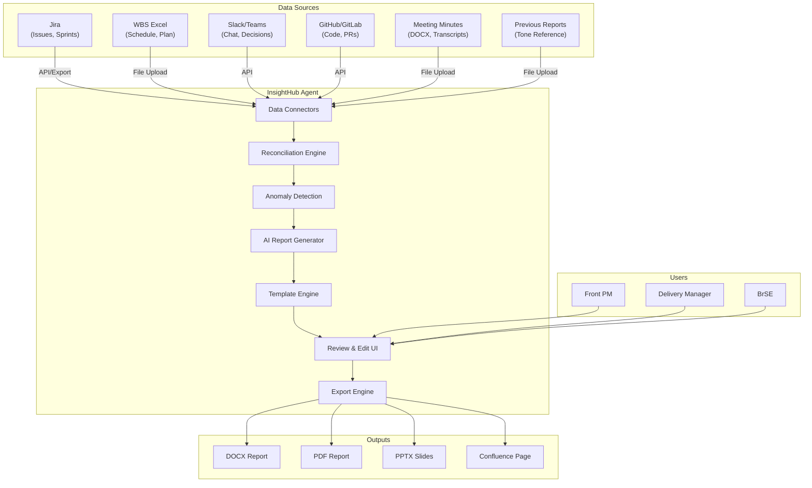

# Software Requirements Specification (SRS)
## AI Agent for Weekly & Monthly Project Reporting - InsightHub Agent

**Document Version:** 1.0  
**Project:** FPT Japan AI Hackathon 2026  
**Prepared By:** Business Analyst  
**Date:** May 21, 2026  
**Status:** Draft

---

## Table of Contents

1. [Introduction](#1-introduction)
2. [Overall Description](#2-overall-description)
3. [System Features and Functional Requirements](#3-system-features-and-functional-requirements)
4. [External Interface Requirements](#4-external-interface-requirements)
5. [Non-Functional Requirements](#5-non-functional-requirements)
6. [Data Requirements](#6-data-requirements)
7. [Quality Attributes](#7-quality-attributes)
8. [Appendices](#8-appendices)

---

## 1. Introduction

### 1.1 Purpose
This Software Requirements Specification (SRS) document provides a complete description of the functional and non-functional requirements for the InsightHub Agent - an AI-powered reporting co-pilot for FPT Japan Front PMs and Delivery Managers.

**Intended Audience:**
- Development Team (architects, developers, QA engineers)
- Project Managers and Product Owners
- System Administrators and DevOps Engineers
- Quality Assurance and Testing Teams
- Hackathon Judges and Evaluators

### 1.2 Scope

**Product Name:** InsightHub Agent (AI Reporting Co-pilot)

**Product Description:**
The InsightHub Agent is an intelligent automation system that aggregates project data from multiple source systems (Jira, WBS Excel, Slack/Teams, GitHub, meeting minutes), reconciles cross-source information, detects anomalies, and generates customer-ready weekly and monthly project status reports in multiple languages and formats.

**Major Capabilities:**
1. Multi-source data integration and aggregation
2. Cross-source data reconciliation and anomaly detection
3. AI-powered report generation with full traceability
4. Multi-template and multi-language report output
5. Interactive review and conversational refinement workflow
6. Portfolio roll-up reporting for Delivery Managers
7. Scheduled and ad-hoc report generation

**Benefits:**
- Reduce weekly report preparation time from 3-6 hours to < 5 minutes
- Reduce monthly report preparation time from 6-10 hours to < 15 minutes
- Eliminate manual data inconsistencies
- Ensure 100% traceability for all reported facts
- Maintain consistent narrative tone and professional language

### 1.3 Definitions, Acronyms, and Abbreviations

| Term | Definition |
|------|------------|
| **AI** | Artificial Intelligence |
| **API** | Application Programming Interface |
| **BrSE** | Bridge System Engineer |
| **BPMN** | Business Process Model and Notation |
| **CI/CD** | Continuous Integration / Continuous Deployment |
| **DM** | Delivery Manager |
| **Front PM** | Customer-facing Project Manager |
| **Keigo (敬語)** | Japanese honorific/formal language |
| **KPI** | Key Performance Indicator |
| **LLM** | Large Language Model |
| **MoSCoW** | Must Have, Should Have, Could Have, Won't Have (prioritization method) |
| **OAuth** | Open Authorization (authentication protocol) |
| **PR** | Pull Request |
| **REST** | Representational State Transfer |
| **SLA** | Service Level Agreement |
| **Sprint** | Time-boxed Agile iteration (typically 2 weeks) |
| **Story Point** | Relative unit of effort in Agile estimation |
| **TLS** | Transport Layer Security |
| **Velocity** | Story points completed per sprint |
| **WBS** | Work Breakdown Structure |

### 1.4 References

1. FPT Japan AI Hackathon 2026 Challenge Brief v1.0
2. Business Requirements Document (BRD) - InsightHub Agent v1.0
3. Atlassian Jira REST API v3 Documentation
4. Microsoft Graph API for Teams Documentation
5. Slack Web API Documentation
6. GitHub REST API v3 and GraphQL API v4 Documentation
7. PMI PMBOK Guide - Project Reporting Standards
8. ISO/IEC 25010:2011 - Systems and software Quality Requirements and Evaluation (SQuaRE)

### 1.5 Overview
The remainder of this document describes the system in detail, organized into:
- Overall system description and context
- Detailed functional requirements organized by feature
- External interface specifications
- Non-functional requirements (performance, security, usability, etc.)
- Data requirements and models
- Quality attributes and acceptance criteria

---

## 2. Overall Description

### 2.1 Product Perspective

The InsightHub Agent operates as a standalone system that integrates with existing project management and collaboration tools. It does NOT modify or replace these systems; rather, it acts as a read-only aggregator and intelligent reporting layer on top of them.

**System Context Diagram:**

### 2.2 Product Functions

**High-Level Functional Summary:**

| Function Category | Key Capabilities |
|------------------|------------------|
| **Data Integration** | Connect to Jira, WBS Excel, Slack/Teams, GitHub, meeting minutes via API or file upload |
| **Data Reconciliation** | Map Jira issues to WBS tasks; detect inconsistencies; compute actual vs. planned progress |
| **Anomaly Detection** | Apply 15+ configurable rules to detect quality, schedule, and risk issues |
| **Report Generation** | Generate weekly/monthly reports in customer-specific templates with AI-powered narrative |
| **Multi-Language Support** | Output reports in Japanese (敬語), English, or Vietnamese |
| **Review Workflow** | Interactive UI for PM to review, edit, and refine reports with conversational commands |
| **Export** | Export reports to DOCX, PDF, PPTX, Markdown, Confluence |
| **Portfolio Reporting** | Roll-up view across multiple projects for Delivery Managers (bonus feature) |
| **Scheduling** | Auto-generate reports on configured schedule (e.g., every Friday) |
| **Audit & Traceability** | Log all data fetches, LLM calls; provide source citations for all facts |

### 2.3 User Classes and Characteristics

| User Class | Characteristics | Technical Expertise | Frequency of Use | Key Requirements |
|-----------|-----------------|---------------------|-----------------|------------------|
| **Front PM** | Customer-facing; manages 1-3 projects; bilingual (JP/EN) | Medium | Weekly/Monthly | Fast report generation; easy customization; Japanese support |
| **Delivery Manager** | Oversees 5-10 projects; executive-level reporting | Medium | Monthly | Portfolio roll-up; multi-project visibility |
| **BrSE** | Offshore coordination; trilingual (JP/EN/VN) | Medium-High | Weekly | Multi-language support; consistent terminology |
| **System Administrator** | Deploys and configures the system | High | Setup/Maintenance | Easy deployment; secure configuration; monitoring |

### 2.4 Operating Environment

**Deployment Options:**
- AWS (preferred): EC2, ECS/Fargate, Lambda
- Azure: VM, Container Instances, Functions
- On-premise: Docker containers or VM

**Client Environment:**
- Web browser: Chrome, Edge, Firefox, Safari (latest 2 versions)
- Minimum screen resolution: 1280x720

**Server Environment:**
- Operating System: Linux (Ubuntu 20.04+ or Amazon Linux 2)
- Runtime: Python 3.9+ or Node.js 18+
- Database: PostgreSQL 13+ or MongoDB 5+ (for audit logs and configuration)
- Message Queue (optional): Redis or RabbitMQ (for scheduled jobs)

**Network Requirements:**
- Outbound HTTPS access to source system APIs (Jira, Slack, GitHub, etc.)
- Outbound HTTPS access to approved LLM endpoints
- Inbound HTTPS for user access (port 443)

### 2.5 Design and Implementation Constraints

| Constraint Type | Description |
|----------------|-------------|
| **Technology** | Must support both API-based and file-based data ingestion for all source systems |
| **Security** | Must NOT send customer-identifying data to public LLM APIs unless explicitly approved |
| **Compliance** | Must provide full audit trail for all generated reports |
| **Performance** | Weekly report generation must complete in < 60 seconds; monthly in < 3 minutes |
| **Portability** | Must deploy on AWS, Azure, or on-premise without significant changes |
| **Interoperability** | Must integrate with Jira, Slack, Teams, GitHub, GitLab, Bitbucket via standard APIs |
| **Maintainability** | Adding new templates, KPIs, or data sources must not require code changes |

### 2.6 Assumptions and Dependencies

See BRD Section 6 for full list. Key technical dependencies:
- Jira REST API v3 availability
- Slack Web API or Microsoft Graph API for Teams
- GitHub REST API v3 or GraphQL API v4
- Access to approved LLM service (Claude, GPT-4, or equivalent)
- Sample data provided by hackathon organizers is representative

---

## 3. System Features and Functional Requirements

### 3.1 Data Source Connectors

#### FR-CONN-001: Jira Integration
**Priority:** Must Have  
**Status:** Draft  

**Description:**
The system shall integrate with Jira to retrieve issues, sub-tasks, epics, sprints, status transitions, story points, time logged, assignees, and custom fields.

**Functional Requirements:**

- **FR-CONN-001.1**: The system shall support Jira Cloud API authentication via API token or OAuth 2.0.
- **FR-CONN-001.2**: The system shall support Jira Server/Data Center API authentication via personal access token.
- **FR-CONN-001.3**: The system shall retrieve all issues for a configured project or filter within a specified date range.
- **FR-CONN-001.4**: The system shall retrieve issue history to track status transitions and field changes.
- **FR-CONN-001.5**: The system shall retrieve sprint information including start date, end date, committed story points, and completed story points.
- **FR-CONN-001.6**: The system shall support Jira Excel export as a fallback when API access is not available.
- **FR-CONN-001.7**: The system shall map Jira custom fields via configurable field mapping.

**Acceptance Criteria:**
- [ ] Given valid Jira API credentials, when the system fetches data, then all issues for the configured project are retrieved
- [ ] Given a date range, when fetching Jira data, then only issues created or updated within that range are included
- [ ] Given a Jira Excel export file, when imported, then the system parses issues, status, story points, and assignees correctly
- [ ] Given custom fields are configured, when fetching issues, then custom field values are mapped to standard attributes

**Technical Notes:**
- Use Jira REST API v3 for Jira Cloud
- Use Jira REST API v2 for Jira Server/Data Center
- Implement pagination for large issue sets (page size: 100)
- Cache issue metadata to reduce API calls

---

#### FR-CONN-002: WBS Excel Integration
**Priority:** Must Have  
**Status:** Draft  

**Description:**
The system shall import Work Breakdown Structure (WBS) data from Excel files containing planned schedule, phases, tasks, planned effort, planned completion %, and dependencies.

**Functional Requirements:**

- **FR-CONN-002.1**: The system shall support Excel file upload (.xlsx, .xls) for WBS data.
- **FR-CONN-002.2**: The system shall parse WBS structure including phases, tasks, sub-tasks, and dependencies.
- **FR-CONN-002.3**: The system shall extract planned start date, planned end date, planned effort (man-months), and planned completion % for each task.
- **FR-CONN-002.4**: The system shall detect WBS template format automatically or via user-specified mapping.
- **FR-CONN-002.5**: The system shall validate WBS data for required fields (task name, planned dates) and flag missing data.

**Acceptance Criteria:**
- [ ] Given a valid WBS Excel file, when imported, then all phases, tasks, and planned dates are extracted
- [ ] Given a WBS with custom column names, when user provides column mapping, then data is parsed correctly
- [ ] Given a WBS task with missing planned end date, when imported, then the system flags it as incomplete
- [ ] Given WBS planned % for week N, when computing progress, then the system uses the correct baseline

**Technical Notes:**
- Support Microsoft Excel (.xlsx) and older (.xls) formats
- Use libraries: openpyxl (Python) or xlsx (Node.js)
- Support multiple WBS template variations via configurable column mapping

---

#### FR-CONN-003: Slack/Teams Integration
**Priority:** Must Have  
**Status:** Draft  

**Description:**
The system shall integrate with Slack or Microsoft Teams to retrieve channel messages, threads, and mentions for detecting blockers, decisions, and informal status updates.

**Functional Requirements:**

- **FR-CONN-003.1**: The system shall support Slack Web API authentication via OAuth 2.0 or bot token.
- **FR-CONN-003.2**: The system shall support Microsoft Teams via Microsoft Graph API authentication (OAuth 2.0).
- **FR-CONN-003.3**: The system shall retrieve messages from configured channels within a specified date range.
- **FR-CONN-003.4**: The system shall retrieve threaded replies to capture full conversation context.
- **FR-CONN-003.5**: The system shall support Slack export JSON format as a fallback when API access is not available.
- **FR-CONN-003.6**: The system shall filter out bot messages and system notifications unless explicitly configured.
- **FR-CONN-003.7**: The system shall detect blocker keywords ("blocked", "blocker", "urgent", "cannot proceed", "escalation") in messages.
- **FR-CONN-003.8**: The system shall detect decision keywords ("decided", "agreed", "action item", "follow-up") in messages.

**Acceptance Criteria:**
- [ ] Given valid Slack credentials, when fetching messages, then all messages from configured channels are retrieved
- [ ] Given a date range, when fetching Slack messages, then only messages within that range are included
- [ ] Given a Slack export JSON file, when imported, then messages, timestamps, and user IDs are parsed correctly
- [ ] Given a message contains "blocked by", when analyzing chat data, then it is flagged as a potential blocker
- [ ] Given a Teams channel, when fetching via Graph API, then messages and replies are retrieved correctly

**Technical Notes:**
- Use Slack Web API methods: conversations.history, conversations.replies
- Use Microsoft Graph API endpoint: /teams/{team-id}/channels/{channel-id}/messages
- Implement rate limiting and exponential backoff for API calls
- Store user ID to display name mapping for report readability

---

#### FR-CONN-004: GitHub/GitLab/Bitbucket Integration
**Priority:** Must Have  
**Status:** Draft  

**Description:**
The system shall integrate with GitHub, GitLab, or Bitbucket to retrieve commits, pull requests, code reviews, and CI/CD status for validating reported work and detecting quality issues.

**Functional Requirements:**

- **FR-CONN-004.1**: The system shall support GitHub API authentication via personal access token or GitHub App.
- **FR-CONN-004.2**: The system shall support GitLab API authentication via personal access token or OAuth 2.0.
- **FR-CONN-004.3**: The system shall support Bitbucket API authentication via app password or OAuth 2.0.
- **FR-CONN-004.4**: The system shall retrieve commits for a specified repository and branch within a date range.
- **FR-CONN-004.5**: The system shall retrieve pull requests (opened, merged, closed) with author, reviewers, and review status.
- **FR-CONN-004.6**: The system shall retrieve CI/CD pipeline status for commits and pull requests.
- **FR-CONN-004.7**: The system shall extract Jira issue keys from commit messages and PR titles (e.g., "ABC-123: Fix login bug").
- **FR-CONN-004.8**: The system shall support GitHub/GitLab JSON export as a fallback when API access is not available.

**Acceptance Criteria:**
- [ ] Given valid GitHub credentials, when fetching commits, then all commits for the repository and date range are retrieved
- [ ] Given a merged pull request, when analyzing, then author, reviewers, merge date, and linked Jira keys are extracted
- [ ] Given a commit message "ABC-123: Implement feature X", when parsing, then the system links it to Jira issue ABC-123
- [ ] Given a PR with failing CI status, when generating report, then the system flags it as a quality issue
- [ ] Given GitLab or Bitbucket repositories, when connecting, then commits and PRs are retrieved using equivalent API endpoints

**Technical Notes:**
- Use GitHub REST API v3 or GraphQL API v4
- Use GitLab API v4
- Use Bitbucket REST API 2.0
- Implement regex to extract Jira keys: `[A-Z]{2,}-\d+`
- Handle API rate limits: GitHub (5000/hour), GitLab (600/minute), Bitbucket (1000/hour)

---

#### FR-CONN-005: Meeting Minutes Integration
**Priority:** Must Have  
**Status:** Draft  

**Description:**
The system shall import meeting minutes from DOCX, TXT, Markdown files, or Teams/Zoom transcripts to extract decisions, action items, and customer concerns.

**Functional Requirements:**

- **FR-CONN-005.1**: The system shall support file upload for meeting minutes in DOCX, TXT, Markdown, and PDF formats.
- **FR-CONN-005.2**: The system shall extract text content from meeting minutes files.
- **FR-CONN-005.3**: The system shall detect structured sections (Agenda, Decisions, Action Items, Next Steps) in meeting minutes.
- **FR-CONN-005.4**: The system shall extract action items with owner and due date if present.
- **FR-CONN-005.5**: The system shall extract decisions and agreements from meeting minutes.
- **FR-CONN-005.6**: The system shall extract customer questions and concerns from meeting minutes.
- **FR-CONN-005.7**: The system shall support Microsoft Teams and Zoom transcript formats.

**Acceptance Criteria:**
- [ ] Given a DOCX meeting minutes file, when imported, then text content is extracted correctly
- [ ] Given a meeting minutes with "Action Items" section, when parsed, then action items are extracted with owner and due date
- [ ] Given a decision statement "We agreed to postpone Phase 2", when analyzing, then it is extracted as a decision
- [ ] Given a Teams transcript, when imported, then speaker, timestamp, and text are parsed correctly

**Technical Notes:**
- Use python-docx or mammoth for DOCX parsing
- Use NLP techniques to identify section headers
- Use regex patterns to extract action items: "AI: \[Owner\] - \[Task\] by \[Date\]"

---

#### FR-CONN-006: Previous Reports Integration
**Priority:** Should Have  
**Status:** Draft  

**Description:**
The system shall import previous weekly and monthly reports to learn narrative tone, structure, and terminology for continuity.

**Functional Requirements:**

- **FR-CONN-006.1**: The system shall support file upload for previous reports in DOCX, PDF, or Markdown formats.
- **FR-CONN-006.2**: The system shall extract text content and structure from previous reports.
- **FR-CONN-006.3**: The system shall analyze tone, formality level, and common phrasing in previous reports.
- **FR-CONN-006.4**: The system shall use previous reports as reference examples when generating new reports.
- **FR-CONN-006.5**: The system shall detect language (Japanese, English, Vietnamese) from previous reports.

**Acceptance Criteria:**
- [ ] Given 3 previous weekly reports, when generating a new report, then the tone and phrasing are consistent
- [ ] Given previous reports in Japanese keigo, when generating a new report, then keigo is used appropriately
- [ ] Given previous reports use specific terminology ("deliverable" vs "output"), when generating, then the same term is used

**Technical Notes:**
- Use LLM few-shot learning with previous reports as examples
- Extract style guide: formality level, sentence length, section order

---

### 3.2 Data Reconciliation Engine

#### FR-RECON-001: Jira-to-WBS Task Mapping
**Priority:** Must Have  
**Status:** Draft  

**Description:**
The system shall map Jira issues to WBS tasks to enable cross-source progress tracking and detect orphan items.

**Functional Requirements:**

- **FR-RECON-001.1**: The system shall map Jira issues to WBS tasks by exact match on Jira key field in WBS.
- **FR-RECON-001.2**: The system shall map Jira issues to WBS tasks by exact match on task title.
- **FR-RECON-001.3**: The system shall map Jira issues to WBS tasks by fuzzy match (≥ 80% similarity) on task title when exact match fails.
- **FR-RECON-001.4**: The system shall flag Jira issues with no matching WBS task as "orphan Jira issues".
- **FR-RECON-001.5**: The system shall flag WBS tasks with no matching Jira issue as "untracked WBS tasks".
- **FR-RECON-001.6**: The system shall allow user to manually map or unmap Jira issues to WBS tasks via UI.

**Acceptance Criteria:**
- [ ] Given a Jira issue "ABC-123" and WBS task with Jira Key "ABC-123", when mapping, then they are linked
- [ ] Given a Jira issue "Implement login page" and WBS task "Implement login page", when mapping, then they are linked
- [ ] Given a Jira issue with no matching WBS task, when reconciling, then it is flagged as orphan
- [ ] Given a WBS task with no matching Jira issue, when reconciling, then it is flagged as untracked
- [ ] Given user manually maps Jira ABC-456 to WBS Task 5, when saved, then the mapping persists

**Technical Notes:**
- Use fuzzy string matching: Levenshtein distance or cosine similarity
- Store mappings in database for persistence across report runs

---

#### FR-RECON-002: Progress Computation
**Priority:** Must Have  
**Status:** Draft  

**Description:**
The system shall compute actual vs. planned progress at task, phase, and project levels by reconciling Jira status and WBS planned completion %.

**Functional Requirements:**

- **FR-RECON-002.1**: The system shall compute actual progress for a task as: (Jira status = Done) → 100%, (In Progress) → 50%, (To Do) → 0%.
- **FR-RECON-002.2**: The system shall compute actual progress for a phase as: (sum of completed task story points) / (sum of all task story points in phase).
- **FR-RECON-002.3**: The system shall compute planned progress for a task from WBS planned % complete for the reporting week.
- **FR-RECON-002.4**: The system shall compute planned progress for a phase as: average of planned % for all tasks in phase.
- **FR-RECON-002.5**: The system shall compute progress variance as: (actual % - planned %).
- **FR-RECON-002.6**: The system shall compute progress trend as: (current week actual % - previous week actual %).
- **FR-RECON-002.7**: The system shall flag tasks with progress variance > 10 percentage points as "phase drift".

**Acceptance Criteria:**
- [ ] Given a task in Jira status "Done", when computing actual progress, then it is 100%
- [ ] Given a phase with 10 story points total and 7 completed, when computing actual progress, then it is 70%
- [ ] Given a task with WBS planned % = 80% and Jira actual % = 60%, when computing variance, then it is -20%
- [ ] Given current week actual = 75% and previous week = 60%, when computing trend, then it is +15%
- [ ] Given variance > 10%, when generating report, then the task is flagged as "phase drift"

**Technical Notes:**
- Handle tasks without story points: use count-based progress (X of Y tasks done)
- Support custom Jira workflows with configurable status-to-progress mapping

---

#### FR-RECON-003: Schedule Slippage Detection
**Priority:** Must Have  
**Status:** Draft  

**Description:**
The system shall detect tasks that are past their WBS planned end date but not yet completed in Jira.

**Functional Requirements:**

- **FR-RECON-003.1**: The system shall compare WBS planned end date to current date for all tasks.
- **FR-RECON-003.2**: The system shall flag tasks where (planned end date < current date) AND (Jira status ≠ Done) as "schedule slippage".
- **FR-RECON-003.3**: The system shall compute days overdue as: (current date - planned end date).
- **FR-RECON-003.4**: The system shall categorize slippage severity: < 3 days = Low, 3-7 days = Medium, > 7 days = High.
- **FR-RECON-003.5**: The system shall include schedule slippage items in the Blockers & Risks section of the report.

**Acceptance Criteria:**
- [ ] Given a task with planned end date = May 15 and current date = May 21 and status = In Progress, when checking, then it is flagged with 6 days overdue
- [ ] Given a task with planned end date = May 15 and status = Done, when checking, then it is NOT flagged
- [ ] Given 8 days overdue, when categorizing, then severity is High
- [ ] Given schedule slippage detected, when generating report, then it appears in Blockers & Risks section

---

#### FR-RECON-004: Code Activity Cross-Check
**Priority:** Must Have  
**Status:** Draft  

**Description:**
The system shall cross-check Jira issues marked "Done" against GitHub/GitLab activity to detect suspicious completions (no code commits or PRs).

**Functional Requirements:**

- **FR-RECON-004.1**: The system shall extract Jira keys from commit messages and PR titles.
- **FR-RECON-004.2**: The system shall link commits and PRs to Jira issues based on extracted keys.
- **FR-RECON-004.3**: The system shall flag Jira issues with status = Done and zero linked commits/PRs as "done without code activity".
- **FR-RECON-004.4**: The system shall flag merged PRs that reference a Jira key where the Jira issue is not yet Done as "code merged but ticket still open".
- **FR-RECON-004.5**: The system shall allow user to dismiss false positives (e.g., documentation-only tasks with no code).

**Acceptance Criteria:**
- [ ] Given a Jira issue ABC-123 with status Done and no commits/PRs reference ABC-123, when checking, then it is flagged
- [ ] Given a merged PR titled "ABC-456: Fix bug" and Jira ABC-456 status = In Progress, when checking, then it is flagged
- [ ] Given a documentation task with no code, when user dismisses flag, then it no longer appears in future reports
- [ ] Given a commit message "Fixes ABC-789", when parsing, then ABC-789 is linked

**Technical Notes:**
- Use regex to extract Jira keys from commit messages: `[A-Z]{2,}-\d+`
- Support common commit message patterns: "ABC-123:", "Fixes ABC-123", "[ABC-123]"

---

#### FR-RECON-005: Bug Metrics Aggregation
**Priority:** Must Have  
**Status:** Draft  

**Description:**
The system shall aggregate bug metrics from Jira to report opened, closed, backlog, mean time to fix, and regression rate.

**Functional Requirements:**

- **FR-RECON-005.1**: The system shall identify bugs by Jira issue type = "Bug" or "Defect".
- **FR-RECON-005.2**: The system shall count bugs opened in the reporting period.
- **FR-RECON-005.3**: The system shall count bugs closed in the reporting period.
- **FR-RECON-005.4**: The system shall count open bugs at end of period, categorized by severity/priority.
- **FR-RECON-005.5**: The system shall compute mean time to fix (MTTF) as: average of (closed date - created date) for bugs closed in period.
- **FR-RECON-005.6**: The system shall identify regression bugs (reopened bugs) and compute regression rate as: (reopened / closed).
- **FR-RECON-005.7**: The system shall compute bug trend vs. previous period: opened delta, closed delta, backlog delta.

**Acceptance Criteria:**
- [ ] Given 5 bugs created in the period, when computing metrics, then "Opened: 5" is reported
- [ ] Given 8 bugs moved to Done in the period, when computing, then "Closed: 8" is reported
- [ ] Given 12 open bugs at period end (4 Critical, 8 Medium), when reporting, then breakdown by severity is shown
- [ ] Given bugs closed in 3, 5, 7 days, when computing MTTF, then average = 5 days
- [ ] Given 2 of 10 closed bugs were reopened, when computing regression rate, then it is 20%

**Technical Notes:**
- Use Jira JQL to filter bugs: `type = Bug`
- Detect reopened bugs via status history: transitioned to Done, then transitioned back to In Progress

---

#### FR-RECON-006: Meeting Decision Tracking
**Priority:** Should Have  
**Status:** Draft  

**Description:**
The system shall extract action items and decisions from meeting minutes and check whether they were actioned (Jira ticket created or Slack discussion).

**Functional Requirements:**

- **FR-RECON-006.1**: The system shall extract action items from meeting minutes using NLP or regex patterns.
- **FR-RECON-006.2**: The system shall extract owner and due date from action items if present.
- **FR-RECON-006.3**: The system shall search Jira for tickets created after the meeting date that match action item description (fuzzy match ≥ 70%).
- **FR-RECON-006.4**: The system shall search Slack/Teams for messages after the meeting date that reference the action item.
- **FR-RECON-006.5**: The system shall flag action items with no matching Jira ticket or Slack discussion within 3 business days as "decision not actioned".
- **FR-RECON-006.6**: The system shall allow user to manually mark action items as "actioned externally".

**Acceptance Criteria:**
- [ ] Given meeting minutes with "AI: John - Create API documentation by May 25", when parsing, then action item is extracted with owner=John, due=May 25
- [ ] Given action item "Create API docs" and Jira ticket created 2 days later titled "API Documentation Task", when checking, then action item is marked as actioned
- [ ] Given action item with no Jira ticket or Slack mention after 3 days, when checking, then it is flagged
- [ ] Given user marks action item as "actioned externally", when generating future reports, then it is no longer flagged

**Technical Notes:**
- Use NLP libraries: spaCy or NLTK for entity extraction
- Use fuzzy matching: cosine similarity on TF-IDF vectors

---

### 3.3 Anomaly Detection Engine

#### FR-ANOM-001: Configurable Anomaly Rules
**Priority:** Must Have  
**Status:** Draft  

**Description:**
The system shall apply configurable anomaly detection rules to cross-source data to identify quality, schedule, and risk issues.

**Functional Requirements:**

- **FR-ANOM-001.1**: The system shall load anomaly detection rules from configuration (Sample_Reporting_Rules.xlsx or equivalent).
- **FR-ANOM-001.2**: Each rule shall have: rule ID, category, description, detection logic, severity (High/Medium/Low).
- **FR-ANOM-001.3**: The system shall execute all enabled rules on reconciled data.
- **FR-ANOM-001.4**: The system shall flag detected anomalies with rule ID, severity, affected item, and evidence.
- **FR-ANOM-001.5**: The system shall allow user to configure rule thresholds (e.g., "bug aging" threshold from 14 days to 21 days).
- **FR-ANOM-001.6**: The system shall allow user to enable/disable rules per project.
- **FR-ANOM-001.7**: The system shall log all rule executions and results in audit log.

**Acceptance Criteria:**
- [ ] Given 15 anomaly rules configured, when running detection, then all rules are executed
- [ ] Given a rule detects 3 issues, when viewing results, then all 3 are flagged with rule ID, severity, and evidence
- [ ] Given user changes "bug aging" threshold to 21 days, when rule runs, then only bugs > 21 days are flagged
- [ ] Given user disables rule "PR without review", when running detection, then that rule is skipped

**Technical Notes:**
- Store rules in database or configuration file (YAML/JSON)
- Use rule engine pattern for extensibility

**Out of Scope:**
- Custom rule creation via UI (rules are predefined or configured via file)

---

#### FR-ANOM-002: Priority Anomaly Rules (Minimum Set)
**Priority:** Must Have  
**Status:** Draft  

**Description:**
The system shall implement a minimum set of 15 anomaly detection rules covering progress, bugs, risks, schedule, quality, resources, and consistency.

**Functional Requirements:**

The following rules shall be implemented (see Sample_Reporting_Rules.xlsx for full specification):

| Rule ID | Category | Description | Severity |
|---------|----------|-------------|----------|
| **ANOM-PG-001** | Progress | Done ticket with no code activity | High |
| **ANOM-PG-002** | Progress | Code merged but ticket still open | Medium |
| **ANOM-PG-003** | Progress | Task past planned end-date | High |
| **ANOM-PG-004** | Progress | Phase % drift (> 10 points) | High |
| **ANOM-BG-001** | Bug | Bug aging (> 14 days no change) | Medium |
| **ANOM-BG-002** | Bug | Severity-1 unresolved at period end | High |
| **ANOM-BG-003** | Bug | Reopen spike (> 2× baseline) | Medium |
| **ANOM-RK-001** | Risk | Slack blocker not in Jira | Medium |
| **ANOM-RK-002** | Risk | Decision not actioned (> 3 days) | Medium |
| **ANOM-SC-001** | Schedule | Sprint commitment miss (< 70% two sprints in a row) | High |
| **ANOM-QL-001** | Quality | PR without review (reviewer = author or none) | Medium |
| **ANOM-QL-002** | Quality | Failing CI on default branch | High |
| **ANOM-RS-001** | Resource | Single point of failure (> 40% work by 1 person) | Medium |
| **ANOM-CS-001** | Consistency | Customer Q&A unanswered (> 5 days) | High |
| **ANOM-PG-005** | Progress | Orphan Jira issues (no WBS parent) | Low |

**Acceptance Criteria:**
- [ ] Given test data with seeded anomalies, when running detection, then ≥ 85% of seeded anomalies are detected
- [ ] Given a done ticket with no commits, when rule ANOM-PG-001 runs, then it is flagged
- [ ] Given a Severity-1 bug still open at month-end, when rule ANOM-BG-002 runs, then it appears in Executive Summary

**Technical Notes:**
- Each rule is a separate function/method for maintainability
- Rules return structured results: {rule_id, severity, item, evidence}

---

### 3.4 AI Report Generation

#### FR-RGEN-001: Weekly Report Generation
**Priority:** Must Have  
**Status:** Draft  

**Description:**
The system shall generate customer-ready weekly reports containing executive summary, progress, completed items, in-progress items, planned next week, blockers & risks, bug summary, decisions & action items, and metrics.

**Functional Requirements:**

- **FR-RGEN-001.1**: The system shall generate an Executive Summary (3-5 lines) with overall status (Green/Yellow/Red), top achievements, and top risks.
- **FR-RGEN-001.2**: The system shall generate a Progress Overview with planned vs. actual % by phase, variance, and trend vs. last week.
- **FR-RGEN-001.3**: The system shall generate a "Completed This Week" section listing tickets closed, features delivered, and demos given, each with Jira key citation.
- **FR-RGEN-001.4**: The system shall generate an "In Progress" section listing ongoing items with owner and target close date.
- **FR-RGEN-001.5**: The system shall generate a "Planned for Next Week" section listing top priorities, dependencies, and expected milestones.
- **FR-RGEN-001.6**: The system shall generate a "Blockers & Risks" section with each item having owner, impact, mitigation, and target resolution date.
- **FR-RGEN-001.7**: The system shall generate a "Bug Summary" with opened/closed/open counts by severity and trend chart specification.
- **FR-RGEN-001.8**: The system shall generate a "Decisions & Action Items" section from customer meetings this week.
- **FR-RGEN-001.9**: The system shall generate a "Metrics Appendix" with velocity, throughput, code activity, and optional charts.
- **FR-RGEN-001.10**: The system shall use LLM to generate narrative text based on reconciled data and anomalies.
- **FR-RGEN-001.11**: The system shall cite sources for all facts using hyperlinks or footnotes to Jira keys, commit SHAs, Slack message IDs.

**Acceptance Criteria:**
- [ ] Given project data for week of May 15-21, when generating weekly report, then all 9 sections are populated
- [ ] Given 5 tickets closed, when generating "Completed This Week", then all 5 are listed with Jira key links
- [ ] Given 2 High-severity anomalies, when generating Executive Summary, then both appear as top risks
- [ ] Given a fact "8 bugs closed", when viewing report, then clicking citation links to Jira query showing those 8 bugs
- [ ] Given no blockers detected, when generating Blockers section, then it states "No blockers reported"

**Technical Notes:**
- Use LLM with structured prompt template containing all data sections
- Use few-shot examples from previous reports for tone consistency
- Post-process LLM output to inject citations and hyperlinks

**Out of Scope:**
- Charts are specified as text (e.g., "bar chart: opened=5, closed=8"); rendering is done by export engine

---

#### FR-RGEN-002: Monthly Report Generation
**Priority:** Must Have  
**Status:** Draft  

**Description:**
The system shall generate customer-ready monthly reports extending weekly format with phase-level trends, budget/effort consumption, quality KPIs, resource snapshot, forward-looking plan, and customer-visible deliverables.

**Functional Requirements:**

- **FR-RGEN-002.1**: The system shall include all sections from weekly report (FR-RGEN-001).
- **FR-RGEN-002.2**: The system shall generate phase-level progress with 4 weekly snapshots showing monthly trend.
- **FR-RGEN-002.3**: The system shall generate budget/effort section with planned MM vs. actual MM, burn rate, and projected end date.
- **FR-RGEN-002.4**: The system shall generate quality KPIs: defect density, escaped defects, code review coverage, automation rate.
- **FR-RGEN-002.5**: The system shall generate resource snapshot: team composition, ramp-up/ramp-down, key person risks.
- **FR-RGEN-002.6**: The system shall generate forward-looking section: next month plan, upcoming milestones, change requests in pipeline.
- **FR-RGEN-002.7**: The system shall generate customer-visible deliverables produced in the month.
- **FR-RGEN-002.8**: The system shall use month-to-date data (all weeks in the month) for metrics computation.

**Acceptance Criteria:**
- [ ] Given project data for May 2026, when generating monthly report, then all weekly + monthly-specific sections are included
- [ ] Given 4 weeks of data, when generating phase trend, then 4 data points are shown for each phase
- [ ] Given planned 10 MM and actual 8 MM consumed, when generating budget section, then variance = -2 MM and burn rate is calculated
- [ ] Given 3 deliverables completed in May, when generating deliverables section, then all 3 are listed with delivery date

**Technical Notes:**
- Aggregate weekly data into monthly summaries
- Compute month-over-month trends where applicable

---

#### FR-RGEN-003: Portfolio Roll-Up Report (Bonus)
**Priority:** Could Have  
**Status:** Draft  

**Description:**
The system shall generate a consolidated portfolio report for Delivery Managers showing status across multiple projects with drill-down capability.

**Functional Requirements:**

- **FR-RGEN-003.1**: The system shall display a dashboard view with one row per project showing: project name, status traffic light (Green/Yellow/Red), top 3 risks, and headline metrics (% complete, open bugs, schedule variance).
- **FR-RGEN-003.2**: The system shall compute aggregate metrics across all projects: total % complete, total open bugs, total resources.
- **FR-RGEN-003.3**: The system shall allow drill-down from portfolio view to individual project monthly report.
- **FR-RGEN-003.4**: The system shall highlight projects requiring attention (Red status or High-severity anomalies).
- **FR-RGEN-003.5**: The system shall support filtering portfolio view by DM, customer, or date range.

**Acceptance Criteria:**
- [ ] Given DM oversees 5 projects, when generating portfolio report, then all 5 projects appear in dashboard
- [ ] Given Project A has status Red, when viewing portfolio, then it is highlighted
- [ ] Given user clicks on Project B in portfolio view, when drilling down, then Project B monthly report is displayed
- [ ] Given 10 total projects with 3 Red and 7 Green, when viewing summary, then aggregate status shows 30% Red

**Technical Notes:**
- Portfolio report is generated by running individual project reports and aggregating results
- Use caching to avoid redundant data fetching for each project

---

### 3.5 Template Engine

#### FR-TMPL-001: Multiple Template Support
**Priority:** Must Have  
**Status:** Draft  

**Description:**
The system shall support multiple report templates to accommodate different customer requirements and internal reporting formats.

**Functional Requirements:**

- **FR-TMPL-001.1**: The system shall load report templates from DOCX files with placeholder markers (e.g., `{{EXECUTIVE_SUMMARY}}`, `{{PROGRESS_TABLE}}`).
- **FR-TMPL-001.2**: The system shall allow user to select a template when generating a report.
- **FR-TMPL-001.3**: The system shall auto-detect template based on previous reports for the same project.
- **FR-TMPL-001.4**: The system shall replace template placeholders with generated content.
- **FR-TMPL-001.5**: The system shall support conditional sections (e.g., show Quality KPIs only for monthly reports).
- **FR-TMPL-001.6**: The system shall allow user to add new templates via configuration without code changes.
- **FR-TMPL-001.7**: The system shall validate templates for required placeholders and flag missing ones.

**Acceptance Criteria:**
- [ ] Given 2 templates (Customer A Weekly, Internal FPT Monthly), when user selects Customer A, then Customer A template is used
- [ ] Given previous reports used Customer A template, when generating new report without selection, then Customer A template is auto-selected
- [ ] Given a template with placeholder `{{BUG_SUMMARY}}`, when generating report, then bug summary content replaces the placeholder
- [ ] Given a new template uploaded via UI, when generating report, then new template appears in selection dropdown

**Technical Notes:**
- Store templates in database or file system with metadata (name, type, customer)
- Use templating library: Jinja2 (Python) or Handlebars (Node.js) for DOCX placeholders
- Support nested placeholders for tables and lists

---

#### FR-TMPL-002: Customizable Report Sections
**Priority:** Must Have  
**Status:** Draft  

**Description:**
The system shall allow PMs to show/hide optional report sections and configure project-specific KPIs.

**Functional Requirements:**

- **FR-TMPL-002.1**: The system shall allow user to toggle visibility of optional sections (e.g., Quality KPIs, Code Activity, Metrics Appendix).
- **FR-TMPL-002.2**: The system shall allow user to configure project-specific KPIs (e.g., "CR throughput target: 5 per sprint").
- **FR-TMPL-002.3**: The system shall include configured custom KPIs in the generated report.
- **FR-TMPL-002.4**: The system shall save section visibility preferences per project and per template.
- **FR-TMPL-002.5**: The system shall support custom section ordering via drag-and-drop in UI.

**Acceptance Criteria:**
- [ ] Given user hides "Metrics Appendix" section, when generating report, then that section does not appear
- [ ] Given user adds custom KPI "API Response Time < 200ms", when generating report, then it appears in Metrics section
- [ ] Given user reorders sections via drag-and-drop, when generating report, then sections appear in new order
- [ ] Given section preferences saved for Project X, when generating future reports for Project X, then preferences are applied

**Technical Notes:**
- Store preferences in database per (project_id, template_id)
- Validate custom KPI format to ensure it can be populated from data sources

---

### 3.6 Multi-Language Support

#### FR-LANG-001: Japanese Report Generation
**Priority:** Must Have  
**Status:** Draft  

**Description:**
The system shall generate reports in Japanese using appropriate 敬語 (keigo) for customer-facing content.

**Functional Requirements:**

- **FR-LANG-001.1**: The system shall generate all report sections in Japanese when language = "JA" is selected.
- **FR-LANG-001.2**: The system shall use 敬語 (keigo) for customer-facing reports (default formality level).
- **FR-LANG-001.3**: The system shall use less formal Japanese (です/ます体) for internal reports when configured.
- **FR-LANG-001.4**: The system shall translate technical terms consistently (e.g., "sprint" → "スプリント", "bug" → "バグ" or "不具合").
- **FR-LANG-001.5**: The system shall handle mixed JP/EN content (e.g., Jira keys, technical acronyms remain in English).
- **FR-LANG-001.6**: The system shall validate Japanese output for grammatical correctness using LLM or grammar checker.

**Acceptance Criteria:**
- [ ] Given language = JA and customer-facing template, when generating report, then all narrative uses keigo
- [ ] Given language = JA and internal template, when generating report, then です/ます体 is used
- [ ] Given a blocker "API integration delayed", when translating to JA, then output is "API統合が遅延しています"
- [ ] Given previous Japanese reports as examples, when generating new report, then tone and terminology match

**Technical Notes:**
- Use LLM with Japanese language instruction and keigo examples
- Provide domain-specific term glossary (JP-EN) to LLM for consistent translation
- Validate with native Japanese speaker during development

---

#### FR-LANG-002: English and Vietnamese Report Generation
**Priority:** Must Have  
**Status:** Draft  

**Description:**
The system shall generate reports in English and Vietnamese for offshore team communication and BrSE needs.

**Functional Requirements:**

- **FR-LANG-002.1**: The system shall generate all report sections in English when language = "EN" is selected.
- **FR-LANG-002.2**: The system shall generate all report sections in Vietnamese when language = "VN" is selected.
- **FR-LANG-002.3**: The system shall use professional business tone for all languages.
- **FR-LANG-002.4**: The system shall translate technical terms consistently across all languages.
- **FR-LANG-002.5**: The system shall allow user to specify preferred terminology variants (e.g., "bug" vs "defect", "issue" vs "problem").

**Acceptance Criteria:**
- [ ] Given language = EN, when generating report, then all text is in English
- [ ] Given language = VN, when generating report, then all text is in Vietnamese
- [ ] Given term preference "bug" → "defect", when generating EN report, then "defect" is used consistently

**Technical Notes:**
- Use LLM with language-specific prompts
- Maintain glossary for technical terms in all 3 languages

---

### 3.7 Review and Refinement Workflow

#### FR-REVIEW-001: Side-by-Side Review Interface
**Priority:** Must Have  
**Status:** Draft  

**Description:**
The system shall provide an interactive UI for PMs to review generated reports alongside supporting evidence from source systems.

**Functional Requirements:**

- **FR-REVIEW-001.1**: The system shall display generated report in a main pane with formatted sections.
- **FR-REVIEW-001.2**: The system shall display supporting evidence in a side pane showing: Jira tickets, Slack messages, commits, meeting minutes excerpts.
- **FR-REVIEW-001.3**: The system shall link each report statement to its source evidence via clickable citations.
- **FR-REVIEW-001.4**: Clicking a citation shall highlight the corresponding evidence in the side pane.
- **FR-REVIEW-001.5**: The system shall allow user to navigate between report sections using table of contents.
- **FR-REVIEW-001.6**: The system shall allow user to expand/collapse evidence details.

**Acceptance Criteria:**
- [ ] Given a generated report, when viewing in UI, then report is displayed in main pane with formatted sections
- [ ] Given a statement "8 bugs closed", when clicking citation, then side pane shows list of 8 Jira bugs with keys and titles
- [ ] Given evidence pane shows 50 items, when user scrolls, then navigation is smooth and responsive
- [ ] Given user clicks "Blockers & Risks" in TOC, when navigating, then that section scrolls into view

**Technical Notes:**
- Use web UI framework: React, Vue, or Angular
- Use split-pane layout with resizable dividers

---

#### FR-REVIEW-002: Inline Editing
**Priority:** Must Have  
**Status:** Draft  

**Description:**
The system shall allow users to edit report content inline and save changes for final export.

**Functional Requirements:**

- **FR-REVIEW-002.1**: The system shall allow user to click any report section to enter edit mode.
- **FR-REVIEW-002.2**: The system shall provide rich text editing: bold, italic, bullet lists, numbered lists.
- **FR-REVIEW-002.3**: The system shall save edits automatically or on user action (Save button).
- **FR-REVIEW-002.4**: The system shall preserve user edits when exporting to DOCX/PDF.
- **FR-REVIEW-002.5**: The system shall allow user to revert edits to AI-generated version.
- **FR-REVIEW-002.6**: The system shall track edit history for audit purposes.

**Acceptance Criteria:**
- [ ] Given a report section, when user clicks to edit, then rich text editor appears
- [ ] Given user edits "5 bugs" to "6 bugs", when saving, then change is persisted
- [ ] Given user exports report, when opening DOCX, then edited content appears
- [ ] Given user clicks "Revert to AI version", when confirmed, then original AI-generated text is restored

**Technical Notes:**
- Use rich text editor: Quill, Draft.js, or TinyMCE
- Store edit history in database with timestamp and user ID

---

#### FR-REVIEW-003: Conversational Refinement
**Priority:** Should Have  
**Status:** Draft  

**Description:**
The system shall allow users to refine report content using conversational commands without manual editing.

**Functional Requirements:**

- **FR-REVIEW-003.1**: The system shall provide a chat interface for user to issue refinement commands.
- **FR-REVIEW-003.2**: The system shall support commands such as: "Make the executive summary more concise", "Translate to Japanese keigo", "Add a section on the integration phase", "Move the API issue to risks instead of blockers".
- **FR-REVIEW-003.3**: The system shall use LLM to interpret commands and regenerate affected report sections.
- **FR-REVIEW-003.4**: The system shall show before/after preview when applying conversational edits.
- **FR-REVIEW-003.5**: The system shall allow user to accept or reject conversational edits.
- **FR-REVIEW-003.6**: The system shall learn from user edits to improve future report generation (optional enhancement).

**Acceptance Criteria:**
- [ ] Given user types "Make executive summary shorter", when command is processed, then executive summary is regenerated with fewer words
- [ ] Given user types "Translate this section to Japanese", when processed, then section content is translated
- [ ] Given user types "Move blocker X to risks section", when processed, then item X appears in risks and is removed from blockers
- [ ] Given user rejects conversational edit, when confirmed, then original content is retained

**Technical Notes:**
- Use LLM with instruction-following capability (Claude, GPT-4)
- Implement command parser to extract intent and target section
- Show diff view for before/after comparison

---

### 3.8 Export Engine

#### FR-EXPORT-001: Multiple Export Formats
**Priority:** Must Have  
**Status:** Draft  

**Description:**
The system shall export generated reports to multiple formats: DOCX, PDF, PPTX, Markdown, and Confluence page.

**Functional Requirements:**

- **FR-EXPORT-001.1**: The system shall export reports to Microsoft Word (.docx) format preserving formatting, tables, and hyperlinks.
- **FR-EXPORT-001.2**: The system shall export reports to PDF format preserving formatting, tables, and hyperlinks.
- **FR-EXPORT-001.3**: The system shall export reports to PowerPoint (.pptx) format with one section per slide.
- **FR-EXPORT-001.4**: The system shall export reports to Markdown (.md) format with standard Markdown syntax.
- **FR-EXPORT-001.5**: The system shall export reports directly to Confluence page via Confluence API.
- **FR-EXPORT-001.6**: The system shall embed or reference charts in exported documents (charts specified as text or image references).
- **FR-EXPORT-001.7**: The system shall preserve citations as hyperlinks in DOCX/PDF/Confluence or as footnotes in printed formats.

**Acceptance Criteria:**
- [ ] Given a generated report, when user exports to DOCX, then a valid .docx file is downloaded
- [ ] Given a generated report, when user exports to PDF, then a valid PDF file is downloaded with clickable links
- [ ] Given a report with 8 sections, when exporting to PPTX, then 8 slides are created (plus title slide)
- [ ] Given a report, when exporting to Markdown, then standard Markdown syntax is used (headers, lists, links)
- [ ] Given Confluence credentials configured, when exporting to Confluence, then a new page is created in the specified space

**Technical Notes:**
- Use python-docx or docxtpl for DOCX generation
- Use ReportLab or WeasyPrint for PDF generation
- Use python-pptx for PowerPoint generation
- Use Confluence REST API for direct page creation

---

### 3.9 Scheduling and Automation

#### FR-SCHED-001: Scheduled Report Generation
**Priority:** Should Have  
**Status:** Draft  

**Description:**
The system shall support scheduled automatic report generation on a recurring cadence (e.g., every Friday morning).

**Functional Requirements:**

- **FR-SCHED-001.1**: The system shall allow user to configure scheduled report generation per project.
- **FR-SCHED-001.2**: The system shall support scheduling options: weekly (specific day of week), monthly (specific day of month).
- **FR-SCHED-001.3**: The system shall generate report automatically at the scheduled time using the latest data.
- **FR-SCHED-001.4**: The system shall send notification to PM when scheduled report is ready for review.
- **FR-SCHED-001.5**: The system shall allow user to enable/disable scheduled generation per project.
- **FR-SCHED-001.6**: The system shall log all scheduled report generations in audit log.

**Acceptance Criteria:**
- [ ] Given schedule configured for "Every Friday at 9:00 AM", when Friday arrives, then report is auto-generated at 9:00 AM
- [ ] Given scheduled report completes, when generated, then PM receives email or in-app notification
- [ ] Given user disables scheduled generation, when scheduled time arrives, then no report is generated
- [ ] Given scheduled generation fails, when error occurs, then PM receives error notification with details

**Technical Notes:**
- Use job scheduler: cron, Celery (Python), or node-cron (Node.js)
- Store schedule configuration in database per project
- Implement retry logic for transient failures

---

#### FR-SCHED-002: Ad-Hoc Report Generation
**Priority:** Must Have  
**Status:** Draft  

**Description:**
The system shall support on-demand report generation triggered by user at any time.

**Functional Requirements:**

- **FR-SCHED-002.1**: The system shall allow user to trigger report generation via UI button or API call.
- **FR-SCHED-002.2**: The system shall allow user to specify custom date range for ad-hoc reports.
- **FR-SCHED-002.3**: The system shall allow user to select report type (weekly, monthly, phase-end, custom).
- **FR-SCHED-002.4**: The system shall generate ad-hoc reports using the same data sources and reconciliation logic as scheduled reports.
- **FR-SCHED-002.5**: The system shall display progress indicator while ad-hoc report is being generated.

**Acceptance Criteria:**
- [ ] Given user clicks "Generate Report Now", when triggered, then report generation starts immediately
- [ ] Given user selects date range "May 1-15", when generating ad-hoc report, then only data from that range is included
- [ ] Given user selects "Phase-End Report" type, when generating, then phase-specific template is used
- [ ] Given report generation takes 45 seconds, when in progress, then progress indicator shows status

**Technical Notes:**
- Support async report generation to avoid blocking UI
- Use WebSocket or polling for real-time progress updates

---

### 3.10 Audit and Traceability

#### FR-AUDIT-001: Citation and Source Traceability
**Priority:** Must Have  
**Status:** Draft  
**Regulatory Reference:** General data governance and audit best practices  

**Description:**
The system shall provide full traceability for every fact, metric, and claim in generated reports by citing source systems and source records.

**Functional Requirements:**

- **FR-AUDIT-001.1**: The system shall cite Jira issue keys for all ticket-related facts with hyperlinks to Jira.
- **FR-AUDIT-001.2**: The system shall cite GitHub commit SHAs or PR numbers for all code activity facts with hyperlinks to GitHub.
- **FR-AUDIT-001.3**: The system shall cite Slack message IDs or Teams message links for all chat-based facts.
- **FR-AUDIT-001.4**: The system shall cite meeting minutes file name and paragraph/line number for decisions and action items.
- **FR-AUDIT-001.5**: The system shall generate a traceability log file for each report listing all source records used.
- **FR-AUDIT-001.6**: The system shall reject generation if any fact cannot be traced to a source (hallucination prevention).

**Acceptance Criteria:**
- [ ] Given a report states "8 bugs closed", when viewing report, then clicking citation links to Jira query showing exactly those 8 bugs
- [ ] Given a report states "API integration delayed (Slack)", when clicking citation, then links to specific Slack message
- [ ] Given a report is generated, when viewing traceability log, then all source record IDs are listed
- [ ] Given LLM generates a fact with no source evidence, when validating, then generation fails with error

**Technical Notes:**
- Implement post-processing step to validate citations before finalizing report
- Store traceability log as JSON or CSV file alongside exported report

**Out of Scope:**
- Real-time verification of source links (e.g., checking if Jira ticket still exists)

---

#### FR-AUDIT-002: Audit Log
**Priority:** Must Have  
**Status:** Draft  
**Regulatory Reference:** General IT audit and compliance requirements  

**Description:**
The system shall log all data fetches, LLM API calls, report generations, and user actions for audit and troubleshooting purposes.

**Functional Requirements:**

- **FR-AUDIT-002.1**: The system shall log every API call to source systems (Jira, Slack, GitHub) with timestamp, endpoint, user, and response status.
- **FR-AUDIT-002.2**: The system shall log every LLM API call with timestamp, model, prompt hash (not full prompt for security), response length, and latency.
- **FR-AUDIT-002.3**: The system shall log every report generation with timestamp, project, user, template, language, and generation time.
- **FR-AUDIT-002.4**: The system shall log every user edit with timestamp, user, section edited, and diff.
- **FR-AUDIT-002.5**: The system shall store audit logs in tamper-evident format (append-only log or blockchain-style hashing).
- **FR-AUDIT-002.6**: The system shall retain audit logs for at least 1 year.
- **FR-AUDIT-002.7**: The system shall provide audit log search and filtering via admin UI.

**Acceptance Criteria:**
- [ ] Given a report is generated, when viewing audit log, then all API calls and LLM calls for that generation are logged
- [ ] Given a user edits a report, when viewing audit log, then edit timestamp, user, and diff are recorded
- [ ] Given admin searches audit log for project "ABC", when filtering, then all log entries for project ABC are shown
- [ ] Given audit log entry is created, when attempting to modify, then modification fails (append-only enforcement)

**Technical Notes:**
- Store audit logs in dedicated database table or logging service (CloudWatch, Datadog, ELK)
- Use structured logging format: JSON with standard fields (timestamp, user_id, action, details)

---

## 4. External Interface Requirements

### 4.1 User Interfaces

#### UI-001: Web Application Interface
**Description:** The primary user interface shall be a web application accessible via modern browsers.

**Requirements:**
- Responsive design supporting desktop (1280x720 minimum) and tablet (1024x768 minimum)
- Clean, professional aesthetic consistent with FPT Japan branding
- Accessibility: WCAG 2.1 Level AA compliance (contrast ratios, keyboard navigation, screen reader support)
- Language toggle: JP / EN / VN for UI labels
- Dark mode support (optional)

**Key Screens:**
1. **Dashboard**: List of projects with status, last report date, next scheduled report
2. **Report Configuration**: Select project, date range, template, language, sections
3. **Report Generation Progress**: Real-time progress indicator with estimated time remaining
4. **Report Review**: Side-by-side view with report and evidence panes, inline editing, conversational chat
5. **Export Options**: Select format (DOCX, PDF, PPTX, Markdown, Confluence)
6. **Audit Log**: Searchable table of all system actions
7. **Admin Configuration**: Data source credentials, templates, anomaly rules, user management

### 4.2 Hardware Interfaces

**Not Applicable** - This is a software-only system with no direct hardware interfaces.

### 4.3 Software Interfaces

#### SI-001: Jira REST API
- **API Version:** Jira Cloud API v3 / Jira Server API v2
- **Protocol:** HTTPS REST
- **Authentication:** API token, OAuth 2.0, or Personal Access Token
- **Data Exchange Format:** JSON
- **Key Endpoints:**
  - `GET /rest/api/3/search` - Search issues with JQL
  - `GET /rest/api/3/issue/{issueKey}` - Get issue details
  - `GET /rest/api/3/issue/{issueKey}/changelog` - Get issue history
  - `GET /rest/agile/1.0/sprint/{sprintId}` - Get sprint details

#### SI-002: Slack Web API
- **API Version:** Slack Web API (current)
- **Protocol:** HTTPS REST
- **Authentication:** OAuth 2.0 or Bot Token
- **Data Exchange Format:** JSON
- **Key Endpoints:**
  - `conversations.history` - Get channel messages
  - `conversations.replies` - Get threaded replies
  - `users.info` - Get user profile

#### SI-003: Microsoft Graph API (Teams)
- **API Version:** Microsoft Graph v1.0
- **Protocol:** HTTPS REST
- **Authentication:** OAuth 2.0
- **Data Exchange Format:** JSON
- **Key Endpoints:**
  - `GET /teams/{team-id}/channels/{channel-id}/messages` - Get channel messages
  - `GET /teams/{team-id}/channels/{channel-id}/messages/{message-id}/replies` - Get replies

#### SI-004: GitHub API
- **API Version:** GitHub REST API v3 / GraphQL API v4
- **Protocol:** HTTPS REST / GraphQL
- **Authentication:** Personal Access Token or GitHub App
- **Data Exchange Format:** JSON
- **Key Endpoints (REST):**
  - `GET /repos/{owner}/{repo}/commits` - Get commits
  - `GET /repos/{owner}/{repo}/pulls` - Get pull requests
  - `GET /repos/{owner}/{repo}/actions/runs` - Get CI workflow runs

#### SI-005: GitLab API
- **API Version:** GitLab API v4
- **Protocol:** HTTPS REST
- **Authentication:** Personal Access Token or OAuth 2.0
- **Data Exchange Format:** JSON

#### SI-006: Bitbucket API
- **API Version:** Bitbucket REST API 2.0
- **Protocol:** HTTPS REST
- **Authentication:** App Password or OAuth 2.0
- **Data Exchange Format:** JSON

#### SI-007: Confluence API
- **API Version:** Confluence REST API
- **Protocol:** HTTPS REST
- **Authentication:** API token or OAuth 2.0
- **Data Exchange Format:** JSON
- **Key Endpoints:**
  - `POST /wiki/rest/api/content` - Create page
  - `PUT /wiki/rest/api/content/{id}` - Update page

#### SI-008: Large Language Model (LLM) API
- **Supported Models:** Claude (Anthropic), GPT-4 (OpenAI), Gemini (Google), or equivalent
- **Protocol:** HTTPS REST
- **Authentication:** API Key
- **Data Exchange Format:** JSON
- **Key Requirements:**
  - Context window: ≥ 32K tokens (64K+ preferred for large projects)
  - Response time: < 5 seconds (P95)
  - Support for system prompts and few-shot examples

### 4.4 Communications Interfaces

#### CI-001: HTTPS/TLS
- All external API communications shall use HTTPS with TLS 1.2 or higher
- Certificate validation shall be enforced

#### CI-002: Email Notifications
- The system shall send email notifications for scheduled report completion and errors
- Email protocol: SMTP with STARTTLS
- Email format: HTML with plain text fallback

#### CI-003: WebSocket (Optional)
- For real-time progress updates during report generation
- Protocol: WSS (WebSocket Secure)

---

## 5. Non-Functional Requirements

### 5.1 Performance Requirements

#### NFR-PERF-001: Report Generation Latency
**Priority:** Must Have  
**Description:** The system shall generate reports within time limits that do not disrupt PM workflow.

**Requirements:**
- Weekly report generation: < 60 seconds (end-to-end from trigger to draft ready)
- Monthly report generation: < 3 minutes (end-to-end)
- Portfolio report generation (10 projects): < 5 minutes
- Ad-hoc query response (e.g., "How many bugs fixed?"): < 10 seconds

**Acceptance Criteria:**
- [ ] Given standard project (50-100 Jira issues, 4 weeks of data), when generating weekly report, then completes in < 60 seconds
- [ ] Given large project (500 Jira issues, 1 month of data), when generating monthly report, then completes in < 3 minutes

---

#### NFR-PERF-002: Data Source Connector Performance
**Priority:** Must Have  
**Description:** Data source connectors shall retrieve data efficiently to minimize report generation time.

**Requirements:**
- Jira API response: < 10 seconds for up to 500 issues
- Slack/Teams API response: < 10 seconds for up to 1000 messages
- GitHub API response: < 10 seconds for up to 500 commits
- WBS Excel parse: < 5 seconds for up to 200 tasks
- Meeting minutes parse: < 3 seconds per document (up to 20 pages)

**Acceptance Criteria:**
- [ ] Given Jira project with 300 issues, when fetching via API, then completes in < 10 seconds
- [ ] Given Slack channel with 500 messages in date range, when fetching, then completes in < 10 seconds

---

#### NFR-PERF-003: Concurrent User Support
**Priority:** Should Have  
**Description:** The system shall support multiple concurrent users generating reports without performance degradation.

**Requirements:**
- Support ≥ 20 concurrent report generations
- UI response time: < 1 second for page loads and user interactions
- Database query response: < 500 ms (P95)

**Acceptance Criteria:**
- [ ] Given 20 users simultaneously generating reports, when monitoring, then average generation time increases by < 20%
- [ ] Given user clicks a button in UI, when action completes, then response is < 1 second

---

### 5.2 Security Requirements

#### NFR-SEC-001: Authentication and Authorization
**Priority:** Must Have  
**Regulatory Reference:** General security best practices  

**Description:** The system shall authenticate users and enforce role-based access control.

**Requirements:**
- User authentication via SSO (SAML, OAuth 2.0, or LDAP)
- Support for multi-factor authentication (MFA)
- Role-based access control: Admin, PM, DM, Viewer
- Session timeout: 30 minutes of inactivity
- Password policy (if local auth): min 12 characters, complexity requirements, rotation every 90 days

**Acceptance Criteria:**
- [ ] Given valid credentials, when user logs in, then session is established
- [ ] Given user is role=Viewer, when attempting to edit report, then access is denied
- [ ] Given user is inactive for 31 minutes, when session expires, then user is redirected to login

---

#### NFR-SEC-002: Data Encryption
**Priority:** Must Have  
**Regulatory Reference:** General data protection standards  

**Description:** The system shall encrypt sensitive data at rest and in transit.

**Requirements:**
- Data in transit: TLS 1.2 or higher for all network communications
- Data at rest: AES-256 encryption for database and file storage
- API credentials and secrets stored in secret manager (AWS Secrets Manager, Azure Key Vault, or HashiCorp Vault)
- No hardcoded credentials in source code

**Acceptance Criteria:**
- [ ] Given data transmitted over network, when monitoring, then TLS 1.2+ is used
- [ ] Given database stores Jira API tokens, when accessing storage, then tokens are encrypted with AES-256
- [ ] Given source code repository, when scanning, then no hardcoded credentials are found

---

#### NFR-SEC-003: Data Confidentiality
**Priority:** Must Have  
**Regulatory Reference:** Customer data protection agreements  

**Description:** The system shall protect customer-identifying data and prevent unauthorized access or leakage.

**Requirements:**
- Customer-identifying data (project names, ticket content, customer names) shall NOT be sent to public LLM APIs unless explicitly approved
- Support for on-premise or private cloud deployment to meet data residency requirements
- API access logs shall record all data access for audit
- Data anonymization option for non-production environments

**Acceptance Criteria:**
- [ ] Given LLM API endpoint is public (e.g., api.openai.com), when sending prompt, then customer-identifying data is redacted or deployment fails validation
- [ ] Given on-premise deployment, when all components are deployed, then no external API calls except to approved LLM endpoint
- [ ] Given audit log, when reviewing, then all data access events are recorded with user and timestamp

---

#### NFR-SEC-004: Vulnerability Management
**Priority:** Must Have  

**Description:** The system shall be protected against common security vulnerabilities.

**Requirements:**
- Protection against OWASP Top 10 vulnerabilities (SQL injection, XSS, CSRF, etc.)
- Dependency scanning: all third-party libraries scanned for known vulnerabilities (CVEs)
- Regular security updates applied within 30 days of disclosure
- Penetration testing conducted before production release

**Acceptance Criteria:**
- [ ] Given user input in web form, when submitting, then XSS and SQL injection attempts are blocked
- [ ] Given dependency scan, when running, then no High or Critical CVEs are present
- [ ] Given security update released for library, when notified, then update is applied within 30 days

---

### 5.3 Reliability and Availability

#### NFR-REL-001: System Availability
**Priority:** Should Have  
**Description:** The system shall be available during business hours with minimal downtime.

**Requirements:**
- Availability: ≥ 99% during business hours (Monday-Friday, 8 AM - 8 PM JST)
- Planned maintenance: scheduled during off-hours with ≥ 48 hours notice
- Unplanned downtime: < 4 hours per month

**Acceptance Criteria:**
- [ ] Given business hours in a month, when measuring uptime, then availability is ≥ 99%
- [ ] Given planned maintenance, when scheduled, then users are notified ≥ 48 hours in advance

---

#### NFR-REL-002: Fault Tolerance
**Priority:** Should Have  
**Description:** The system shall handle transient failures gracefully.

**Requirements:**
- Retry logic for API calls: exponential backoff, up to 3 retries
- Graceful degradation: if one data source is unavailable, report generation continues with partial data and flags missing source
- Error messages shall be user-friendly and actionable

**Acceptance Criteria:**
- [ ] Given Jira API returns 503 (service unavailable), when fetching data, then system retries up to 3 times
- [ ] Given Slack API is unreachable, when generating report, then report is generated without Slack data and notes data source unavailable
- [ ] Given error occurs, when displaying to user, then message explains what failed and suggests action (e.g., "Jira API connection failed. Check credentials.")

---

#### NFR-REL-003: Data Integrity
**Priority:** Must Have  
**Description:** The system shall ensure generated reports accurately reflect source data without corruption.

**Requirements:**
- Data validation at ingestion: check for required fields, data types, valid ranges
- Reconciliation validation: flag any detected inconsistencies
- Report generation shall be deterministic (same inputs → same outputs)
- Audit trail for all data transformations

**Acceptance Criteria:**
- [ ] Given Jira export with missing "status" field, when importing, then validation error is raised
- [ ] Given same project data and parameters, when generating report twice, then outputs are identical
- [ ] Given data transformation applied, when auditing, then transformation is logged with input/output

---

### 5.4 Usability

#### NFR-USE-001: Ease of Use
**Priority:** Must Have  
**Description:** The system shall be intuitive and require minimal training for PMs and DMs.

**Requirements:**
- First-time user can generate a report within 10 minutes without documentation
- Onboarding wizard for initial setup (connect data sources, select template)
- Contextual help and tooltips throughout UI
- User manual and video tutorials provided

**Acceptance Criteria:**
- [ ] Given a new PM user, when using system for first time, then can generate report in < 10 minutes
- [ ] Given user hovers over field label, when displayed, then tooltip explains purpose
- [ ] Given user clicks "Help" button, when opened, then relevant documentation appears

---

#### NFR-USE-002: Error Handling and Messaging
**Priority:** Must Have  
**Description:** The system shall provide clear, actionable error messages when issues occur.

**Requirements:**
- Error messages shall state what went wrong and suggest corrective action
- Error messages shall not expose sensitive system details (stack traces, file paths)
- Error messages shall be displayed in user's selected language
- Support contact information provided for unresolved errors

**Acceptance Criteria:**
- [ ] Given Jira API authentication fails, when error displayed, then message states "Jira authentication failed. Check API token in Settings."
- [ ] Given error in Japanese UI, when displayed, then error message is in Japanese
- [ ] Given unexpected error, when displayed, then generic message with support email is shown

---

### 5.5 Maintainability

#### NFR-MAINT-001: Extensibility
**Priority:** Should Have  
**Description:** Adding new features (templates, KPIs, data sources) shall not require code changes.

**Requirements:**
- Configuration-driven design: templates, anomaly rules, KPIs configured via files or UI
- Plugin architecture for data source connectors (add new connector without modifying core)
- API for programmatic access to report generation

**Acceptance Criteria:**
- [ ] Given a new report template, when uploaded via UI, then it becomes available for selection
- [ ] Given a new anomaly rule, when added to configuration file, then it is applied on next report generation
- [ ] Given a new data source (e.g., Azure DevOps), when connector plugin is added, then it integrates without core code changes

---

#### NFR-MAINT-002: Code Quality
**Priority:** Should Have  
**Description:** The codebase shall be maintainable and follow best practices.

**Requirements:**
- Code coverage: ≥ 70% unit test coverage
- Linting and code formatting enforced via CI/CD
- Documentation: inline code comments for complex logic, README with setup instructions
- Modular architecture: clear separation of concerns (connectors, reconciliation, generation, export)

**Acceptance Criteria:**
- [ ] Given codebase, when running test coverage report, then coverage is ≥ 70%
- [ ] Given code commit, when CI runs, then linting and formatting checks pass
- [ ] Given new developer, when reading README, then can set up development environment in < 30 minutes

---

### 5.6 Portability

#### NFR-PORT-001: Deployment Flexibility
**Priority:** Must Have  
**Description:** The system shall deploy on multiple platforms without significant changes.

**Requirements:**
- Support deployment on AWS, Azure, or on-premise
- Containerized deployment via Docker
- Infrastructure-as-Code (IaC) templates provided (Terraform, CloudFormation, or Bicep)
- Database: support for PostgreSQL, MySQL, or MongoDB

**Acceptance Criteria:**
- [ ] Given AWS account, when deploying with provided CloudFormation template, then system is operational
- [ ] Given Azure subscription, when deploying with provided Bicep template, then system is operational
- [ ] Given on-premise Linux server, when deploying via Docker Compose, then system is operational
- [ ] Given system configured with PostgreSQL, when switching to MySQL, then system operates without code changes

---

### 5.7 Compliance

#### NFR-COMP-001: Audit Trail
**Priority:** Must Have  
**Regulatory Reference:** General IT audit requirements  

**Description:** The system shall maintain a complete audit trail for all actions.

**Requirements:**
- See FR-AUDIT-002 for detailed audit log requirements
- Audit logs shall be tamper-evident (append-only, cryptographic hashing)
- Audit logs shall be searchable and exportable
- Audit logs retained for ≥ 1 year

**Acceptance Criteria:**
- [ ] Given any user action, when completed, then action is logged with timestamp, user, and details
- [ ] Given audit log entry, when attempting to modify, then modification is prevented
- [ ] Given admin searches audit log, when filtering by date range, then relevant entries are returned

---

## 6. Data Requirements

### 6.1 Data Models

#### Entity: Project
| Attribute | Type | Description | Constraints |
|-----------|------|-------------|-------------|
| project_id | UUID | Unique project identifier | Primary Key |
| project_name | String | Project name | Required, max 200 chars |
| customer_name | String | Customer organization name | Optional |
| status | Enum | Green / Yellow / Red | Required |
| start_date | Date | Project start date | Required |
| end_date | Date | Planned project end date | Optional |
| pm_user_id | UUID | Assigned Front PM | Foreign Key to User |
| dm_user_id | UUID | Assigned Delivery Manager | Foreign Key to User |
| created_at | Timestamp | Record creation timestamp | Auto-generated |
| updated_at | Timestamp | Record update timestamp | Auto-updated |

#### Entity: Data Source
| Attribute | Type | Description | Constraints |
|-----------|------|-------------|-------------|
| source_id | UUID | Unique data source identifier | Primary Key |
| project_id | UUID | Associated project | Foreign Key to Project |
| source_type | Enum | Jira / Slack / Teams / GitHub / GitLab / Bitbucket / WBS / MeetingMinutes | Required |
| source_name | String | Display name (e.g., "Project ABC Jira") | Required |
| connection_type | Enum | API / FileUpload | Required |
| credentials | JSON | Encrypted API credentials or connection parameters | Required if connection_type=API |
| last_sync | Timestamp | Last successful data fetch | Optional |
| status | Enum | Active / Inactive / Error | Required |

#### Entity: Report
| Attribute | Type | Description | Constraints |
|-----------|------|-------------|-------------|
| report_id | UUID | Unique report identifier | Primary Key |
| project_id | UUID | Associated project | Foreign Key to Project |
| report_type | Enum | Weekly / Monthly / PhaseEnd / AdHoc | Required |
| language | Enum | JA / EN / VN | Required |
| template_id | UUID | Template used | Foreign Key to Template |
| date_range_start | Date | Report period start date | Required |
| date_range_end | Date | Report period end date | Required |
| generated_at | Timestamp | Report generation timestamp | Auto-generated |
| generated_by | UUID | User who generated report | Foreign Key to User |
| status | Enum | Draft / Reviewed / Finalized / Exported | Required |
| content | JSON | Report sections and content | Required |
| traceability_log | JSON | Source citations for all facts | Required |

#### Entity: Template
| Attribute | Type | Description | Constraints |
|-----------|------|-------------|-------------|
| template_id | UUID | Unique template identifier | Primary Key |
| template_name | String | Display name (e.g., "Customer A Weekly") | Required |
| template_type | Enum | Weekly / Monthly / Portfolio | Required |
| language | Enum | JA / EN / VN | Required |
| file_path | String | Path to template file (DOCX) | Required |
| sections | JSON | Section definitions and placeholders | Required |
| created_by | UUID | User who created template | Foreign Key to User |
| created_at | Timestamp | Template creation timestamp | Auto-generated |

#### Entity: Anomaly Rule
| Attribute | Type | Description | Constraints |
|-----------|------|-------------|-------------|
| rule_id | String | Unique rule identifier (e.g., ANOM-PG-001) | Primary Key |
| rule_name | String | Human-readable rule name | Required |
| category | Enum | Progress / Bug / Risk / Schedule / Quality / Resource / Consistency | Required |
| description | String | Rule description | Required |
| detection_logic | String | Pseudocode or SQL-like expression | Required |
| severity | Enum | High / Medium / Low | Required |
| enabled | Boolean | Is rule active | Default: True |
| threshold_config | JSON | Configurable thresholds (e.g., {"days": 14}) | Optional |

#### Entity: Audit Log
| Attribute | Type | Description | Constraints |
|-----------|------|-------------|-------------|
| log_id | UUID | Unique log entry identifier | Primary Key |
| timestamp | Timestamp | Action timestamp | Auto-generated |
| user_id | UUID | User who performed action | Foreign Key to User |
| action_type | Enum | APICall / LLMCall / ReportGenerated / UserEdit / ConfigChange | Required |
| details | JSON | Action-specific details | Required |
| source_hash | String | Hash of source data (for tamper detection) | Optional |

### 6.2 Data Volume Estimates

**Assumptions:** 50 Front PMs, 10 DMs, average 2 projects per PM

| Entity | Estimated Records | Growth Rate |
|--------|------------------|-------------|
| Projects | 100 (initial) | +50/year |
| Data Sources | 500 (5 per project) | Proportional to projects |
| Reports | 5,000/year (weekly) + 1,200/year (monthly) = 6,200/year | Steady state after year 1 |
| Templates | 20 (initial) | +5/year |
| Anomaly Rules | 15 (initial) | +3/year |
| Audit Log Entries | ~500,000/year (estimates) | Steady state |

**Storage Estimates:**
- Database: ~10 GB/year (reports with content JSON)
- File Storage: ~50 GB/year (exported DOCX/PDF files)
- Audit Logs: ~5 GB/year

### 6.3 Data Retention

| Data Type | Retention Period | Archive Policy |
|-----------|------------------|----------------|
| Active Reports (Draft/Reviewed) | 6 months in active DB | Move to archive DB after 6 months |
| Finalized Reports | 2 years in active DB | Move to archive DB after 2 years; retain indefinitely in archive |
| Audit Logs | 1 year in active DB | Move to cold storage after 1 year; retain for 7 years |
| Source Data Cache | 90 days | Auto-purge after 90 days (re-fetch from source systems if needed) |

---

## 7. Quality Attributes

### 7.1 Accuracy
- Zero hallucinations in generated reports (automatic disqualification if violated)
- ≥ 85% precision in anomaly detection (judge's test cases)
- 100% traceability for all quantitative claims

### 7.2 Consistency
- Narrative tone matches previous reports for the same project
- Terminology consistent across all report sections
- Data reconciliation eliminates cross-source inconsistencies

### 7.3 Completeness
- All mandatory template sections populated
- All configured data sources successfully queried
- All enabled anomaly rules executed

### 7.4 Timeliness
- Weekly reports generated in < 60 seconds
- Monthly reports generated in < 3 minutes
- Scheduled reports delivered on time (99% success rate)

---

## 8. Appendices

### Appendix A: Evaluation Criteria (from Challenge Brief)

| # | Criterion | Description | Points |
|---|-----------|-------------|--------|
| 1 | Data Coverage | Connectors work for Jira + WBS + at least one chat source + GitHub + minutes. Handles both API and Excel-export modes. | 15 |
| 2 | Reconciliation Accuracy | Cross-source signals (Done-without-commit, schedule drift, orphan blockers) detected with ≥ 85% precision on the judge's seeded test cases. | 15 |
| 3 | Report Quality — Content | Generated weekly/monthly report content is accurate, complete per template, and traceable. No hallucinated tickets or numbers. | 15 |
| 4 | Report Quality — Tone & Language | Japanese output uses appropriate keigo. EN and VN outputs are professional. Tone matches sample previous reports. | 10 |
| 5 | Template Engine | Supports multiple templates. PM can switch templates or add a new one without code changes. | 10 |
| 6 | Citation & Traceability | Every fact in the report is clickable / traceable to source. Hallucinations are penalized heavily. | 10 |
| 7 | Review & Refinement UX | Side-by-side review UI works. Conversational edits ("shorter", "translate", "move to risks") work reliably. | 5 |
| 8 | Diff vs Last Report | Agent can produce a week-over-week or month-over-month diff highlighting what changed. | 5 |
| 9 | Portfolio Roll-up (Bonus) | DM view across multiple projects with drill-down. (Bonus — full marks possible without it but other categories must be near-perfect.) | 5 |
| 10 | Architecture & Security | Connectors authenticated cleanly, secrets handled, audit log present, data does not leak. | 5 |
| 11 | Pitch & Demo | Live demo runs end-to-end on the supplied sample data. Story is clear and the value to a real Front PM is obvious. | 5 |
| **Total** | | | **100** |

**Disqualification Criteria:**
- Hallucinated content in the generated report (tickets, names, numbers, decisions that do not exist in the source data)
- End-to-end flow (load sample data → generate report) does not run during judging
- Submissions that simply forward raw Jira export to a generic LLM without doing reconciliation across sources
- Sample customer data redistributed or used outside the hackathon

### Appendix B: Sample Anomaly Rules Summary

See **Sample_Reporting_Rules.xlsx** for full specification. Minimum 15 rules required (listed in FR-ANOM-002).

### Appendix C: Acronyms and Abbreviations

See Section 1.3 for full list.

### Appendix D: Change Log

| Version | Date | Author | Description |
|---------|------|--------|-------------|
| 0.1 | May 20, 2026 | Business Analyst | Initial draft |
| 1.0 | May 21, 2026 | Business Analyst | Complete SRS for review |

---

**Approval Signatures:**

| Role | Name | Signature | Date |
|------|------|-----------|------|
| Business Analyst | [Name] | __________ | __________ |
| Lead Developer | [Name] | __________ | __________ |
| QA Lead | [Name] | __________ | __________ |
| Project Manager | [Name] | __________ | __________ |
| Front PM Representative | [Name] | __________ | __________ |
| Delivery Manager Representative | [Name] | __________ | __________ |

---

**End of Software Requirements Specification**
