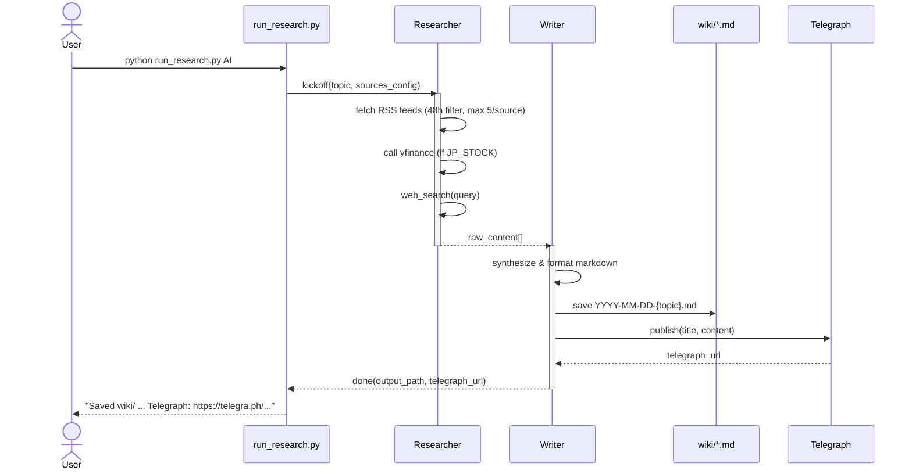
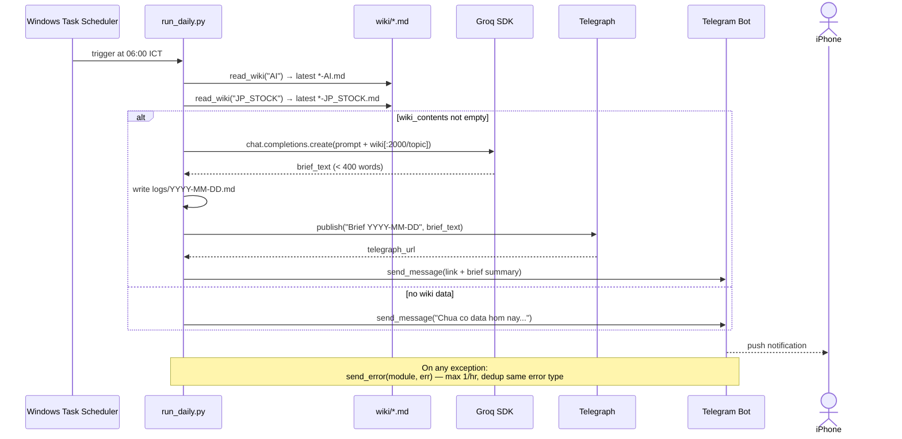
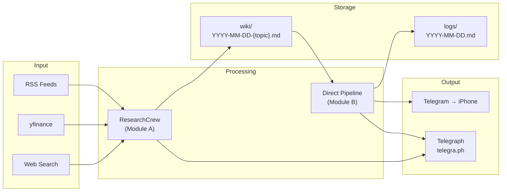

# SD — System Design
**Project:** Personal AI Agent (CrewAI + Groq)
**Date:** 2026-04-26
**Status:** 🟢 Phase 2 Build — DONE & TESTED

---

## 1. Architecture Overview

```mermaid
graph TD
    subgraph TRIGGER["Trigger Layer"]
        TS[Windows Task Scheduler<br/>6:00 ICT daily]
        CLI[CLI<br/>python run_research.py]
    end

    subgraph MOD_A["Module A — ResearchCrew"]
        R[Researcher Agent]
        W[Writer Agent]
    end

    subgraph MOD_B["Module B — Direct Pipeline"]
        RW[read_wiki()]
        LLM[Groq LLM call<br/>llama-3.3-70b]
        PUB[publish()]
        TGS[send_message()]
    end

    subgraph SOURCES["Input Sources"]
        RSS[RSS Feeds]
        YF[yfinance API]
        WS[Web Search]
    end

    subgraph OUTPUT["Output"]
        WIKI[(wiki/*.md)]
        LOG[(logs/*.md)]
        TELE[Telegraph<br/>telegra.ph]
        TGMSG[Telegram Message<br/>→ iPhone]
    end

    CLI --> MOD_A
    TS --> MOD_B

    RSS --> R
    YF --> R
    WS --> R

    R --> W
    W --> WIKI
    W --> TELE

    RW --> WIKI
    RW --> LLM --> PUB --> TELE
    PUB --> TGS --> TGMSG
    LLM --> LOG
```

---

## 2. Module A — Sequence Diagram (ResearchCrew)



> **Note:** ResearchCrew chạy tối đa 3 lần nếu gặp Groq rate limit (backoff 60s/lần).

---

## 3. Module B — Sequence Diagram (Direct Pipeline)



---

## 4. Data Flow Diagram



---

## 5. File & Folder Structure

```
personal-agent/
├── crews/
│   ├── research/
│   │   ├── agents.py         ← Researcher + Writer agents (Groq LLM)
│   │   ├── tasks.py          ← research_task, write_task
│   │   └── crew.py           ← ResearchCrew class + retry logic
│   └── daily/
│       ├── agents.py         ← (không dùng — Module B bypass CrewAI)
│       └── tasks.py          ← (không dùng — Module B bypass CrewAI)
├── tools/
│   ├── rss_tool.py           ← fetch RSS, 48h filter, max 5/source
│   ├── yfinance_tool.py      ← fetch ^N225 (TOPIX unavailable)
│   ├── search_tool.py        ← web search (duckduckgo-search, todo: → ddgs)
│   ├── wiki_tool.py          ← read/write wiki files
│   └── telegraph_tool.py     ← direct requests to api.telegra.ph
├── utils/
│   ├── config.py             ← load config.yaml, resolve paths
│   └── telegram.py           ← send_message(), send_error() (anti-spam)
├── wiki/                     ← knowledge base output
│   └── YYYY-MM-DD-{topic}.md
├── logs/                     ← daily brief logs
│   └── YYYY-MM-DD.md
├── docs/
│   ├── RD-requirements.md
│   ├── SD-system-design.md   ← this file
│   └── SD-interface-contract.md
├── .telegraph_token          ← Telegraph access token (auto-created)
├── .last_error.json          ← anti-spam state cho send_error()
├── config.yaml               ← source list, schedule, LLM config
├── run_research.py           ← entrypoint Module A
├── run_daily.py              ← entrypoint Module B (Task Scheduler)
└── requirements.txt
```

---

## 6. Tech Stack

| Layer | Technology |
|---|---|
| Crew Orchestration | CrewAI (Module A only) |
| LLM | Groq `llama-3.3-70b-versatile` (free tier) |
| RSS Parsing | `feedparser` |
| Stock Data | `yfinance` — chỉ `^N225` (TOPIX không hỗ trợ) |
| Web Search | `duckduckgo-search` (todo: migrate → `ddgs`) |
| Telegraph | Direct `requests` to `api.telegra.ph` |
| Telegram | Direct `requests` to `api.telegram.org` (Bot API) |
| Scheduler | Windows Task Scheduler → `run_daily.py` 6:00 ICT |
| Storage | Local filesystem (`wiki/`, `logs/`) |
| Config | `config.yaml` + `.env` |
