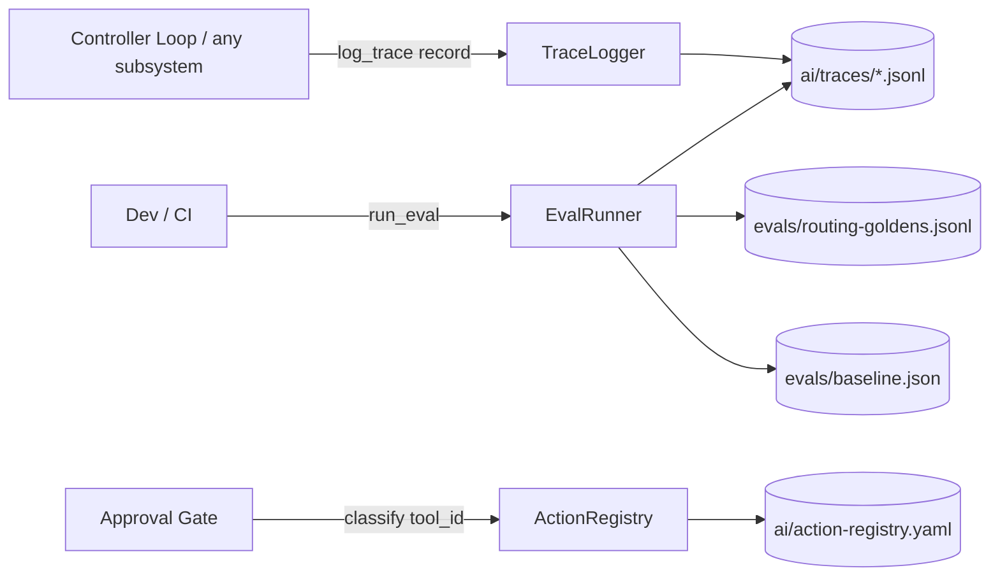

# SD — System Design: Eval Foundation
**Date:** 2026-06-21
**Status:** 🔵 Draft
**Ref:** [`RD-eval-foundation.md`](RD-eval-foundation.md) · plan [`OPERATING-MODEL-OPUS-ANIMUS-v4.md`](OPERATING-MODEL-OPUS-ANIMUS-v4.md) §6.1, §7.1 (L9), §8.2

> Boundary-level design. Interface = signature + I/O shape, KHÔNG implementation detail.

---

## 1. Architecture Overview

3 cấu phần độc lập, animus-level (dùng chung mọi subsystem), đặt ở **root `opus-animus/`**:

```
                 ┌──────────────────────────────────────────────┐
                 │            opus-animus/ (root)               │
                 │                                              │
 controller loop │   ai/traces/        ◀── TraceLogger.log()   │
 (mọi subsystem) ─┼─▶ evals/            ◀── EvalRunner.run()    │
 approval gate   │   ai/action-registry.yaml ◀ ActionRegistry  │
                 └──────────────────────────────────────────────┘
```



Ba cấu phần KHÔNG phụ thuộc nhau lúc chạy: TraceLogger ghi, EvalRunner đọc trace+golden, ActionRegistry tra cứu. EvalRunner là consumer duy nhất đọc trace (L9 không load lúc routing — RD NFR/§7.1).

---

## 2. Data Flow

```
A) Trace (mỗi loop step)
1. step xong → caller dựng record dict (schema §8.2)
2. TraceLogger.log_trace(record) → append 1 dòng JSON vào ai/traces/{JST-date}.jsonl
3. (sau phản hồi user) TraceLogger.patch_trace(id, {user_verdict, outcome})
       → append 1 dòng delta {id, patch:{...}} (append-only, merge khi đọc — RD Q3 default)

B) Eval routing (chạy tay / CI)
1. dev đổi router rule/prompt → run_eval(suite="routing")
2. đọc evals/routing-goldens.jsonl (~50 case)
3. mỗi case: gọi router adapter → predicted target_subsystem
4. so predicted vs gold → routing_accuracy, misroute table, confidence buckets
5. so baseline (evals/baseline.json) → PASS/FAIL → exit code
   (--from-traces: tính misroute_rate thực từ user_verdict trong ai/traces/)

C) Action gate (mỗi action LLM đề xuất)
1. LLM proposal {tool_id, args}
2. ActionRegistry.classify(tool_id) → class (registry, KHÔNG từ LLM)
3. gate_for(class) → {free | requires_approval | requires_confirm}
4. unregistered tool_id → "dangerous" (deny-by-default)
```

---

## 3. Component Breakdown

### TraceLogger
**Trách nhiệm:** Ghi/patch trace append-only. Là cách DUY NHẤT viết vào `ai/traces/`.
**Input:** `record` (dict đúng schema §8.2) hoặc `(id, patch)`.
**Output:** None (side-effect: 1 dòng JSON).
**Side effects:** Append `ai/traces/YYYY-MM-DD.jsonl` (theo JST). Không rewrite dòng cũ.

### EvalRunner
**Trách nhiệm:** Chấm routing trên golden set + (tùy chọn) trên trace thật; áp regression gate; report confidence calibration.
**Input:** `suite` name, `goldens` path, optional `traces` glob, `baseline`.
**Output:** `report` dict + exit code (0 PASS / 1 FAIL). In bảng người-đọc-được.
**Side effects:** Chỉ đọc; ghi `evals/baseline.json` khi `--update-baseline`.

### ActionRegistry
**Trách nhiệm:** Map `tool_id → class` deterministic; quyết định gate. Không gọi LLM.
**Input:** `tool_id` (str).
**Output:** `class` ∈ {read, draft, write, dangerous}; `gate` decision.
**Side effects:** None (đọc registry YAML 1 lần, cache in-memory).

---

## 4. Interface Contracts

### log_trace(record) → None
```python
record = {
    "id": str,              # "YYYY-MM-DD-HHMM-NN" — unique trong ngày, sortable
    "ts": str,              # ISO8601 +09:00
    "origin": "user" | "proactive_trigger",
    "user_input": str,
    "intent_type": str,     # strategy|information|execution|content|memory|health|infra|admin
    "target_subsystem": str,# NEXUS|CONSILIUM|LOGOS|RECTOR|LUCIDA|WIKI|INFRA
    "route_confidence": float,   # 0.0–1.0
    "sources_loaded": list[str],
    "action_class": str,    # read|draft|write|dangerous (từ ActionRegistry, không từ LLM)
    "output_kind": str,
    "step_index": int,      # ≥0; multi-step task chia sẻ id-prefix, khác step_index
}
# Errors: raise ValueError nếu thiếu field bắt buộc / enum sai (validate trước khi ghi)
# Side effect: append 1 dòng vào ai/traces/{date}.jsonl
```

### patch_trace(id, patch) → None
```python
patch = {"user_verdict": "accepted"|"snoozed"|"dismissed"|None,
         "outcome": "done"|"used"|"ignored"|None}
# Append dòng delta: {"id": id, "patch": patch}. Merge-by-id khi EvalRunner đọc.
```

### run_eval(suite, goldens, traces=None, baseline=...) → report
```python
report = {
    "suite": "routing",
    "n": int,
    "routing_accuracy": float,
    "misroute_rate": float,
    "misroutes": [{"input": str, "gold": str, "got": str}],
    "confidence_buckets": [{"range": "0.9-1.0", "n": int, "accuracy": float}],  # [F7]
    "baseline": float,
    "result": "PASS" | "FAIL",
}
# exit code 1 nếu routing_accuracy < baseline (regression gate)
```

### classify(tool_id) → class  ·  gate_for(class) → gate
```python
classify("calendar.events.insert") -> "write"
classify("telegram.broadcast")     -> "dangerous"   # unregistered → deny-by-default
gate_for("read")     -> "free"
gate_for("draft")    -> "free"
gate_for("write")    -> "requires_approval"
gate_for("dangerous")-> "requires_confirm"
```

---

## 5. Storage & State

| Data | Location | Format | Lifetime |
|---|---|---|---|
| Run traces (L9) | `opus-animus/ai/traces/YYYY-MM-DD.jsonl` | JSONL append-only | Permanent (eval/replay) |
| Routing goldens | `opus-animus/evals/routing-goldens.jsonl` | JSONL `{input,target_subsystem,note?,lang?}` | Permanent |
| Eval baseline | `opus-animus/evals/baseline.json` | JSON `{routing_accuracy: float}` | Cập nhật tay khi cải thiện |
| Action registry | `opus-animus/ai/action-registry.yaml` | YAML `tool_id: class` | Permanent (mở rộng khi thêm tool) |

> Vị trí root `opus-animus/` chốt theo RD Q1 default (L9/eval là animus-level). Cần user confirm.

---

## 6. Error Handling Strategy

| Scenario | Behavior | Logged? |
|---|---|---|
| Record thiếu field / enum sai | `log_trace` raise ValueError (internal logic) | — |
| Ghi trace lỗi I/O | raise (không nuốt — trace là audit) | Yes (stderr) |
| Golden file thiếu/parse lỗi | EvalRunner raise, dừng (không chấm mù) | Yes |
| Router adapter lỗi 1 case | đếm là miss, ghi vào misroutes, tiếp tục | Yes |
| `tool_id` không có trong registry | trả `dangerous` (deny-by-default), KHÔNG raise | Yes (gate log) |

**Principle:** lỗi internal logic → raise; tool lạ ở gate → deny-by-default, không raise.

---

## 7. Technology Decisions

| Quyết định | Chọn | Lý do | Không chọn vì |
|---|---|---|---|
| Trace store | JSONL append-only | Replayable, crash-safe theo dòng, diff-friendly, no infra | SQLite: overkill single-user; khó diff |
| Patch verdict | Append delta + merge-by-id | Giữ append-only thuần (RD NFR-02) | Rewrite-by-id: phá append-only, risk corrupt |
| Action class source | Registry YAML deterministic | Safety gate không được phụ thuộc LLM self-label (§6.1) | LLM self-label: lỗ hổng an toàn |
| Unregistered tool | `dangerous` (deny-by-default) | An toàn mặc định | default read: side-effect ngầm |
| Router eval | Claude CLI qua adapter | Tái dùng `utils/llm.py`, không cần API key | API SDK: thêm key/cost |
| Registry format | YAML phẳng | Người đọc/sửa tay dễ | JSON: ít readable; code: khó audit |

---

*Eval Foundation — SD v1 | 2026-06-21 | opus-animus v4 Phase 1*
