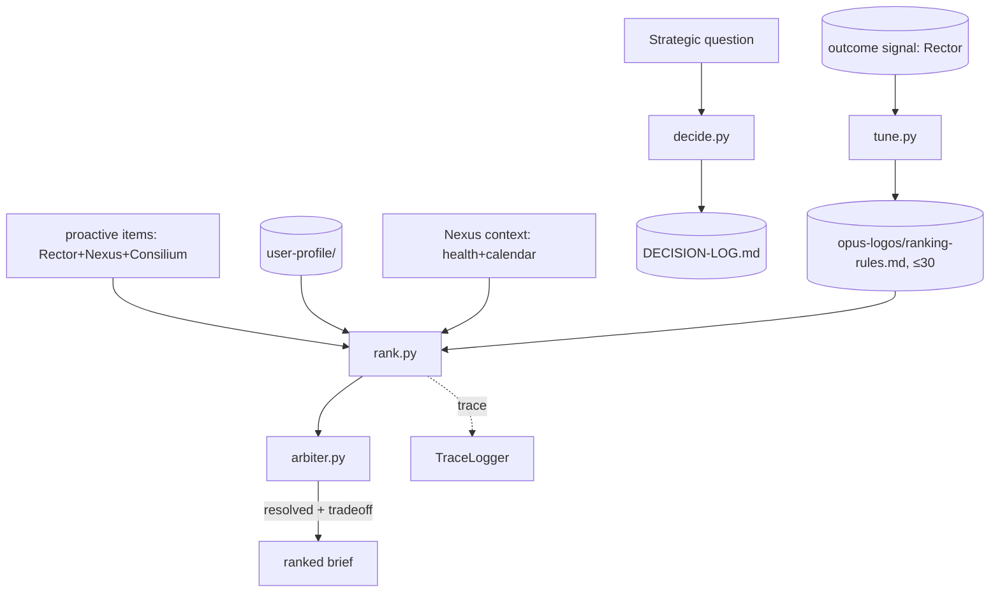

# SD — System Design: Opus Logos (Strategy Brain)
**Date:** 2026-06-21
**Status:** 🔵 Draft
**Ref:** [`RD-proactive-mvp.md`](RD-proactive-mvp.md) · plan [`OPERATING-MODEL-OPUS-ANIMUS-v4.md`](OPERATING-MODEL-OPUS-ANIMUS-v4.md) §1, §3.3, §5, §7.2, §10
**Phụ thuộc:** [`SD-eval-foundation.md`](SD-eval-foundation.md) (trace + action registry); đọc outcome signal từ [`SD-opus-rector.md`](SD-opus-rector.md)

> Full subsystem design. Boundary-level.

---

## 1. Architecture Overview

**Logos = strategic reasoning brain.** *"Logos thinks."* Owns priority, roadmap, decision, stop-list — và (v4) là **ranker** + **arbiter cuối cùng** của brief (§3.3), và **tuner** của ranking từ outcome signal (§5).

```
opus-logos/
├── CLAUDE.md                 ← subsystem law + map
├── ai/
│   └── status.md             ← Logos state (thin map)
├── docs/
├── logos/                    ← logic (Phase 4, sau BD)
│   ├── rank.py               ← rank proactive items theo goal/energy/calendar
│   ├── arbiter.py            ← conflict resolution, precedence cố định
│   ├── decide.py             ← strategic decision → DECISION-LOG
│   └── tune.py               ← re-rank heuristics từ outcome signal
└── README.md
```

Logos **owns** (ghi): `DECISION-LOG.md` (animus-level decisions), ranking heuristics.
Logos **đọc**: user-profile (goals/prefs/constraints), outcome signal (Rector), context hôm nay (Nexus).



---

## 2. Data Flow

```
A) Rank (cho daily brief)
1. rank(items, profile, context) — items đã gom từ Rector/Nexus/Consilium
2. score mỗi item: goal-alignment(profile) + urgency + energy/calendar fit + heuristics
3. trả items theo thứ tự ưu tiên (chưa giải mâu thuẫn)

B) Arbitrate (§3.3 [F4]) — brief KHÔNG được chứa 2 đề xuất mâu thuẫn
1. detect_conflicts(ranked_items)  (vd "push deadline" ⨯ "rest for recovery")
2. áp precedence CỐ ĐỊNH: safety/health > hard deadline > goal priority > preference
3. drop/hạ bậc item thua; giữ item thắng + GẮN trade-off statement
4. trả (resolved_items, tradeoff_notes)

C) Decide (strategic, ngoài brief)
1. decide(question, context) → decision + rationale
2. append DECISION-LOG.md (không sống chỉ trong chat — §7.3)

D) Tune (§5) — outcome-driven, KHÔNG fine-tuning
1. đọc outcome signal (Rector): item done vs not_done
2. điều chỉnh heuristic re-rank (vd hạ trọng số loại nudge bị accept-nhưng-không-done)
3. ghi ranking-rules.md (≤30, reconcile weekly)
```

---

## 3. Component Breakdown

### rank.py — Ranker
**Trách nhiệm:** Xếp ưu tiên item theo goal-alignment + năng lượng/lịch hôm nay + heuristics. KHÔNG giải mâu thuẫn (việc của arbiter).
**Input:** `items`, `user_profile`, `context` (health+calendar).
**Output:** `ranked_items` (có `score`, `priority`).
**Side effects:** None (đọc heuristics).

### arbiter.py — Conflict resolver
**Trách nhiệm:** Đảm bảo brief không chứa đề xuất mâu thuẫn; resolve theo precedence cố định; phát trade-off.
**Input:** `ranked_items`.
**Output:** `(resolved_items, tradeoff_notes)`.
**Side effects:** None.

### decide.py — Strategic decision
**Trách nhiệm:** Quyết định chiến lược/priority/stop-list; ghi lại lý do.
**Input:** `question`, `context`.
**Output:** `{decision, rationale, alternatives}`.
**Side effects:** Append `DECISION-LOG.md`.

### tune.py — Ranking tuner
**Trách nhiệm:** Cập nhật heuristic re-rank từ outcome signal. Heuristic only, no weights/fine-tune.
**Input:** outcome signals (từ Rector).
**Output:** updated rule set.
**Side effects:** Ghi `opus-logos/ranking-rules.md` (≤30).

---

## 4. Interface Contracts

### rank(items, profile, context) → ranked_items
```python
ranked_item = {**item,           # item schema §3.6
    "score": float,              # 0.0–1.0
    "priority": "high"|"medium"|"low",
    "rank_reason": str,          # vì sao xếp hạng này (đưa vào trace)
}
# deterministic-ish: cùng input ⇒ cùng thứ tự (seed/temp thấp nếu dùng Claude CLI)
```

### arbitrate(ranked_items) → (resolved_items, tradeoff_notes)
```python
PRECEDENCE = ["safety/health", "hard_deadline", "goal_priority", "preference"]
# Rule: không 2 item mâu thuẫn cùng tồn tại; item thua bị drop/hạ bậc
tradeoff_note = {
    "kept": item_id, "dropped": item_id,
    "reason": "health > deadline mềm; deadline còn đệm 2 ngày",
}
```

### decide(question, context) → decision
```python
decision = {"decision": str, "rationale": str, "alternatives": list[str]}
# Side effect: append DECISION-LOG.md (id, date, question, decision, rationale)
```

### tune(outcome_signals) → rules
```python
# outcome_signals: [{item_id, kind, engagement, outcome}]
# weight outcome > engagement; cập nhật ranking-rules.md (≤30, reconcile weekly)
```

---

## 5. Storage & State

| Data | Location | Format | Owner | Lifetime |
|---|---|---|---|---|
| Strategic decisions | `opus-animus/DECISION-LOG.md` | MD append | **Logos** | Permanent (§7.2) |
| Ranking heuristics | `opus-logos/ranking-rules.md` | MD, ≤30 | Logos | Bounded |
| Logos status | `opus-logos/ai/status.md` | MD thin | Logos | Live |
| Roadmap / stop-list | `opus-logos/docs/` hoặc DECISION-LOG | MD | Logos | Permanent |
| User profile (read) | `opus-animus/user-profile/` | JSON | (read-only) | — |

---

## 6. Error Handling Strategy

| Scenario | Behavior | Logged? |
|---|---|---|
| user-profile thiếu | degrade: dùng GOALS.md/north-star; rank kém chính xác, nêu rõ | Yes |
| Không detect được conflict rõ ràng | giữ nguyên thứ tự rank, không bịa trade-off | Yes |
| Ranking-rules > 30 | merge/retire yếu nhất | Yes |
| LLM rank parse lỗi | retry 1x → fallback heuristic deterministic | Yes |
| decide() ghi DECISION-LOG lỗi I/O | raise (quyết định phải được lưu — §7.3) | Yes |

**Principle:** thiếu input ngoài → degrade + nêu gap (§10); ghi decision lỗi → raise.

---

## 7. Technology Decisions

| Quyết định | Chọn | Lý do | Không chọn vì |
|---|---|---|---|
| Logos là subsystem riêng | folder `opus-logos/` | v4 §1: reasoning ≠ execution ≠ information | Gộp Rector: lẫn "thinks" và "plans" |
| Arbiter precedence CỐ ĐỊNH | safety>deadline>goal>pref (§3.3) | Deterministic, audit được; brief không mâu thuẫn | LLM tự quyết precedence: không nhất quán |
| Rank: Claude CLI có ràng buộc | 1 call/brief, precedence trong prompt | Rẻ, đủ tốt MVP; reuse `utils/llm.py` | Pure heuristic: kém ngữ cảnh; ML rank: overkill |
| Tune = heuristic re-rank | ranking-rules.md ≤30 | §5 "no fine-tuning" | Weights/fine-tune: opaque, không audit |
| Logos owns DECISION-LOG | animus-level MD | §7.2 SoT cho decision | Để trong chat: §7.3 cấm |

---

*Opus Logos — SD v1 | 2026-06-21 | opus-animus v4*
