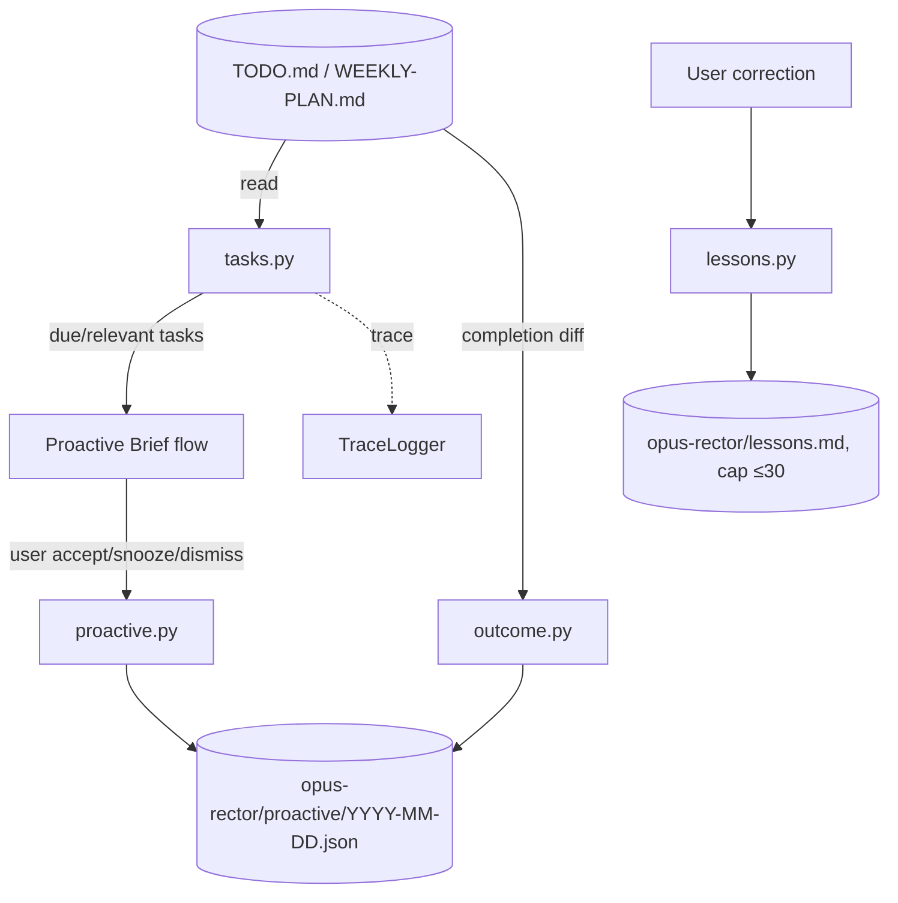

# SD — System Design: Opus Rector (Execution Brain)
**Date:** 2026-06-21
**Status:** 🔵 Draft
**Ref:** [`RD-proactive-mvp.md`](RD-proactive-mvp.md) · plan [`OPERATING-MODEL-OPUS-ANIMUS-v4.md`](OPERATING-MODEL-OPUS-ANIMUS-v4.md) §1, §3.3, §5, §7.2
**Phụ thuộc:** [`SD-eval-foundation.md`](SD-eval-foundation.md) (trace + action registry)

> Full subsystem design (user chọn "build full 2 subsystem"). Boundary-level.

---

## 1. Architecture Overview

**Rector = PM execution brain.** *"Rector plans."* Owns task breakdown, TODO index, workflow, handoff, status — và (v4) **vòng đời proactive item** + **outcome/correction signal**.

```
opus-rector/
├── CLAUDE.md                 ← subsystem law + map
├── ai/
│   └── status.md             ← Rector state (thin map)
├── docs/                     ← SDD docs cho Rector
├── rector/                   ← logic (Phase 4, sau BD)
│   ├── tasks.py              ← breakdown + pull due/relevant
│   ├── proactive.py          ← proactive item lifecycle + state
│   ├── outcome.py            ← engagement vs outcome signal
│   └── lessons.py            ← correction → lesson (bounded)
└── README.md
```

Nguồn dữ liệu Rector **đọc** (không own): `TODO.md`, `WEEKLY-PLAN.md` (animus-level master index, §7.2).
Rector **owns** (ghi): proactive item-set + state, lessons, outcome log.



---

## 2. Data Flow

```
A) Pull due tasks (cho daily brief)
1. pull_due_tasks(date, profile) đọc TODO.md + WEEKLY-PLAN.md
2. filter: due ≤ window | flagged this-week | relevant tới active goal (profile)
3. trả [task] (chưa rank — ranking là việc Logos)

B) Proactive item lifecycle (Rector owns logic + store; Nexus đọc qua API)
1. brief tạo proactive_item-set (schema §3.6) → save_proactive_set(date, items)
2. user action → update_proactive_state(item_id, state)
3. dismiss được nhớ trong ngày → exclude_dismissed(date) khi pull lại
4. Nexus render brief → get_proactive_set(date) (read-only API, KHÔNG đọc file trực tiếp)

C) Outcome signal (§5 [F5] — tách khỏi engagement)
1. record_engagement(item_id, accepted|snoozed|dismissed)   # weak
2. record_outcome(item_id): diff TODO completion hôm nay vs khi item tạo
   → done|not_done                                          # strong, > engagement

D) Correction → lesson
1. log_lesson(correction): append heuristic re-rank rule
2. cap ≤30; reconcile/merge weekly (§5)
```

---

## 3. Component Breakdown

### tasks.py — Task breakdown + pull
**Trách nhiệm:** breakdown goal → task; pull due/relevant tasks; KHÔNG rank, KHÔNG ghi TODO master tự ý.
**Input:** `date`, `user_profile`; hoặc `goal` cho breakdown.
**Output:** `[task]` dicts.
**Side effects:** Đọc `TODO.md`/`WEEKLY-PLAN.md`. (Ghi TODO chỉ khi user duyệt — không trong brief flow.)

### proactive.py — Proactive item lifecycle
**Trách nhiệm:** Tạo/lưu/cập nhật state proactive item; là **single writer** của store. Nexus đọc qua `get_proactive_set()`, không chạm file.
**Input:** `date`, `items` (schema §3.6) / `(item_id, state)`.
**Output:** item-set / updated state.
**Side effects:** Ghi `opus-rector/proactive/YYYY-MM-DD.json` (chỉ Rector được ghi).

### outcome.py — Signal split
**Trách nhiệm:** Ghi engagement (weak) + outcome (strong) riêng biệt. Outcome lấy từ TODO completion, KHÔNG từ click.
**Input:** `item_id`, completion source.
**Output:** `{engagement, outcome}`.
**Side effects:** Append vào proactive store + trace `outcome` field.

### lessons.py — Correction loop
**Trách nhiệm:** correction → heuristic re-rank rule; cap ≤30; weekly reconcile.
**Input:** `correction` text/context.
**Output:** lesson entry.
**Side effects:** Ghi `opus-rector/lessons.md` (bounded). KHÔNG fine-tuning.

---

## 4. Interface Contracts

### pull_due_tasks(date, profile) → list[task]
```python
task = {
    "id": str, "title": str,
    "source": "TODO" | "WEEKLY-PLAN",
    "due": str | None,           # ISO date
    "flag": "this_week" | None,
    "goal_ref": str | None,      # link tới user-profile/goals
}
# read-only trên TODO.md/WEEKLY-PLAN.md; raise nếu file thiếu? → degrade: trả [] + warn
```

### save_proactive_set(date, items) → None  ·  update_proactive_state(item_id, state) → None
```python
item = {  # schema §3.6
    "id": str, "trigger": "time"|"event"|"threshold",
    "source_subsystem": "RECTOR"|"LOGOS"|"NEXUS"|"CONSILIUM",
    "kind": "task"|"health_nudge"|"calendar_prep"|"knowledge_nudge"|"info_alert",
    "title": str, "reason": str, "priority": "high"|"medium"|"low",
    "suggested_action": str, "requires_approval": True,
    "state": "pending"|"accepted"|"snoozed"|"dismissed",
}
state ∈ {"accepted","snoozed","dismissed"}
# Side effect: opus-rector/proactive/{date}.json (Rector = single writer)
```

### get_proactive_set(date) → items   (read API cho Nexus render)
```python
# read-only; Nexus/eval lấy item-set qua đây thay vì đọc file → boundary là interface, không phải shared folder
items = list[proactive_item]
```

### record_engagement(item_id, signal) → None  ·  record_outcome(item_id) → outcome
```python
signal  ∈ {"accepted","snoozed","dismissed"}     # engagement (weak)
outcome ∈ {"done","not_done"}                    # từ TODO completion diff (strong)
# Ranking về sau weight outcome > engagement (§5 [F5]) — tuning thuộc Logos
```

### log_lesson(correction) → None
```python
# append heuristic rule; nếu >30 active → merge/retire yếu nhất; weekly reconcile mâu thuẫn
```

---

## 5. Storage & State

| Data | Location | Format | Owner | Lifetime |
|---|---|---|---|---|
| Master task index | `opus-animus/TODO.md` | MD | animus (Rector reads) | Permanent |
| Weekly focus | `opus-animus/WEEKLY-PLAN.md` | MD | animus (Rector reads) | Per week |
| Proactive item-set + state | `opus-rector/proactive/YYYY-MM-DD.json` | JSON | **Rector** (single writer) | Permanent (§7.2 [F6]) |
| Outcome/engagement log | trong proactive json + trace | JSON/JSONL | Rector | Permanent |
| Lessons (re-rank rules) | `opus-rector/lessons.md` | MD, cap ≤30 | Rector | Bounded |
| Rector status | `opus-rector/ai/status.md` | MD thin | Rector | Live |

> **Deviation khỏi v4 §7.2 (chốt 2026-06-21, ghi DECISION-LOG):** v4 đặt store ở `opus-nexus/proactive/`. Đổi về `opus-rector/proactive/` để **một writer sở hữu store của nó** (khớp luật wiki "chỉ Module C ghi `personal-wiki/`"). Nexus đọc qua `get_proactive_set()` — boundary là interface, không phải shared folder.

---

## 6. Error Handling Strategy

| Scenario | Behavior | Logged? |
|---|---|---|
| TODO.md/WEEKLY-PLAN.md thiếu | degrade: trả [], brief nêu "không đọc được task" | Yes |
| proactive json corrupt | bắt đầu set mới cho ngày, backup file cũ | Yes |
| outcome không xác định được (no completion data) | outcome=None, chỉ giữ engagement | Yes |
| lessons > 30 | merge/retire yếu nhất (không raise) | Yes |
| Action có side-effect (vd sửa TODO) | qua ActionRegistry → write ⇒ requires_approval | Yes (trace) |

---

## 7. Technology Decisions

| Quyết định | Chọn | Lý do | Không chọn vì |
|---|---|---|---|
| Rector là subsystem riêng | folder `opus-rector/` | v4 §1 tách execution brain khỏi Consilium | Nhét vào Consilium: lẫn information vs execution |
| Proactive store JSON/ngày | `opus-rector/proactive/{date}.json` | Single-writer (Rector own logic+store); dễ patch state | `opus-nexus/proactive/` (v4 gốc): tách writer khỏi store → nhầm ownership |
| Nexus lấy proactive qua API | `get_proactive_set()` | Boundary = interface, không shared folder | Nexus đọc file trực tiếp: 2 subsystem coupling ở filesystem |
| Rector đọc, không own TODO.md | TODO.md animus-level | TODO là master index dùng chung (§7.2) | Rector own TODO: khoá việc subsystem khác đọc |
| Lessons = heuristic, bounded ≤30 | MD list | §5 "no fine-tuning"; tránh phình | Fine-tuning/weights: opaque, ngoài scope |
| Outcome tách engagement | 2 field riêng | accept ≠ useful (§5 [F5]) | Gộp 1 signal: rank theo click, sai |

---

*Opus Rector — SD v1 | 2026-06-21 | opus-animus v4*
