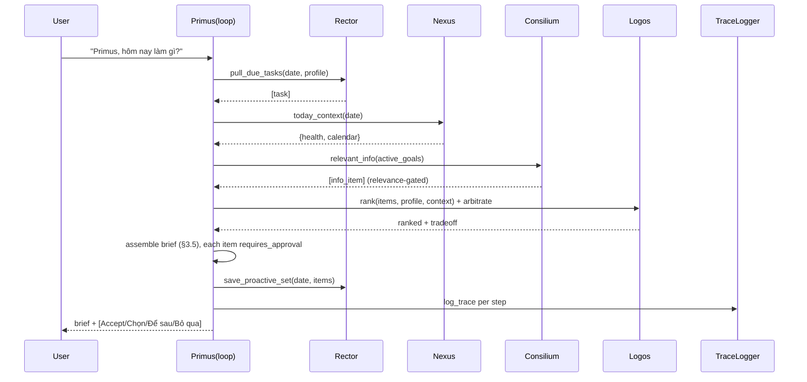

# SD — System Design: Proactive Daily Brief (Pull-Mode)
**Date:** 2026-06-21
**Status:** 🔵 Draft
**Ref:** [`RD-proactive-mvp.md`](RD-proactive-mvp.md) · plan [`OPERATING-MODEL-OPUS-ANIMUS-v4.md`](OPERATING-MODEL-OPUS-ANIMUS-v4.md) §3, §8.1, §11 Phase 2
**Phụ thuộc:** [`SD-eval-foundation.md`](SD-eval-foundation.md), [`SD-opus-rector.md`](SD-opus-rector.md), [`SD-opus-logos.md`](SD-opus-logos.md)

> SD orchestration — wiring các subsystem thành 1 brief. Boundary-level.

---

## 1. Architecture Overview

Pull-mode: user hỏi *"hôm nay làm gì"* → controller loop (§8.1) chạy chuỗi step chaining subsystem → 1 brief mạch lạc. **Suggestion only.**

```
intent_packet(origin, expected_output=proactive_item set)
        │  controller loop (§8.1), max_steps nhỏ
        ▼
  ┌──────────┬───────────┬────────────┬──────────┐
  │ Rector   │  Nexus    │ Consilium  │  Logos   │ → Primus assemble
  │ pull task│ health+   │ info mới   │ rank +   │   (brief §3.5)
  │          │ calendar  │ (relevance)│ arbiter  │
  └────┬─────┴─────┬─────┴─────┬──────┴────┬─────┘
       └───────────┴───────────┴───────────┘
                   │ mỗi step → TraceLogger (L9)
                   ▼
           opus-rector/proactive/{date}.json  (state, Rector owns)
```



---

## 2. Data Flow

```
1. Trigger     → intent_packet{origin, expected_output=proactive_item set, plan=[steps]}
2. Rector      → pull_due_tasks(date, profile)        → task items
3. Nexus       → today_context(date)                  → health + calendar context
4. Consilium   → relevant_info(active_goals)          → info items (relevance gate §3.7)
4b. Actio      → finance_signals(active_goals)        → finance_alert items (read-only export, finance-goal-gated)
5. user-profile→ goals/prefs/constraints              → bias cho bước 6
6. Logos       → rank(items, profile, context)        → ranked
               → arbitrate(ranked)                    → resolved + trade-off (§3.3)
7. Primus      → assemble §3.5 (greeting/context/đề xuất/action bar)
8. ActionRegistry → mỗi suggested action gắn class; write/dangerous ⇒ requires_approval
9. Rector      → save_proactive_set(date, items) → opus-rector/proactive/{date}.json
10. TraceLogger→ log_trace mỗi step (L9)
11. (sau phản hồi) update_proactive_state + record_engagement/outcome
```

**Controller loop guards (§8.1):** max_steps (7, gồm Actio finance step); no-progress 2 lần → ask/abort; mỗi step ghi trace; single-hop "hôm nay làm gì" thường kết thúc sau 1 vòng finish.

---

## 3. Component Breakdown

### Primus brief orchestrator (controller loop)
**Trách nhiệm:** Chạy loop §8.1, gọi từng subsystem theo plan, ráp brief, gate action, ghi trace. KHÔNG tự quyết priority (Logos), KHÔNG tự thực thi (suggestion only §3.1).
**Input:** `intent_packet` (origin=user|proactive_trigger).
**Output:** `brief` (text §3.5) + `proactive_item-set`.
**Side effects:** trace; lưu proactive set (qua Rector).

### Nexus context provider
**Trách nhiệm:** Cấp health + calendar context hôm nay; render-friendly. (Nexus là interface + health owner.)
**Input:** `date`.
**Output:** `{health_summary, calendar_today}`.
**Side effects:** Đọc `opus-nexus/health/`, lịch (nếu có); thiếu calendar → bỏ dòng lịch (RD Q4).

### Consilium info injector
**Trách nhiệm:** Cấp thông tin mới high-signal CHỈ KHI khớp active goal (relevance gate).
**Input:** `active_goals`.
**Output:** `[info_item]` (có thể rỗng → im lặng, không bịa §3.7).
**Side effects:** Đọc daily intel logs / wiki.

(Rector & Logos: xem SD riêng.)

---

## 4. Interface Contracts

### generate_brief(intent_packet) → (brief, items)
```python
intent_packet = {
    "origin": "user"|"proactive_trigger",
    "expected_output": "proactive_item set",
    "context_depth": "L1",       # thin; deep load chỉ khi cần
    "plan": [ "rector.pull", "nexus.context", "consilium.info", "logos.rank_arbitrate", "assemble" ],
    "step_index": 0,
}
brief = str                       # shape §3.5, tiếng Việt
items = list[proactive_item]      # schema §3.6, mỗi item requires_approval=True
# Rate limit: ≤1 morning + 1 evening/ngày (RD FR-16); pull lần 2 không item mới → câu "không có gì mới"
```

### today_context(date) → context  ·  relevant_info(goals) → list[info_item]
```python
context = {"health_summary": str, "calendar_today": str | None}
info_item = {"title": str, "reason": str, "goal_ref": str}   # rỗng được phép
```

### (dùng lại từ SD khác)
```python
# Rector:  pull_due_tasks, save_proactive_set, update_proactive_state, record_engagement/outcome
# Logos:   rank, arbitrate
# Eval:    log_trace, classify, gate_for
```

---

## 5. Storage & State

| Data | Location | Format | Owner | Lifetime |
|---|---|---|---|---|
| Proactive item-set + state | `opus-rector/proactive/YYYY-MM-DD.json` | JSON | Rector | Permanent |
| Brief render (optional cache) | `opus-rector/proactive/` cùng file | JSON field | Rector | Permanent |
| Run traces | `opus-animus/ai/traces/*.jsonl` | JSONL | (TraceLogger) | Permanent |
| Health/calendar source | `opus-nexus/health/`, lịch | MD/JSON | Nexus | Permanent |

---

## 6. Error Handling Strategy

| Scenario | Behavior | Logged? |
|---|---|---|
| 1 subsystem thiếu dữ liệu | degrade: ráp brief từ phần có, nêu rõ gap (§10, RD NFR-03) | Yes (trace) |
| Consilium info rỗng | bỏ phần info, KHÔNG bịa nudge (§3.7) | Yes |
| Conflict không resolve được | Logos giữ rank, không ship 2 mâu thuẫn; nếu vẫn mơ hồ → hỏi 1 câu | Yes |
| Pull lần 2 trong ngày | trả "không có gì mới", không nhân bản item (RD NFR-04) | Yes |
| Action write/dangerous | gate → requires_approval/confirm, KHÔNG tự chạy | Yes |
| no-progress 2 vòng loop | stop → ask hoặc abort (§8.1), không spin | Yes |

---

## 7. Technology Decisions

| Quyết định | Chọn | Lý do | Không chọn vì |
|---|---|---|---|
| Pull trước, push sau | on-demand generate | Kiểm soát chất lượng + anti-annoy trước khi tự gửi (§3.4) | Push ngay: spam khi brief chưa ổn |
| Controller loop, không single-dispatch | loop §8.1 max_steps | brief = chain nhiều subsystem | 1-hop dispatch: không chain được |
| Orchestrator = Primus (coordination) | không phải 1 agent | §1.1 "Primus is coordination, not a component" | 1 mega-agent: phá tách subsystem |
| Mọi action qua ActionRegistry | gate deterministic | suggestion-only + safe (§6.1) | LLM self-label: lỗ hổng |
| State ở opus-rector/proactive/ (Rector) | §7.2 SoT | không trap trong chat/status | status.md: §7.3 cấm |
| Trace mỗi step trước khi ship suggestion | log_trace L9 | §8.2 "instrument loop trước khi ship" | Không trace: feedback học mù |

---

*Proactive Daily Brief — SD v1 | 2026-06-21 | opus-animus v4 Phase 2*
