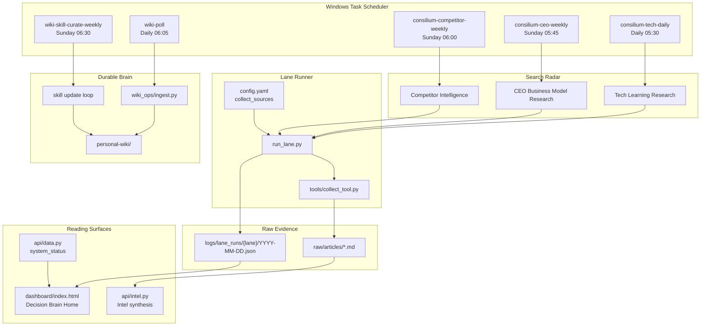

# SA - Opus Consilium System Architecture
**Date:** 2026-05-30  
**Status:** Current runtime architecture  
**Scope:** Decision brain, research scheduler, dashboard, wiki/update loops

---

## 1. Architecture Thesis

Opus Consilium is no longer a generic research dashboard.

It is a decision brain that reads the world through three search lanes, filters signals by decision impact, then routes the result into one of four outcomes:

1. wiki update
2. action / test
3. skill or method update
4. ignore

The core loop is:

```text
Search Radar -> Signal Filter -> Decision Route -> Wiki / Action / Skill Update
```

Consilium should not preserve news just because it is new. A signal matters only when it changes a belief, decision, workflow, skill, thesis, or watchlist.

---

## 2. Current Runtime Structure



---

## 3. Search Lanes

The lane runner lives at:

```text
opus-consilium/run_lane.py
```

It wraps the existing collector functions, but changes the search question and source slice per lane.

| Lane | Task | Cadence | Source count | Primary question | Default route |
|---|---|---:|---:|---|---|
| Tech Learning Research | `consilium-tech-daily` | Daily 05:30 | 14 | What should Huy test, learn, or add to his AI/operator workflow? | Skill / workflow update |
| CEO Business Model Research | `consilium-ceo-weekly` | Sunday 05:45 | 12 | What changes market structure, budget, pricing, adoption, or thesis? | Decision / thesis update |
| Competitor Intelligence | `consilium-competitor-weekly` | Sunday 06:00 | 9 | What named competitor move changes positioning, offer, or watchlist? | FDE / response watchlist |

The wrapper scripts live one level above the project:

```text
C:\Users\HUY\workspace\ai-workspace\run_lane_tech.bat
C:\Users\HUY\workspace\ai-workspace\run_lane_ceo.bat
C:\Users\HUY\workspace\ai-workspace\run_lane_competitor.bat
```

Each script runs:

```text
Python 3.11 -> opus-consilium/run_lane.py --lane {tech|ceo|competitor} --no-notify
```

---

## 4. Signal Filter

All lanes share the collector's existing mechanics:

```text
fetch_all_sources()
dedupe_articles()
goal_align_filter()
rank_top()
save_raw_articles()
daily_synthesis()
```

The important change is that `goal_align_filter()` now receives a lane-specific goal:

- Tech filters for agent workflow, evaluation, coding tools, governance, model capability, and practical repo/tool tests.
- CEO filters for market structure, enterprise budget, pricing, product strategy, adoption, regulation, and investment implication.
- Competitor filters for named moves by Microsoft, Fujitsu, NTT Data, Hitachi, Accenture, Capgemini, IBM Japan, SIers, analysts, and AI-SDLC vendors.

The filter keeps a source only if it has decision impact. The system intentionally drops generic novelty and repeated thesis.

---

## 5. LLM Provider Layer

All LLM calls go through:

```text
utils/llm.py
```

The public helper names remain `claude_cli()` and `claude_cli_json()` so existing callers do not need to change. Under the hood, the helper now supports:

- default Claude CLI execution
- Gemini REST execution when `CONSILIUM_LLM_PROVIDER=gemini`
- automatic Gemini fallback when Claude fails and `GEMINI_API_KEY` is present

Operational knobs:

```text
GEMINI_API_KEY=...
GEMINI_MODEL=gemini-2.5-flash
CONSILIUM_LLM_PROVIDER=claude|gemini
CONSILIUM_LLM_FALLBACK=gemini|none
```

This keeps the Decision Brain architecture model-agnostic: lane search, ingest, query, and skill updates all use the same provider boundary.

---

## 6. Storage Contract

### Raw articles

Lane outputs are saved through the existing collector contract:

```text
raw/articles/YYYY-MM-DD-{slug}.md
```

Required metadata:

```md
# Title

**Source:** openai-news
**URL:** https://...
**Published:** 2026-05-30 00:00 UTC
**Topic:** AI
**Tier:** 0
**Source-Kind:** market_news
**Goal-Score:** 5
**Relevance:** Concrete takeaway. -> Specific next action.
```

### Lane reports

Each lane also writes a compact audit report:

```text
logs/lane_runs/{lane}/YYYY-MM-DD.json
```

This report stores:

- lane label and task name
- source statistics
- number of new and saved articles
- top ranked items
- synthesis status

---

## 7. Wiki Boundary

The wiki remains the durable brain:

```text
personal-wiki/
```

Rules:

1. `raw/` is immutable evidence.
2. `personal-wiki/` is the durable belief/decision layer.
3. Dashboard/Intel output is provisional until promoted.
4. A signal becomes wiki material only when it updates a durable page, decision, open question, thesis, roadmap, or method.
5. Skill updates are method updates, not content summaries.

The current lane runner does not auto-ingest by default. This is intentional: lane search collects and filters evidence first; wiki promotion should happen after impact is clear.

---

## 8. Dashboard Structure

The Home page is now the decision-brain surface:

```text
dashboard/index.html
```

Current visible Home sections:

1. Decision Brain hero
2. Search Radar
   - Tech Learning Research
   - CEO Business Model Research
   - Competitor Intelligence
3. Signal Filter
4. Wiki / Action / Skill Update routing
5. Ops Pulse
6. Today
7. Finance / Health / Career quick context

Removed from sidebar:

- Reading
- Actions

The dashboard status API maps to the new operational architecture:

```text
api/data.py -> system_status()
```

Current status rows:

| Row | Task |
|---|---|
| Tech Learning Research | `consilium-tech-daily` |
| CEO Business Model Research | `consilium-ceo-weekly` |
| Competitor Intelligence | `consilium-competitor-weekly` |
| Wiki Poll - Evidence to Pages | `wiki-poll` |
| Skill Update Loop | `wiki-skill-curate-weekly` |
| Markitdown Input Tool | inbox directory check |

`ok` means the task exists and is enabled. If a task has not run yet, Home shows the next scheduled run.

---

## 9. Scheduler State

Current active tasks:

| Task | State | Next run | Role |
|---|---|---|---|
| `consilium-tech-daily` | Enabled | 2026-05-31 05:30 | Daily tech learning lane |
| `consilium-ceo-weekly` | Enabled | 2026-05-31 05:45 | Weekly CEO/business model lane |
| `consilium-competitor-weekly` | Enabled | 2026-05-31 06:00 | Weekly competitor intelligence lane |
| `wiki-poll` | Enabled | 2026-05-31 06:05 | Evidence-to-wiki operation |
| `wiki-skill-curate-weekly` | Enabled | 2026-05-31 06:30 | Skill/method update loop |

Legacy research tasks now disabled:

| Task | State | Replacement |
|---|---|---|
| `content-collector` | Disabled | `consilium-tech-daily` plus lane runner |
| `opus-weekly-research` | Disabled | `consilium-ceo-weekly` and `consilium-competitor-weekly` |

---

## 10. Main Code Map

| Layer | File | Responsibility |
|---|---|---|
| Lane orchestration | `run_lane.py` | Select sources, run lane-specific goal filter, save raw/articles and lane report |
| Source config | `config.yaml` | Defines RSS/GitHub/HF sources, topics, tiers, keyword filters |
| Collector library | `tools/collect_tool.py` | Fetch, dedupe, score, rank, save raw markdown |
| LLM provider | `utils/llm.py` | Routes Claude-compatible helper calls to Claude or Gemini |
| Dashboard status | `api/data.py` | Exposes wiki stats, article counts, scheduler status |
| Intel synthesis | `api/intel.py` | Reads raw articles and produces dashboard intelligence summaries |
| Dashboard UI | `dashboard/index.html` | Decision Brain Home and app tabs |
| Wiki ingest | `wiki_ops/ingest.py` | Promotes raw evidence into durable wiki pages |
| Wiki chat | `wiki_ops/telegram_handler.py` | Mobile Consilium query and command interface |

---

## 11. Open Gaps

| Gap | Current state | Next decision |
|---|---|---|
| Wiki promotion queue | Manual / implicit | Add explicit dashboard affordance or CLI report for "promote to wiki" candidates |
| `wiki-poll` last result | Enabled, but previous result was non-zero | Inspect whether it is a timeout/interactive task issue or expected short-run termination |
| Lane report consumption | Reports are written but not deeply visualized | Decide whether Home should show latest top items per lane |
| Gemini runtime | Provider layer is wired, but `.env` has no Gemini key yet | Add `GEMINI_API_KEY` before forcing `CONSILIUM_LLM_PROVIDER=gemini` |
| Legacy docs | Some SD/RD docs still describe Module A/B/C era | Treat this SA as the current source of truth and revise old docs opportunistically |
| Query filed-back pages | Not fully automated | Add `query --save` style flow only after promotion rules are stable |

---

## 12. Decision Labels

Use these labels when a lane returns a signal:

| Label | Meaning |
|---|---|
| `keep` | Preserve as evidence or weak signal |
| `promote` | Update a durable wiki page |
| `test` | Run a small workflow/tool/product experiment |
| `watch` | Add to competitor/market watchlist |
| `patch` | Update a skill, prompt, PACK.md, or method |
| `ignore` | Drop as generic novelty or repeated thesis |

---

## 13. Summary

Current Consilium structure:

```text
3 lane Search Radar
  -> lane-specific signal filter
  -> raw evidence + lane report
  -> Home/Intel reading surface
  -> wiki/action/skill/ignore route
  -> durable personal-wiki only after promotion
```

This is the architecture that turns Consilium from a research dashboard into a decision brain with a method-improvement loop.
