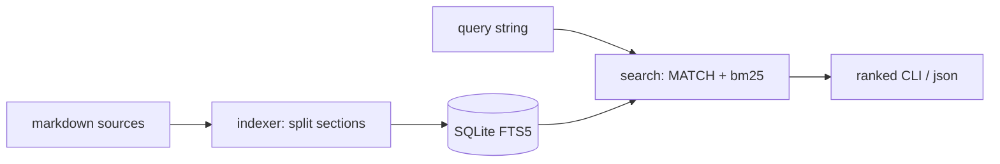

# SD — System Design: Cross-Session Memory (`recall`)
**Date:** 2026-06-14
**Status:** 🔵 Draft
**Ref:** `RD-cross-session-memory.md`

---

## 1. Architecture Overview

```
NGUỒN (markdown, read-only)        INDEXER                 STORE              SEARCH
─────────────────────────         ──────────────         ─────────────      ──────────────────
../ai/sessions/*.md      ─┐
../ai/handoff-*.md         ├──→  iter_sources()   ──→   SQLite FTS5    ──→  search()  ──→  CLI output
../ai/status.md            │     parse_sections()        table `memory`      (bm25 rank      (ranked snippets
personal-wiki/INDEX.md    ─┘     build_index()           memory/recall.db    + snippet)       hoặc --json)
```



**Nguyên tắc:** một chiều, không vòng. Nguồn read-only → index → tra. Recall không bao giờ ghi vào nguồn (giữ Karpathy invariant: chỉ `wiki_ops/ingest.py` ghi wiki; recall thậm chí không ghi gì ngoài DB của chính nó).

---

## 2. Data Flow

```
INDEX (run_recall.py index):
1. iter_sources(config)   → list[(path, kind)]  từ các glob path
2. for each file:
     read text (utf-8)    → lỗi encoding → skip + warn stderr
     parse_sections(text) → [(heading, body), ...]  (split trên `##`)
3. DROP + recreate FTS5 table  (idempotent)
4. INSERT mỗi section thành 1 row (path, section, body, kind, mtime)
5. print "Indexed N files, M sections (Xs)"

QUERY (run_recall.py "<q>"):
1. parse args → query string + flags (--json, --limit, --kind)
2. sanitize query → FTS5 MATCH expression (quote nếu có ký tự đặc biệt)
3. SELECT … FROM memory WHERE memory MATCH ? ORDER BY bm25(memory) LIMIT N
4. format mỗi hit: [path § section] (mtime date) + snippet(highlight)
5. print ranked list  (hoặc json.dumps nếu --json)
```

---

## 3. Component Breakdown

### `memory/sources.py` — collector
**Trách nhiệm:** liệt kê file cần index từ danh sách glob path + gán `kind`.
**Input:** config (danh sách path patterns, hardcode trong module hoặc đọc `utils/config.py`).
**Output:** `list[tuple[Path, str]]` — (path tuyệt đối, kind).
**Side effects:** không.

### `memory/indexer.py` — parser + builder
**Trách nhiệm:** đọc file → tách section → ghi FTS5.
**Input:** list nguồn, db_path.
**Output:** dict thống kê `{files, sections, skipped}`.
**Side effects:** tạo/ghi đè `memory/recall.db`.

### `memory/search.py` — search
**Trách nhiệm:** chạy FTS5 MATCH, rank bm25, dựng snippet.
**Input:** db_path, query, limit, kind.
**Output:** `list[dict]` — {path, section, kind, mtime, snippet, rank}.
**Side effects:** không (read-only DB).

### `run_recall.py` — CLI
**Trách nhiệm:** argparse — phân `index` subcommand vs query string; gọi component; format output.
**Input:** argv.
**Output:** stdout (text hoặc json), exit code.
**Side effects:** không (uỷ thác).

---

## 4. Interface Contracts

### `iter_sources(config) → list[tuple[Path, str]]`
```python
# Output
[(Path("/abs/ai/status.md"), "status"),
 (Path("/abs/ai/sessions/2026-05-07-....md"), "session"),
 (Path("/abs/personal-wiki/INDEX.md"), "wiki-index"), ...]
# Glob path không khớp file nào → bỏ qua im lặng (thư mục có thể chưa tồn tại)
```

### `parse_sections(text: str) → list[tuple[str, str]]`
```python
# Input: nội dung markdown
# Output: [(heading, body), ...]
#   - split trên dòng bắt đầu "## "
#   - nội dung trước heading `##` đầu tiên → ("", preamble)  (gồm cả `# title`)
#   - heading giữ nguyên text sau "## "
#   - body rỗng → vẫn giữ row (heading có thể là tín hiệu)
# Edge: text rỗng "" → []
```

### `build_index(db_path: Path, sources: list) → dict`
```python
# Hành vi: DROP TABLE IF EXISTS memory; CREATE; INSERT tất cả section.
# Output: {"files": int, "sections": int, "skipped": int}
# Errors: file đọc lỗi → skipped += 1, warn stderr, tiếp tục (NFR-003)
#         FTS5 không khả dụng → raise RuntimeError với message rõ (bắt sớm ở Step 0)
```

### `search(db_path, query, limit=8, kind=None) → list[dict]`
```python
# Output item:
{ "path": "ai/status.md", "section": "Current objective",
  "kind": "status", "mtime": "2026-05-20",
  "snippet": "…Migrate toàn bộ LLM calls từ [Groq] → Claude CLI…", "rank": -3.21 }
# rank = bm25 (âm hơn = liên quan hơn); sort tăng dần theo bm25
# query rỗng → raise ValueError (CLI bắt → usage, exit 2)
# MATCH lỗi cú pháp (quote lệch) → catch OperationalError → bọc query thành phrase "..." retry
# kind != None → thêm AND kind = ?
```

---

## 5. Storage & State

| Data | Location | Format | Lifetime |
|---|---|---|---|
| Recall index | `opus-consilium/memory/recall.db` | SQLite FTS5 | Rebuildable — **gitignored** |
| Session/handoff/status | `opus-animus/ai/**` | `.md` | Permanent, read-only |
| Wiki catalog | `opus-consilium/personal-wiki/INDEX.md` | `.md` | Permanent, read-only |

**FTS5 schema:**
```sql
CREATE VIRTUAL TABLE memory USING fts5(
    path,                 -- relative path hiển thị
    section,              -- heading text
    body,                 -- nội dung section (indexed)
    kind UNINDEXED,       -- session|handoff|status|wiki-index (filter, không search)
    mtime UNINDEXED,      -- ISO date từ file mtime (hiển thị)
    tokenize = "unicode61 remove_diacritics 2"   -- NFR-007: tiếng Việt có/không dấu
);
```
Snippet dùng hàm `snippet(memory, 2, '[', ']', '…', 12)` — cột 2 = body, highlight `[...]`, 12 token.
Rank dùng `bm25(memory)`.

---

## 6. Error Handling Strategy

| Scenario | Behavior | Logged? |
|---|---|---|
| File đọc lỗi encoding | Skip file, warn stderr, `skipped += 1`, tiếp tục | Yes (stderr) |
| Thư mục nguồn chưa tồn tại | Glob trả rỗng → bỏ qua im lặng | No |
| FTS5 không khả dụng | Raise RuntimeError message rõ ("SQLite build thiếu FTS5") | Yes |
| Query rỗng | CLI in usage, exit 2 | No |
| Query không khớp | In "Không tìm thấy…", exit 0 | No |
| MATCH cú pháp lỗi (ký tự đặc biệt) | Bọc query thành phrase `"..."`, retry; vẫn lỗi → exit 1 message rõ | Yes |

**Principle:** lỗi ở boundary (file/encoding) → skip + warn, đừng để hỏng cả index. Lỗi ở logic/môi trường (FTS5 thiếu) → raise sớm.

---

## 7. Technology Decisions

| Quyết định | Chọn | Lý do | Không chọn vì |
|---|---|---|---|
| Search engine | SQLite FTS5 (stdlib) | Zero dep, ranked bm25, snippet built-in, nhanh | Whoosh: thêm dep; vector DB: overkill single-user |
| LLM trong recall | Không | Tức thì + miễn phí + không chạm credit | LLM rerank: cost/latency vô ích cho keyword recall |
| Index strategy | Full rebuild (MVP) | Idempotent by construction, corpus nhỏ < 3s | Incremental: phức tạp hơn, để P1 |
| Section split | Level-2 `##` | Granular vừa phải, khớp cấu trúc doc hiện có | Mọi heading: section vụn; file-level: snippet kém |
| Tokenizer | `unicode61 remove_diacritics 2` | Match tiếng Việt có/không dấu | Default: bỏ sót khi gõ thiếu dấu |
| Vị trí code | `run_recall.py` + `memory/` | Theo convention `run_*.py`; `memory/` tách khỏi `wiki_ops/` vì index cả `ai/` | Nhét vào `wiki_ops/`: sai ngữ nghĩa (không chỉ wiki) |

---

*opus-consilium — SD Cross-Session Memory v1 | 2026-06-14*
