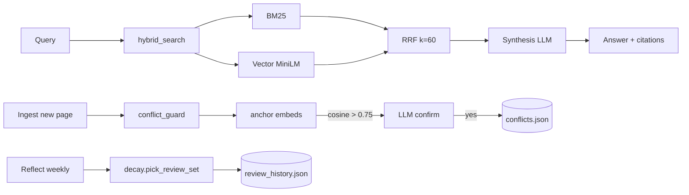

# SD — Wiki Retrieval v2: Hybrid Search + Conflict Guard + Decay
**Date:** 2026-06-02
**Status:** 🔵 Draft
**Ref:** `RD-wiki-retrieval-v2.md`

---

## 1. Architecture Overview

```
┌──────────────────────────────────────────────────────────────────┐
│  EXISTING (unchanged)                                            │
│  ingest.py ──► raw/  ──► personal-wiki/*.md  ──► INDEX/log/      │
└──────────────────────────────────────────────────────────────────┘
                            │
                            │ post-write hook (FR-RV2-006)
                            ▼
┌──────────────────────────────────────────────────────────────────┐
│  NEW MODULES (wiki_ops/)                                         │
│                                                                  │
│  retrieval.py        conflict_guard.py        decay.py           │
│  ┌─────────────┐    ┌──────────────────┐    ┌────────────────┐   │
│  │ BM25 idx    │    │ anchor embeds    │    │ stability calc │   │
│  │ Vector idx  │    │ cosine threshold │    │ pick_review_set│   │
│  │ RRF fuse    │    │ LLM confirm      │    │ update on apply│   │
│  └──────┬──────┘    └────────┬─────────┘    └───────┬────────┘   │
└─────────┼────────────────────┼────────────────────────┼──────────┘
          │                    │                       │
          ▼                    ▼                       ▼
┌──────────────────────────────────────────────────────────────────┐
│  CONSUMERS (modified)                                            │
│                                                                  │
│  query.py            ingest.py (post)         reflect.py         │
│  swap LLM call 1     append conflict          replace pick old   │
│  → hybrid_search()   → check_ingest_conflict  → pick_review_set  │
│                                                                  │
│  lint.py: report contradictions from .cache/conflicts.json       │
└──────────────────────────────────────────────────────────────────┘
          │                                            │
          ▼                                            ▼
┌──────────────────────────────────────────────────────────────────┐
│  CACHE (wiki_ops/.cache/, gitignored)                            │
│  bm25.pkl  vectors.npz  page_index.json                          │
│  anchor_embeds.json  review_history.json  conflicts.json         │
└──────────────────────────────────────────────────────────────────┘
```



---

## 2. Data Flow

### 2.1 Query flow
```
1. User           →  question: str (Telegram / run_wiki.py)
2. query.py       →  call retrieval.hybrid_search(question, top_k=4)
3. retrieval.py   →  load/refresh indices → BM25 scores + cosine scores
                  →  RRF fuse → return [slugs]
4. query.py       →  read pages (existing _read_page)
5. query.py       →  LLM synthesis call (unchanged)
6. Output         →  {status, answer, pages_read}
```

### 2.2 Ingest + conflict flow
```
1. User/scheduler →  source: str
2. ingest.py      →  (unchanged) save raw → LLM compile → write page → update INDEX/log
3. ingest.py      →  NEW: conflict_guard.check_ingest_conflict(page_path)
4. conflict_guard →  embed page summary → cosine vs anchor_embeds
                  →  if max_cosine > 0.75: LLM confirm semantic conflict
                  →  if confirmed: append to .cache/conflicts.json
5. Output         →  ingest result + optional conflicts: list[dict]
```

### 2.3 Reflect flow
```
1. Task Scheduler →  weekly trigger
2. reflect.py     →  recent pages from log.md (unchanged)
3. reflect.py     →  NEW: decay.pick_review_set(n=3) instead of mtime sort
4. decay.py       →  load review_history.json → compute R(t) for all pages
                  →  filter R(t) < 0.5 → sort by R asc → return top n
5. reflect.py     →  LLM synthesis (unchanged) + write reflection-YYYY-WW.md
6. reflect.py     →  decay.mark_reviewed(picked_slugs) → persist
```

### 2.4 Lint flow (additive)
```
1. lint.py        →  (unchanged) orphan/broken/stale/contradiction-tag checks
2. lint.py        →  NEW: read .cache/conflicts.json → append [CONFLICT] entries
3. Telegram       →  combined report
```

---

## 3. Component Breakdown

### 3.1 `wiki_ops/retrieval.py` (NEW)

**Trách nhiệm:** Index + hybrid search trên `personal-wiki/*.md`. Stateful (caches indices), idempotent rebuild.

**Input:**
- `query: str`
- `top_k: int = 4`

**Output:**
- `list[str]` slug list, ordered by RRF rank

**Side effects:**
- Create/update `wiki_ops/.cache/bm25.pkl`, `vectors.npz`, `page_index.json`
- Stdout logs khi rebuild

**Internal layout:**
- `_load_pages() → list[PageDoc]` — scan personal-wiki/, parse frontmatter
- `_should_rebuild() → bool` — compare mtime of log.md vs cache mtime
- `_build_bm25(pages) → BM25Okapi` — tokenize body + title, persist
- `_build_vectors(pages) → np.ndarray` — embed via SentenceTransformer, persist
- `_rrf_fuse(bm25_ranks, vec_ranks, k=60) → list[(slug, score)]`

### 3.2 `wiki_ops/conflict_guard.py` (NEW)

**Trách nhiệm:** Detect semantic conflict giữa page mới và anchor beliefs.

**Anchor pages (hardcoded):**
- `personal-wiki/Personal/current-beliefs.md`
- `personal-wiki/Personal/decisions.md`

**Input:**
- `page_path: Path` (mới ingest)

**Output:**
- `list[dict]` — `[{anchor_path, anchor_anchor, similarity, llm_verdict, snippet}, ...]`

**Side effects:**
- Refresh `anchor_embeds.json` nếu anchor pages thay đổi
- Append to `conflicts.json` nếu LLM confirm
- 1 LLM call mỗi anchor hit (cosine > 0.75)

**Internal:**
- `_split_anchor_into_claims(text) → list[str]` — split by `## ` / bullet
- `_embed_paragraphs(texts) → np.ndarray`
- `_llm_confirm(new_text, anchor_claim) → bool` — claude_cli with strict yes/no prompt

### 3.3 `wiki_ops/decay.py` (NEW)

**Trách nhiệm:** Ebbinghaus stability tracking cho spaced repetition.

**Formula:**
- `R(t) = exp(-elapsed_days / stability)`
- Initial `S₀ = 7` days (per RD Q3 default)
- On `applied::` tag detected or `mark_reviewed`: `S_new = S_old * 2.5`
- Min stability = 1, max = 365 days

**Input/Output:**
- `pick_review_set(n=3) → list[Path]`
- `mark_reviewed(slugs: list[str], at: datetime = now)`
- `bump_on_apply(slug: str)` — call from lint or manual

**Storage:**
```json
{
  "fde-model": {
    "stability_days": 17.5,
    "last_reviewed": "2026-05-19T10:00:00",
    "review_count": 3,
    "applied": false
  }
}
```

### 3.4 Modifications

| File | Change | Lines impacted (est) |
|---|---|---|
| `query.py` | Replace `prompt1 + claude_cli_json` block with `retrieval.hybrid_search()` call | ~15 lines removed, ~3 added |
| `ingest.py` | After `_update_log()`: `conflict_guard.check_ingest_conflict(page_path)` | ~5 lines added |
| `reflect.py` | Replace `_get_old_pages_for_review()` with `decay.pick_review_set()` | ~15 lines removed, ~3 added |
| `lint.py` | New `check_conflicts_log()` + include in `run_lint()` | ~20 lines added |

---

## 4. Interface Contracts

### 4.1 `retrieval.hybrid_search(query, top_k=4) → list[str]`

```python
def hybrid_search(query: str, top_k: int = 4) -> list[str]:
    """
    Hybrid BM25 + vector retrieval over personal-wiki/.
    Returns slug list (without .md), ordered by RRF rank descending.

    Side effects:
    - Builds/refreshes indices in wiki_ops/.cache/ if stale.

    Errors:
    - Returns [] if wiki has no pages.
    - Raises RuntimeError if sentence-transformers model fails to load.
    """
```

**Input:** `query` non-empty str, `top_k` ∈ [1, 20].
**Output:** `["fde-model", "fde-adoption-radar", ...]` — len ≤ top_k.

### 4.2 `conflict_guard.check_ingest_conflict(page_path) → list[dict]`

```python
def check_ingest_conflict(page_path: Path) -> list[dict]:
    """
    Compare a newly ingested page against anchor beliefs.

    Returns list of confirmed conflicts:
    [
      {
        "new_page": "AI/outcome-pricing-fails.md",
        "anchor_page": "Personal/decisions.md",
        "anchor_claim": "Bet on outcome-based delivery for FDE Japan",
        "similarity": 0.83,
        "llm_verdict": "conflict",
        "snippet": "first 200 chars of new page paragraph that conflicts"
      }
    ]

    Returns [] if no conflicts or anchor pages missing.
    Persists results into .cache/conflicts.json (appended).
    """
```

### 4.3 `decay.pick_review_set(n=3) → list[Path]`

```python
def pick_review_set(n: int = 3) -> list[Path]:
    """
    Return n pages with lowest retention R(t).

    Skips:
    - SCHEMA.md, INDEX.md, log.md
    - reflection-*.md
    - Pages with `applied::` tag set

    Initializes new pages with S₀=7, last_reviewed=created_at.
    """
```

### 4.4 `decay.mark_reviewed(slugs, at=None) → None`

```python
def mark_reviewed(slugs: list[str], at: datetime | None = None) -> None:
    """
    Update review_history.json:
    - last_reviewed = at or now()
    - stability_days *= 2.5 (capped at 365)
    - review_count += 1
    """
```

### 4.5 `lint.check_conflicts_log() → list[str]`

```python
def check_conflicts_log() -> list[str]:
    """
    Read .cache/conflicts.json, return formatted issue lines:
    ["[CONFLICT] {new_page} -> {anchor_page}#{claim}: similarity={s:.2f}"]
    Returns [] if file missing or empty.
    """
```

---

## 5. Storage & State

| Data | Location | Format | Lifetime |
|---|---|---|---|
| Wiki pages (truth) | `personal-wiki/**/*.md` | Markdown | Permanent (git) |
| BM25 index | `wiki_ops/.cache/bm25.pkl` | Pickle (`BM25Okapi`) | Rebuilt on stale |
| Vector index | `wiki_ops/.cache/vectors.npz` | NumPy compressed | Rebuilt on stale |
| Page metadata | `wiki_ops/.cache/page_index.json` | JSON `{slug → {path, mtime, tokens}}` | Aligned with bm25/vectors |
| Anchor embeds | `wiki_ops/.cache/anchor_embeds.json` | JSON `{anchor_path → [{claim, vector}]}` | Refreshed on anchor mtime change |
| Conflicts log | `wiki_ops/.cache/conflicts.json` | JSON list (append-only) | Permanent (history) |
| Review history | `wiki_ops/.cache/review_history.json` | JSON `{slug → {S, last, count}}` | Permanent |
| Embedding model | HuggingFace cache (default) | — | One-time download |

**`.gitignore` addition:**
```
opus-consilium/wiki_ops/.cache/
```
(Locks Open Question Q1 → Default chosen.)

**Stale detection:**
- BM25/vector: rebuild if `max(page mtime in wiki) > cache mtime` OR `len(pages) != cached count`.
- Anchor embeds: rebuild per-anchor if anchor mtime > cached anchor mtime.

---

## 6. Error Handling Strategy

| Scenario | Behavior | Logged? |
|---|---|---|
| sentence-transformers model not downloaded | First call downloads (~80MB); print progress | Yes (stdout) |
| `.cache/` missing or corrupt | Rebuild from scratch silently | Yes (stdout) |
| Anchor page missing | Skip that anchor, continue with others | Yes |
| LLM confirm timeout/error in conflict_guard | Treat as no-conflict (false-negative bias) | Yes |
| review_history.json corrupt | Backup `.bak`, reinitialize | Yes |
| Query returns 0 hits | Fall back to existing `no_match` path in query.py | No (normal) |
| Embedding tensor mismatch (page count vs vectors) | Force full rebuild | Yes |

**Principle:** Cache layer = transient. Bất kỳ lỗi nào ở cache → rebuild, không raise. Anchor missing / LLM error → degraded mode (skip), không block ingest pipeline.

---

## 7. Technology Decisions

| Quyết định | Chọn | Lý do | Không chọn vì |
|---|---|---|---|
| BM25 library | `rank_bm25` (pure Python) | Zero C-deps, 200 LOC, đủ cho 500 pages | Whoosh: overkill, schema setup; Tantivy: Rust binding phức tạp |
| Embedding model | `sentence-transformers/all-MiniLM-L6-v2` | 80MB, CPU < 30ms/page, 384-dim đủ semantic | mpnet-base: 420MB, 2x slow, gain marginal ở scale này |
| Vector storage | `numpy.savez_compressed` | 1 file, fast load, no index needed ở 500 pages | FAISS: cài đặt build phức tạp Windows; Chroma: server overhead |
| Similarity calc | `np.dot` brute-force | 500 × 384 dot product < 5ms — không cần ANN | HNSW/IVF: chỉ cần khi > 10k vectors |
| RRF k=60 | Theo Cormack et al. 2009 + AgentMemory benchmark | Sweet spot, không cần tune | k=10/100: marginal diff trên dataset nhỏ |
| Tokenizer cho BM25 | Lowercase + split whitespace + remove punctuation | Markdown content tiếng Anh chủ yếu | NLTK/spaCy: thêm dep, overkill |
| LLM confirm trong conflict_guard | `claude_cli` với strict prompt "yes/no + 1 dòng lý do" | Đã centralized trong `utils/llm.py` | Direct API: phá nguyên tắc CLAUDE.md |
| Cosine threshold default | 0.75 | Theo MiniLM literature, "moderately similar" | 0.85: miss valid conflicts; 0.65: nhiều false positive |
| Anchor split granularity | Per `##` heading + bullet | Beliefs/decisions có cấu trúc rõ | Per paragraph: quá fine; whole page: quá coarse |
| Cache location | `wiki_ops/.cache/` gitignored | Bảo toàn nguyên tắc "GitHub = wiki content truth"; cache là local | Trong personal-wiki/: làm dirty diff |
| Stability initial value | S₀ = 7 ngày | RD Q3 default, vừa cho weekly rhythm | S₀=1: pick mọi page lần đầu; S₀=30: skip pages quan trọng tuần đầu |
| Stability multiplier | 2.5x (SM-2 inspired) | Chuẩn supermemo, không cần tune | Cộng tuyến tính: không simulate forgetting curve đúng |

---

## 8. Open Questions Resolution (từ RD)

| Q | Resolution | Reasoning |
|---|---|---|
| Q1: Cache trong git? | **Gitignore** | Cache deterministic từ pages; commit gây churn lớn |
| Q2: Cosine 0.75? | **Lock 0.75 cho v1** | Sẽ benchmark 10 cases sau implement; nếu false-positive > 20% → bump 0.80 |
| Q3: S₀? | **7 ngày** | Match weekly reflect cadence |
| Q4: Conflict check sync? | **Sync** | Latency < 2s acceptable; async cần task queue, overkill |

---

## 9. Dependencies (mới)

| Package | Version | Lý do |
|---|---|---|
| `rank_bm25` | `>=0.2.2` | BM25 |
| `sentence-transformers` | `>=2.5` | Local embeddings |
| `numpy` | `>=1.24` | Vector ops (đã có gián tiếp) |

**`requirements.txt` patch:**
```diff
+ rank_bm25>=0.2.2
+ sentence-transformers>=2.5
```

Embedding model tự download lần đầu — không thêm bước install.

---

*opus-consilium — SD-wiki-retrieval-v2 v1.0 | 2026-06-02*
