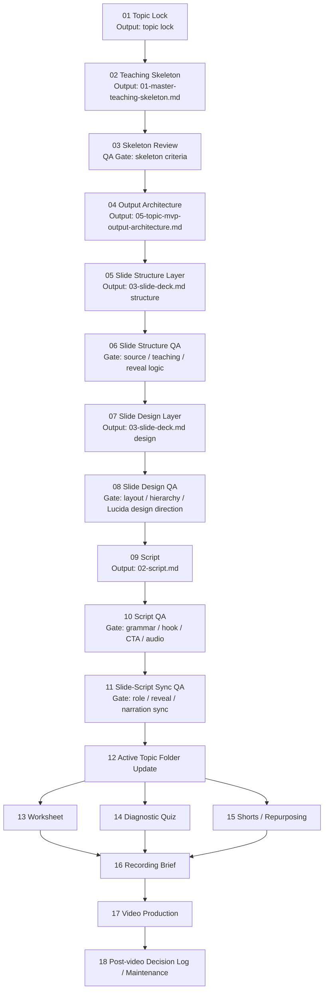
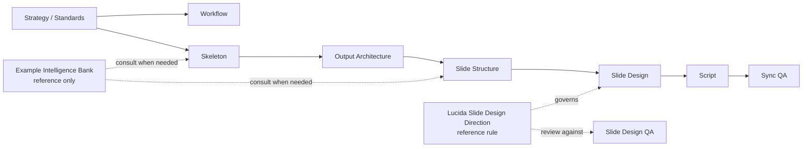
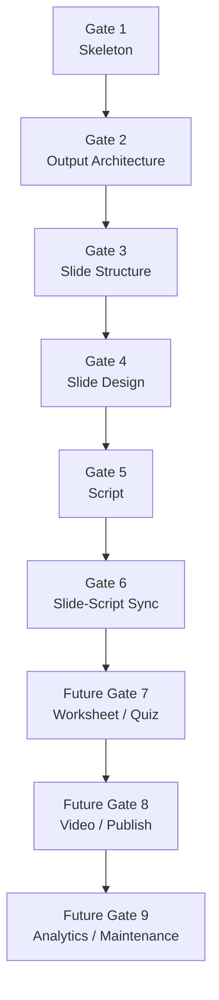

# Lucida Flow Streamline

**Purpose:** Quick visual flow for review in VS Code  
**Source architect:** `10-project-architecture-map.md`  
**Detailed workflow:** `automation/workflows/20-lesson-production-sop.md`

---

## Recommended VS Code Preview

Good options:

- `Markdown Preview Mermaid Support`
- `Mermaid Markdown Syntax Highlighting`
- built-in Markdown preview, if your VS Code version already supports Mermaid blocks

If built-in preview works, open this file and use:

```text
Ctrl+Shift+V
```

or

```text
Open Preview to the Side
```

---

## Main Flow



---

## Rule And Reference Layer



---

## QA Gates



---

## Note

This file is only for quick visual review.

Do not edit process rules here first.

Canonical rule files remain:

- `10-project-architecture-map.md`
- `automation/workflows/20-lesson-production-sop.md`
- `production/03-qa/criteria/*.md`
